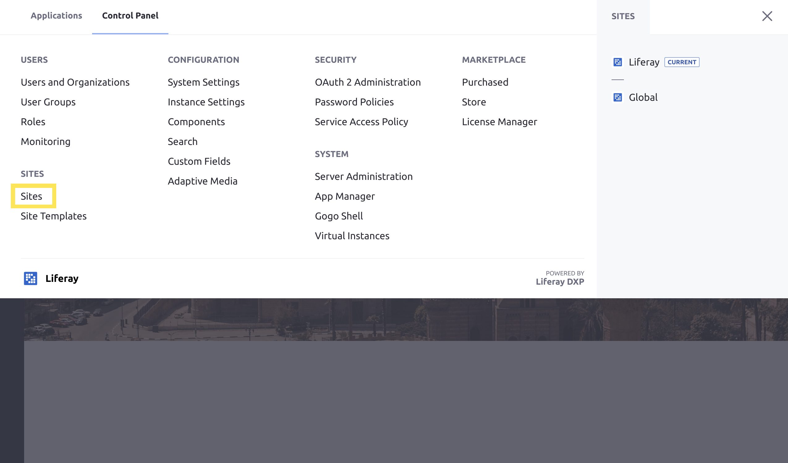
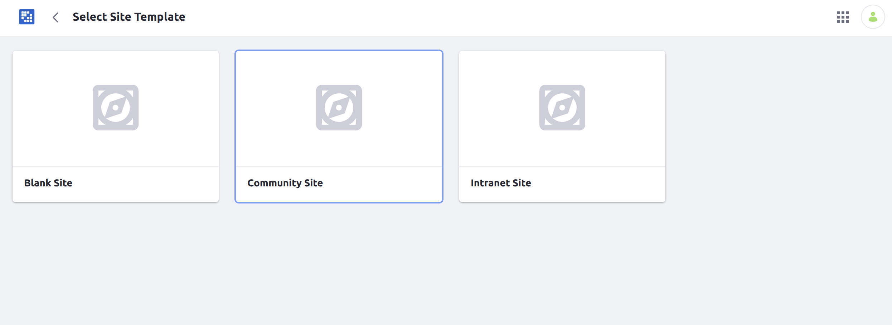
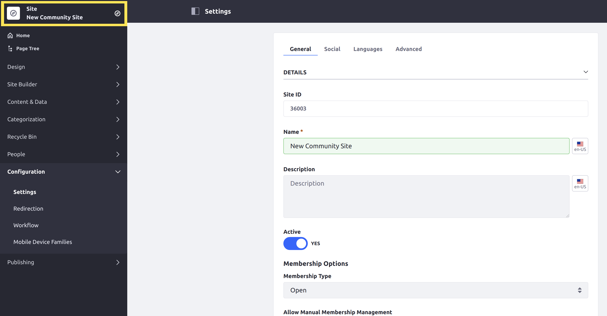
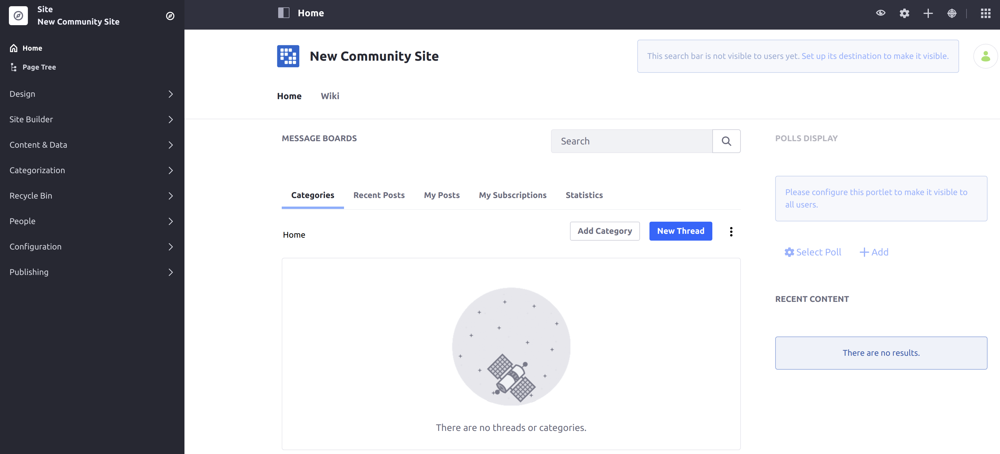

# Creating Your First Site

Sites are collections of pages that contain and display content. This article walks through creating a new Site based on an existing out-of-the-box template.

## Creating a Site

To create a new Community Site, follow these steps:

1. Open the _Global Menu_ and navigate to the _Control Panel_ and select _Sites_.

    

1. Click the Add icon () at the top right of the page.

1. Select the _Community Site_ Template. The Site Template you choose determines what default pages and applications the new Site is populated with.

   

1. Enter a name for the Site.

1. Click _Save_.

A new Site is created and ready for use with two pages: _Home_ and _Wiki_. Each page has several applications already deployed that you may begin exploring.

Users are presented a variety of Site Settings options to further configure their new Site. Click to learn more about [Site Settings](../site-building/site_settings.html).

## Viewing the Site

To view a newly created Site:

1. Verify that the Site selector shows the name of the _Community Site_ you created. Otherwise, click on the compass icon () to select the new Site.

    

1. Click _Home_ beneath the Site selector.

You are taken to the Site's _Home_ page.

## What's Next

Continue our Getting Started guide by learning how to change the look and feel of your site by [Changing Your Site's Theme](./changing-your-sites-appearance.md).

Liferay Sites are flexible, powerful, and can be configured to meet many different needs. See our [Introduction to Site Building](../site-building/introduction-to-site-building.md).
