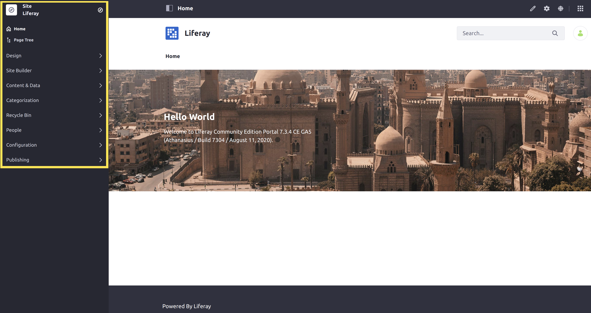
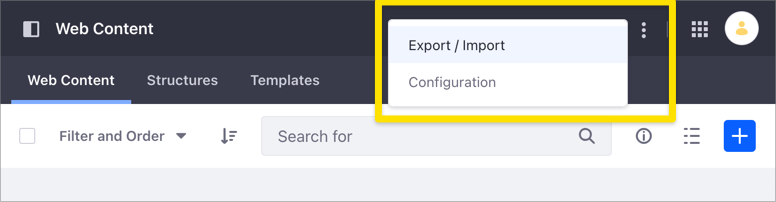
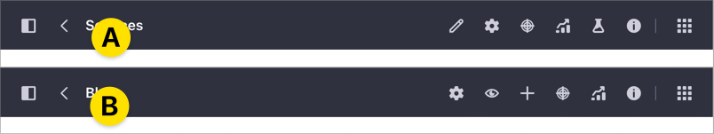
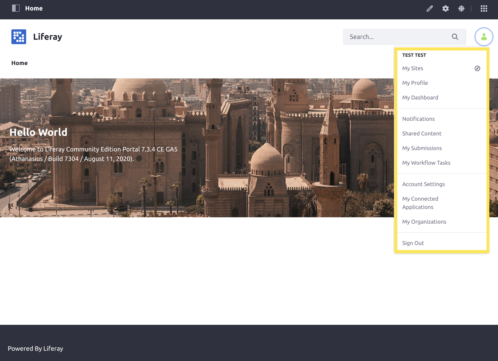
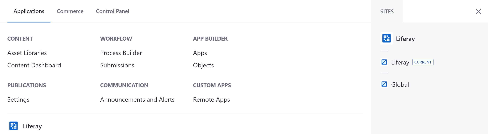
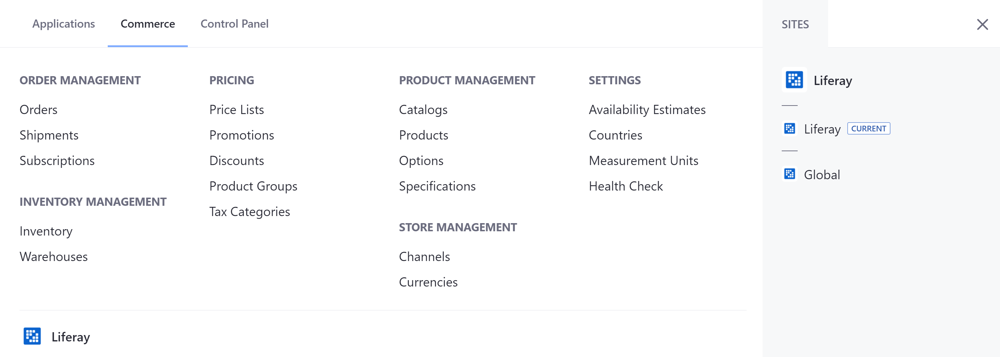
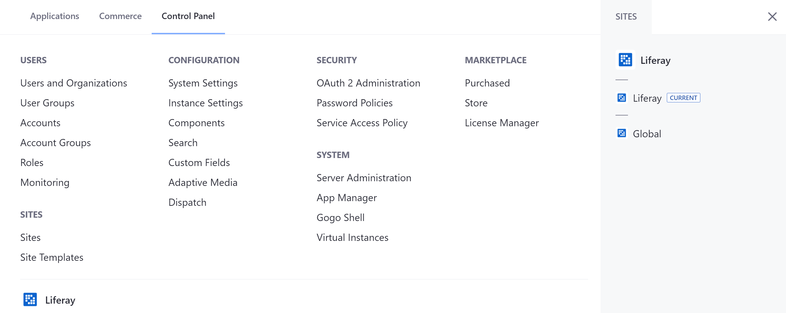
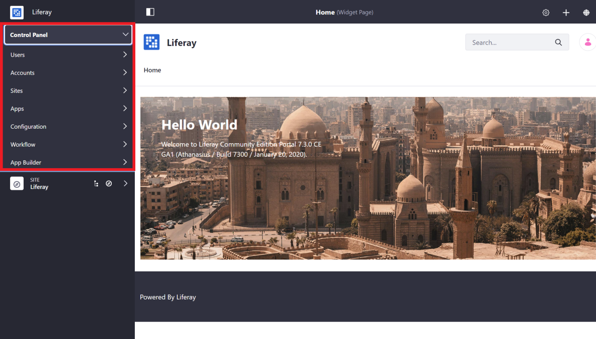

# Navigating DXP

Liferay DXP's out-of-the-box navigation is organized into three major areas: _Personal Menu_, _Global Menu_, and _Site Menu_.

## Site Menu

The DXP _Site Menu_ on the left side of the screen contains actions, content, and configurations that are scoped to the specific site currently being viewed. You can click on the Site Menu icon () in the Application Bar to expand or hide the Site Menu.



The *Site Menu* indicates the selected Site. In the above example, the Site is `Liferay`. You can change what site you are working with by clicking the Compass Icon (  ) in the Site Menu.

The following common site building and management activities can be done in the _Site Menu_:

* [Adding Pages](../site-building/creating-pages/adding-pages/adding-a-page-to-a-site.md)
* [Creating Content](../content-authoring-and-management.md)
* [Managing Site Memberships](../site-building/building-sites/site-membership/adding-members-to-sites.md)
* [Configuring and Optimizing Site Behavior and Functionality](../site_building.html)
* And more...

## Applications Bar

The _Application Bar_ appears at the top of each page and application listed in the [Site Menu](#site-menu). The Application Bar shows an Actions () menu with different options depending on the application that is open at the moment.



When you open a Page in view mode, the available tools in the Applications Bar change depending on the Page type.



For [Content Pages](../site-building/creating-pages/using-content-pages.md) (A), the available tools are:

* Edit ()
* Configure Page ()
* Simulation ()
* Content Performance ()
* A/B Test ()
* Page Audit ()

For [Widget Pages](../site-building/creating-pages/using-widget-pages/adding-widgets-to-a-page.md) (B), the available options are:

* Configure Page ()
* Toggle Controls ()
* Add ()
* Simulation ()
* Content Performance ()
* Page Audit ()

```{note}
The Application Bar options for Content Pages and Widget Pages depend on your Liferay DXP version. [Content Performance](../content-authoring-and-management/page-performance-and-accessibility/about-the-content-performance-tool.md) is available for Content Pages starting with Liferay DXP 7.3 and for Widget Pages starting with Liferay DXP 7.4. Page Audit is available starting with Liferay DXP 7.4. The Toggle Controls option is available starting with Liferay DXP 7.3.
```

## Personal Menu

The Personal Menu is the hub for information and activities for a User that is logged in.



Users can use the personal menu to:

* [Change account information](./introduction-to-the-admin-account.md#changing-account-information) (Name, Password, etc.)
* [See what sites they are members of](../site-building/building-sites/site-membership/adding-members-to-sites.md)
* [Review site notifications](../collaboration-and-social/notifications-and-requests/user-guide/managing-notifications-and-requests.md)
* [Sign out](./introduction-to-the-admin-account.md#signing-out)
* And more...

## Global Menu

The DXP _Global Menu_ contains the _Applications Menu_ and the _Control Panel_. Click the _Applications Menu_ icon () at the top of the screen to access it.

```{note}
By default, Users with the *Guest* or *User* roles are not able to access the Global Menu.
```

You can also navigate to other Sites available to you from either the _Applications_ or _Control Panel_ tabs in the _Global Menu_, on the right side of the interface.

### Applications Menu

The _Applications Menu_ contains a variety of links to manage many different applications within your Liferay DXP server.



Here are some of the applications that can be managed from the _Applications Menu_:

* [Collections](../content-authoring-and-management/collections-and-collection-pages/about-collections-and-collection-pages.md) and the Content Dashboard
* [Workflow](../process-automation/workflow/introduction-to-workflow.md)
* [App Builder](../building-applications/app-builder.md) _(Deprecated and removed in Liferay 7.4)_

### Commerce Menu

Beginning in Liferay 7.3 CE GA6 and Liferay DXP 7.3 GA1, Liferay Commerce 3.0 is now bundled with Liferay Portal 7.3 CE GA6 and Liferay DXP 7.3 GA1.



Here are some functions that can be managed from the _Commerce_ menu:

* [Creating a New Catalog](https://learn.liferay.com/commerce/latest/en/product-management/catalogs/creating-a-new-catalog.html)
* [Creating a New Channel](https://learn.liferay.com/commerce/latest/en/starting-a-store/channels/managing-channels.html)
* [Manage Inventory](https://learn.liferay.com/commerce/latest/en/product-management/managing-inventory/introduction-to-managing-inventory.html)
* [Process Orders](https://learn.liferay.com/commerce/latest/en/order-management/orders/processing-an-order.html)
* And more..

To learn more about Liferay Commerce, see [Introduction to Liferay Commerce](https://learn.liferay.com/commerce/latest/en/starting-a-store/introduction-to-liferay-commerce.html).

### Control Panel

The _Control Panel_ contains general administrative actions and configurations that can be scoped _globally_ to the Liferay DXP installation or to a particular instance.



The following common administrative activities can be done in the Control Panel:

* [Manage Users, Permissions, and Roles](../users-and-permissions/users/adding-and-managing-users.md)
* [Change how users login](../installation-and-upgrades/securing-liferay/authentication-basics.md)
* [Create new Sites](../site-building/building-sites/adding-a-site.md)
* Add new Custom Fields to applications on the site
* And more...

## DXP 7.1 and 7.2

In Liferay DXP versions prior to 7.3, the contents of the Global menu are found within the Control Panel, which is located above the Site Menu on the left side of the screen.



## What's Next

Continue our Getting Started walkthrough and learn about [Creating Your First Site](./creating-your-first-site.md).

## Related Information

* [Creating your first Site](./creating-your-first-site.md)
* [Changing your Site's Appearance](./changing-your-sites-appearance.md)
