# What's New in Liferay DXP 7.4

Liferay DXP 7.4 comes with enhanced functionality and exciting improvements that make it even easier for both technical and non-technical users to deliver and optimize digital experiences.

## Optimizing Digital Experiences with Data-Driven Insight

### Set Any Element as a Click Target in A/B Testing

You can now [run AB tests on any element on the page](../site-building/optimizing-sites/ab-testing/creating-ab-tests.md). Before Liferay DXP 7.4, you could only select buttons and links as a Click Goal. With Liferay DXP 7.4, you can now select any page element by including its element ID.

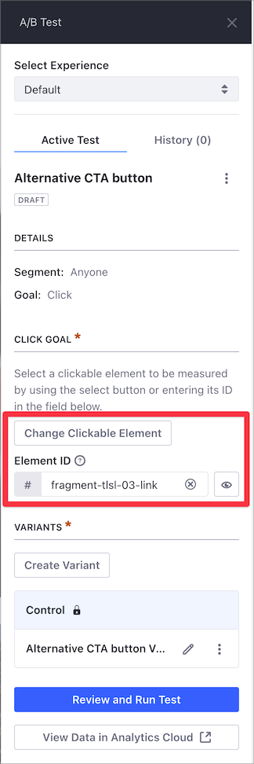

### More Insightful Content Audit Tool

In the [Content Audit Tool](../content-authoring-and-management/content-dashboard/content-dashboard-interface.md) in the Content Dashboard, you can now click on the bars to zoom in on
the results; and content assigned to only one vocabulary category is now represented in the graph. Marketers can now easily spot miscategorized content using this new set of enhancements.

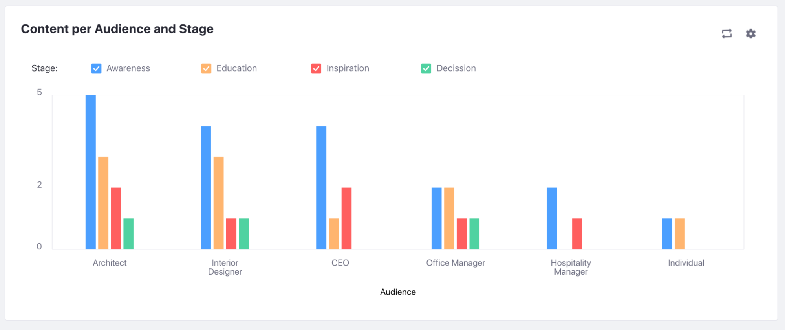

### Content Audit Tool UX Improvements

We've also made several usability improvements to the [Content Audit Tool](../content-authoring-and-management/content-dashboard/content-dashboard-interface.md) in the Content Dashboard. For example, now it is much easier to select the vocabularies to be audited, and it is possible to flip the bar chart axes with a click.

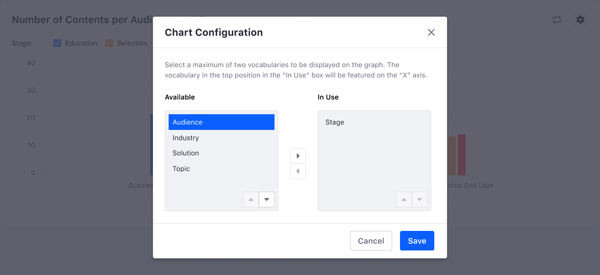

### Traffic Acquisition Channels in the Content Performance Tool

The traffic acquisition channels in the [Content Performance Tool](../content-authoring-and-management/content-performance-panel/analyze-content-metrics-using-content-performance-panel.md) use [Analytics Cloud](https://learn.liferay.com/analytics-cloud/latest/en/index.html) data and include measurements for organic and paid search, social traffic, and referrals. A channel's detail view reveals all referring URLs and domains.

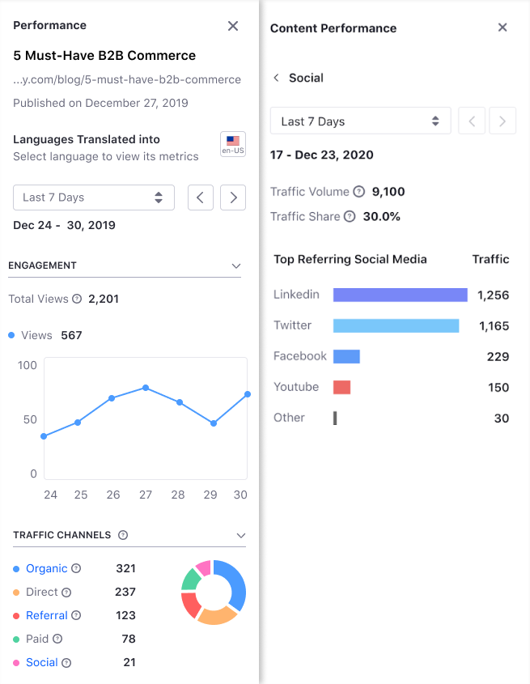

### Content Performance Analytics for All Types of Pages

The Content Performance Panel is now available for all pages: display pages templates of all assets, content, and widget pages. Before Liferay DXP 7.4, the Content Performance Too was only available for web content rendered through a display page template.

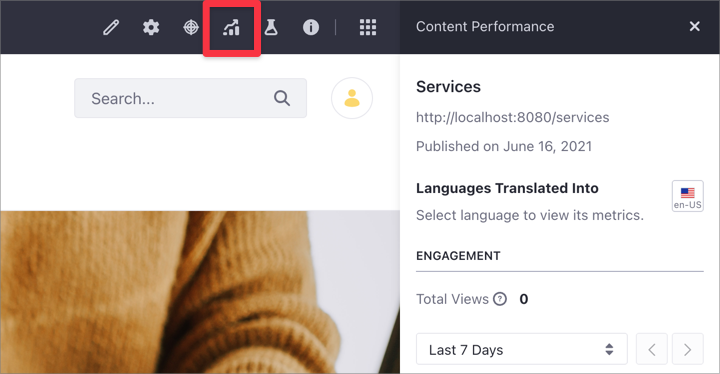

## Empowering Practitioners to Build Rich Digital Experiences

### Page Audit

Starting with Liferay DXP 7.4, you can use [the Page Audit tool](../content-authoring-and-management/page-performance-and-accessibility/analyze-seo-and-accessibility-on-pages.md) for auditing your pages' SEO and accessibility. The Page Audit tool uses the [Google PageSpeed Insights](https://developers.google.com/speed/pagespeed/insights) service, providing specific recommendations for Liferay DXP. With the new Page audit tool, you can check your page's compliance with the best performance, accessibility, search engine metadata, and SEO practices.

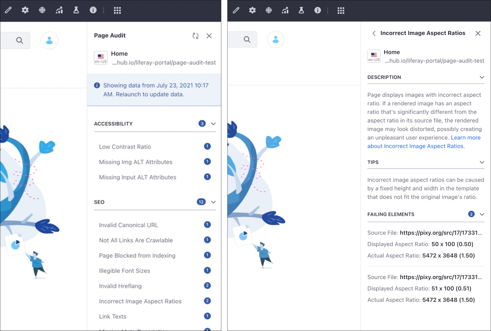

### More Flexibility to Replicate and Draft Experiences

You can now draft and duplicate [Liferay DXP Experiences](../site-building/personalizing-site-experience/experience-personalization/content-page-personalization.md) and replace the default experience with another. These enhancements provide much more flexibility when creating and managing Experiences.

### Documents Now Visible in the Content Dashboard

Documents now appear in the [Content Dashboard](../content-authoring-and-management/content-dashboard/about-the-content-dashboard.md), with new filters based on asset type or MIME type. You can access these filters in the Filter and Order drop-down menu in the Content Dashboard.

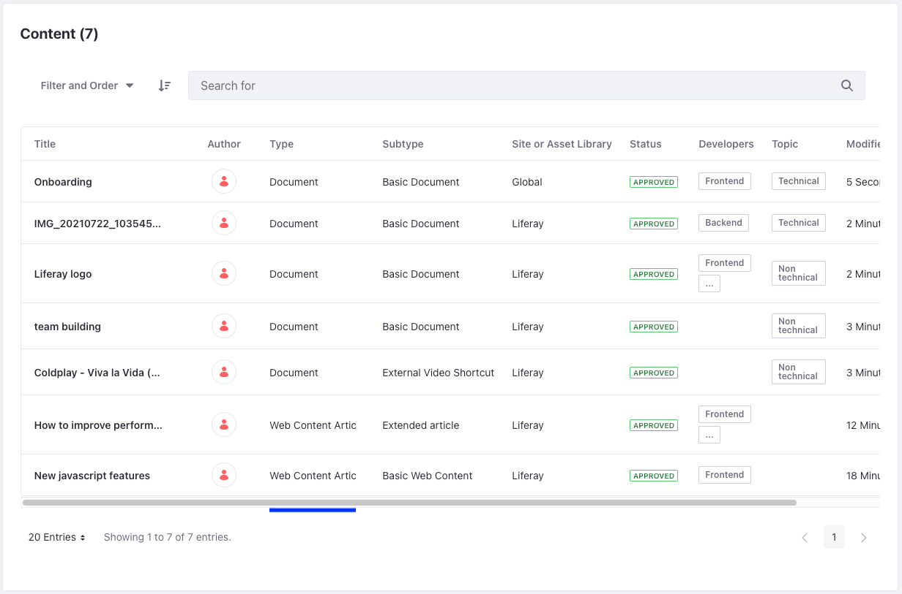

### Account Management Widget

Account Users can view and/or administer their company's details, addresses, assigned users, associated Organizations, Groups, and Roles without needing to leave their website, as well as minimize the need for assistance from a Portal administrator to administer Accounts on their behalf.

## Create a Seamless B2B Buying Experience: Commerce 4.0 Provides Added Stability and Improvements

### Optimized Product Images for Specific Devices

Page load speed is optimized by changing the quality of a picture depending on the device it's being rendered on.

### Different Pricing and Discounts Based on Order Types

Sellers can change pricing and discounts depending on order conditions, such as when an order is marked as urgent vs a stock order.

### Improved Organization Management Widget

The Org Chart widget is now the Organization Management widget, and it makes it easy to manage your sales network within the same platform that you are serving your buyers.

## Business Users Can Build Applications Without Writing Code

With [Liferay Objects](../building-applications/objects.md), you can build and deliver applications without having to write code or deploy modules, yet these applications are built on and integrated with Liferay's core frameworks. Quickly develop and manage flexible solutions that adapt Liferay DXP to your business needs while maintaining a seamless user experience.

### Manage Custom Objects Though the UI

You can define objects, adding fields and object layouts, and choose how entries are displayed through the UI. You can also define the scope for each custom object.

### Object Integration with Experience Management

Objects are integrated with the Display Pages through Info Framework. When creating an object, a collection provider is generated automatically, allowing you to create experiences with object entries through Collection Display Fragment.

### Object Integration with Forms

All the capabilities from Forms can be leveraged to insert data into specific objects by changing the storage type of a form to objects.

### Objects Relationships

You can solve complex use cases with [object relationships](../building-applications/objects/creating-and-managing-objects/defining-object-relationships.md), easy way to relate objects with not only custom objects, but also native objects shipped with Liferay, such as Blog entries or web content.

### Objects Integration with DXP Frameworks

Liferay Objects are fully integrated with existing Liferay DXP frameworks, such as Asset, Workflow, Permission, Blueprints and Headless. When an object is created, its specific Headless APIs are created automatically and can be accessed through Liferay API Explorer.

### Objects Support in Search Widgets

The Type Facet widget supports searchable Liferay Object types, and the Search Results widget can display Object entries.

### Pagination Support in the Collection Display Fragment

You can now paginate the collection items in Collection Display Fragments. This new functionality is especially useful for Collections containing a large number of items. Large Collections become more readable, improving usability and overall experience.

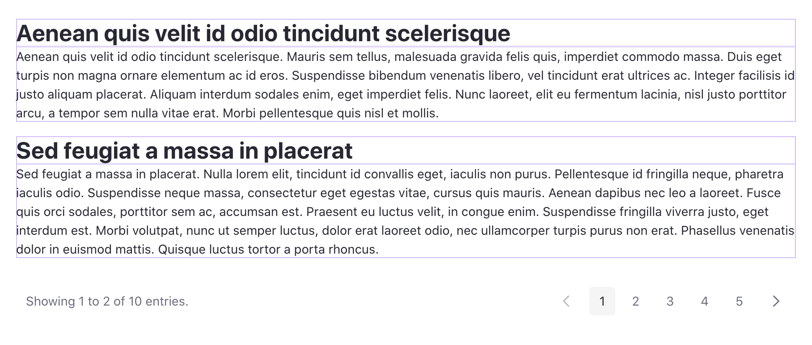

### Search and Filtering Fragments to Collection Displays

Liferay DXP 7.4 includes two new fragments: Collection Filter and Applied Filter.

Using these filters with Collection Display Fragments in your page, you can filter Collections based on different criteria and display what filters have been applied to your Collection.

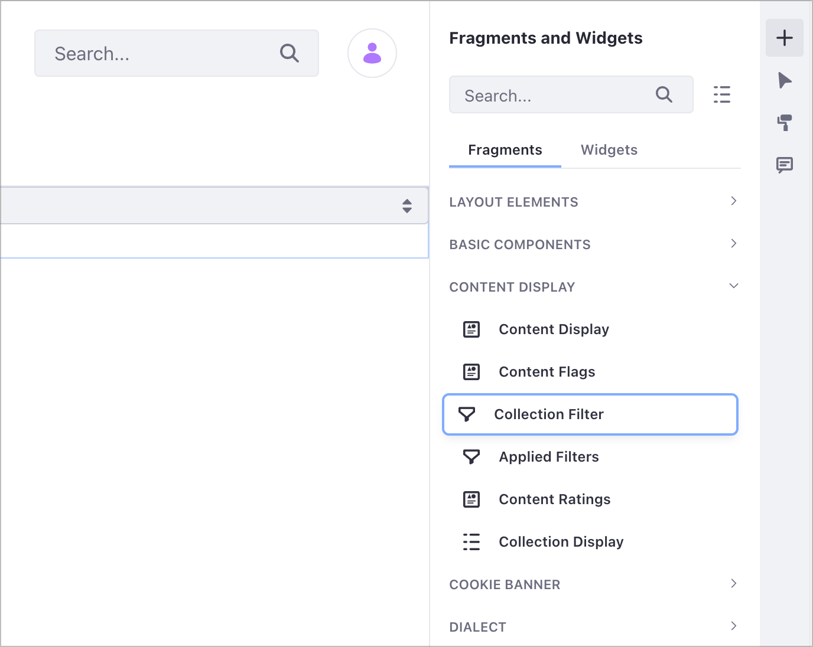

### Display Items Related to One Specific Item with Related Item Collections

When working with the Collection Display Fragment, you can now choose and display items from related Collections using the new Related Items Collection Providers tab.

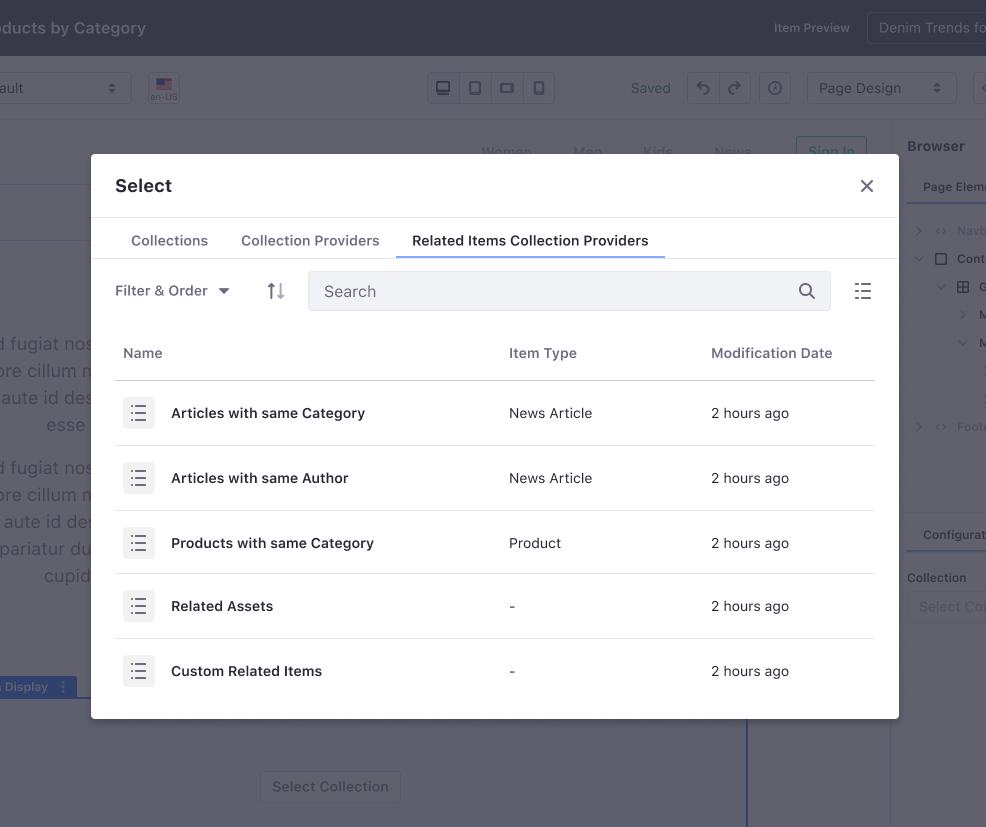

### Define Pre-Filtering Options for the Collection Providers

Developers can now customize Collection Providers using specific configuration fields. This way, users can pre-filter a Collection Provider and have more flexibility to choose items in the Collection Display Fragment. Users can access the filter from the Actions Menu in the Collection Display Fragment.

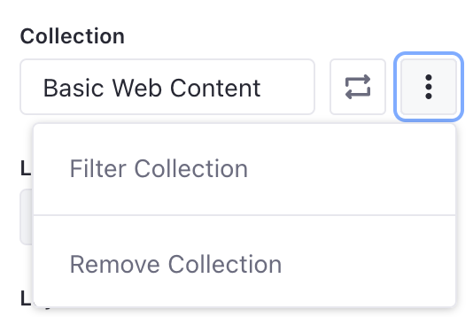

### Specify Sub-Type Fields for Collection Providers as Mapping Elements

When building a Collection Provider with the Info Framework, developers can now include a sub-type field. This allows end users to map fields on the Page to sub-types when using the Collection Provider in a Collection Display Fragment.

### Show/Hide Fragments Based on Viewport

You can hide a Fragment on one Viewport while keeping it visible on another. This new capability allows you to further customize your content's responsiveness for a specific user platform.

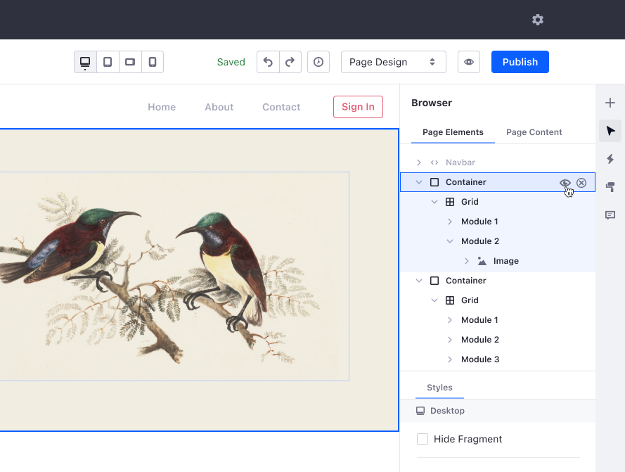

### Native Support for Adaptive Media in Content Pages and Display Page Templates

You can now use [adaptive media in Content Page images](../site-building/creating-pages/building-and-managing-content-pages/configuring-elements-on-content-pages.md) to adjust the image resolution dynamically, based on the target screen size. After you [add an image resolution in Adaptive Media](../content-authoring-and-management/documents-and-media/publishing-and-sharing/serving-device-and-screen-optimized-media/adding-image-resolutions.md), the resolution appears in the Resolution drop-down menu for your Content Page image.

## Reducing the Cost and Effort to Launch and Maintain Digital Experiences

### Automatic Translation for Web Content

This feature helps accelerate the process of [translating web content articles](../content-authoring-and-management/web-content/translating-web-content/automatically-translating-web-content.md). This continues the efforts made in 7.3 to help streamline the translation process of content. With this feature, translators can focus on polishing a translation instead of starting from scratch.

### Expiration Dates for Documents

This feature helps content managers [control outdated documents](../content-authoring-and-management/documents-and-media/uploading-and-managing/using-file-expiration-and-review-dates.md) and prevent them from being published, for example, due to a temporary license.

### Improved WYSIWYG Editor

A new balloon editor has been created by leveraging native CKEditor features. This is a lighter alternative to its predecessor, Alloy Editor, reducing the complexity and maintenance. It also provides some UX improvements, preserving the user-facing features.

### Asset Libraries Can Be Connected with Staging-Enabled Sites

This feature improves the organization and reuse of content for customers in highly regulated sectors where data isolation is key.

Implementing Staging support in Asset Libraries will help customers reduce the amount of effort and cost dedicated to organizing content for multiple sites using the same content while keeping data isolation. This has been backported to 7.3 as well.

### Advanced File Uploader Options When Uploading Documents and Media

Customers use Documents and Media as a media repository to store elements that later are used to create content. However there are situations, for example a blog post or something informal, where the assets used during content creation are uploaded during the content creation process.

To accelerate this process, content creators can now create folders as well as upload files with all the metadata needed from the item selector in order to reduce time and effort in the content creation process.

### Collaborate on Publications

Publications often involves multiple content editors working on a single project. You can now invite teammates to join your publication to view, edit, or publish. You can also discuss changes through the new comment system. Items that are still going through workflow must be approved before they can be published.

### Improved Staging Performance

Publishing Pages in Staging can now be streamlined by publishing only the Page needed without reference to its parent or children. You can also choose whether Asset Links are published along with the Pages.

### Elasticsearch 7.15.x Compatibility Out-of-the-Box

Liferay DXP 7.4 comes with support for Elasticsearch 7.15.x; the [Elasticsearch Sidecar](../using-search/installing-and-upgrading-a-search-engine/elasticsearch/using-the-sidecar-or-embedded-elasticsearch.md) (for development and testing only, not supported) server is version 7.10.2 of the open source Elasticserch distribution.

### Liferay Enterprise Search (LES) Applications Are Now Bundled

Starting with Liferay DXP 7.4, the [Liferay Enterprise Search (LES) applications are included](../using-search/liferay-enterprise-search/activating-liferay-enterprise-search.md) with all Liferay DXP bundles and Docker containers. LES is enabled by default and requires no additional installation steps. However, an LES add-on subscription must be purchased to receive official Liferay Support and additional benefits. Maintenance and updates to LES applications are delivered through Fix Pack and Service Pack releases.

## Leverage Liferay as the Foundation in Your Interconnected Enterprise Landscape

### DXP Accounts

DXP Accounts can model respective entities (companies, employees, and the responsibilities pertaining to their job), facilitate the interactions between these entities (such as purchasing of goods and services), and enable you to document relevant information to support these interactions (Tax ID, Billing and Shipping addresses, personnel structures).

### APIs Everywhere

Liferay DXP includes REST and GraphQL APIs for user management, Site pages and experience, languages, permissions, structured content, and more.

### OAuth2 Enhancements

You can configure registered OAuth 2 applications as trusted applications to avoid manual authorization when obtaining a token.

You can also register OAuth 2 applications so users can have their devices remember their manual authorization (i.e., "remember me").

You can now revoke all existing authorizations of a registered OAuth 2 application with a single click at the OAuth 2 applications' list screen.

### FIDO2 Based Hardware Key Factor Support in Multi-Factor-Authentication

Users can now use the built in multi-factor authentication to [leverage common devices](../installation-and-upgrades/securing-liferay/multi-factor-authentication/fast-identity-online-2.md) (fingerprint readers, USB keys) to authenticate to online services in both mobile and desktop environments.

### Better Data Management in and Maintenance of SAML

Improved attribute mapping user experience gives better control to model the scope and tracking of identifiers used for matching SP users. Changing users' `emailAddress` on the IDP side is not a problem anymore. Custom field mapping became an option also.

There is also a full backwards compatibility: the existing behavior is maintained until you re-configure the SAML integration, and we do not use the SP user's UUID field for any other than the user's purpose for it.

### Click to Chat Integration

An out-of-the-box [integration with a number of chat platforms](../site-building/personalizing-site-experience/enabling-automated-live-chat-systems/enabling-automated-live-chat-systems.md) is available.  Enabling the integration under Instance Settings enables users to chat with representatives at their own convenience.  Please note that a separate subscription with the chat provider is required. The following chat providers are available for OOTB integration:

* Chatwoot
* Crisp
* Hubspot
* JivoChat
* LiveChat
* LivePerson
* Smartsupp
* Tawk.to
* Tidio
* Zendesk

### DocuSign Integration

An out-of-the-box [integration with DocuSign](../content-authoring-and-management/documents-and-media/uploading-and-managing/enabling-docusign-digital-signatures.md) is available. Enabling the integration under Instance Settings enables users to send Digital Signature Envelopes with documents to DocuSign from Documents and Media and the Digital Signature module in the Control Panel.  Users can view previously sent Digital Signature Envelopes to see their status and download signed documents. A separate subscription with DocuSign is required.
