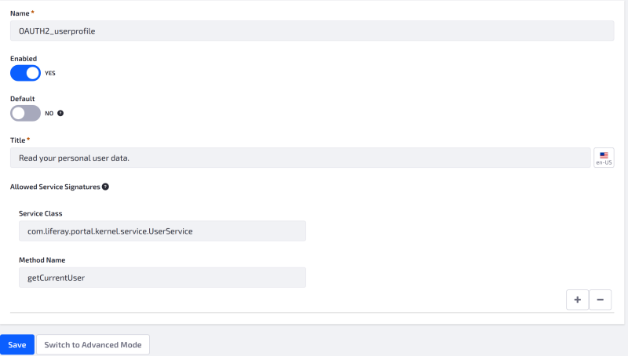
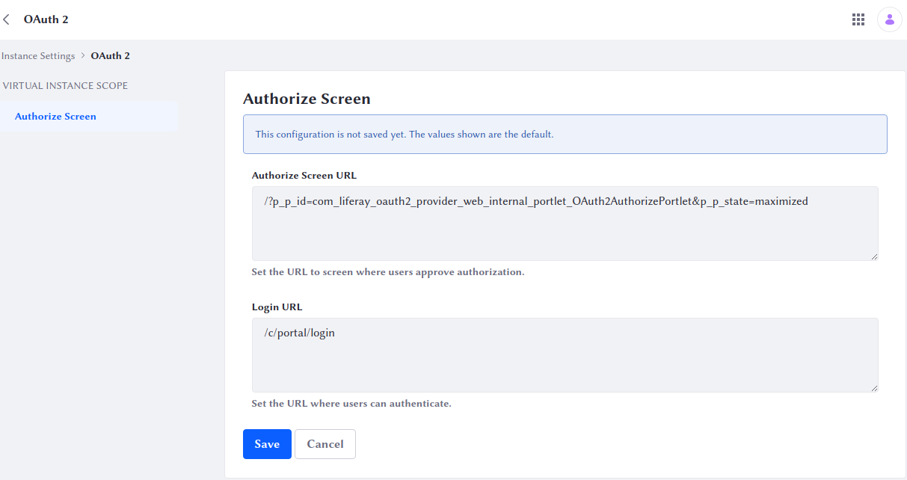

# OAuth 2 Scopes

In OAuth 2.0, applications are granted access to limited subsets of user data. These are called *scopes* (not to be confused with Liferay scopes). They are created in two ways:

* By administrators, by creating a Service Access Policy for the scope.

* By developers, by creating a JAX-RS endpoint. By default, scopes are generated based on the HTTP verbs supported by the JAX-RS endpoint. A special annotation overrides this behavior and registers specific scopes.

## Creating a Scope for a JSONWS Service

The most common way to create a scope is to create a [Service Access Policy](../../installation-and-upgrades/securing-liferay/securing-web-services/setting-service-access-policies.md) prefixed with the name `OAUTH2_`. This naming convention causes the policy to appear in the OAuth application configuration screen as a scope.

For example, say the application needs access to a user's profile information to retrieve the email address. To grant the application access to this, go to *Control Panel* &rarr; *Configuration* &rarr; *Service Access Policy*, and create the policy pictured below.



Note that the policy is not a default policy, and that it grants access only to one method in the `UserService`. This is a JSONWS web service generated by Service Builder. You can view a list of all available services in your installation at this URL:

```
http://[host]:[port]/api/jsonws/
```

Once you create a policy and name it with the `OAUTH2_` prefix, it appears in the *Scopes* tab in OAuth2 Administration.


Now you can select it and save your application.

## Creating the Authorization Page

This step is optional. Users need an interface to authorize access to their accounts, and one is provided automatically. If, however, you want to customize the page, you can create an authorization page in your Site.

1. Open the *Global Menu* (), click the *Control Panel* tab, and go to *Instance Settings* &rarr; *Security* &rarr; *OAuth 2* &rarr; *Authorize Screen*.

   This screen displays the Authorize Screen URL field with this default value: `/?p_p_id=com_liferay_oauth2_provider_web_internal_portlet_OAuth2AuthorizePortlet&p_p_state=maximized`. This corresponds to an internal portlet.

   

1. Set the desired URL for the Authorize Screen (e.g., `/authorize`).

1. Navigate to the desired Site and open the *Site Menu* (),  expand *Site Builder*, and click *Pages*.

1. Click the *Add* button () button and choose *Page*.

   ```{note}
   For Liferay DXP 7.3 and earlier, create a Private Page. Only authenticated users can access Private Pages.
   ```

1. Choose the *Full Page Application* type.

1. Give the page the same name you configured in step 2.

1. Turn the *Hidden from Navigation Menu Widget* switch on. You don't want this page showing up in your Site navigation.

1. On the page that appears next, verify the Friendly URL matches the URL you configured in step 2.

1. Under *Full Page Application*, choose *Application Authorization Request*.

1. Click *Save*.

Excellent! Users can use the default or the UI of your design to go through the authorization process. Now that you have the UI and you understand scopes, it's time to make the authorization process happen in your application.
