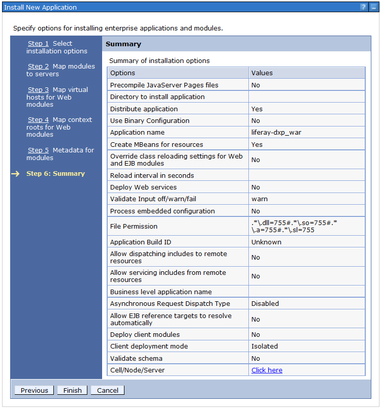

# Installing on WebSphere

Installing Liferay DXP on WebSphere requires installing the DXP WAR, installing dependencies, configuring WebSphere, and starting DXP. You must also configure your database and mail server connections.

> IBM&reg; WebSphere&reg; is a trademark of International Business Machines Corporation, registered in many jurisdictions worldwide.

```{tip}
Throughout this installation and configuration process, WebSphere prompts you to click *Save* to apply changes to the Master Configuration. It is necessary to do so to save the changes.
```

## Prerequisites

For Liferay DXP to work correctly, WebSphere 9 (Fix Pack 11 or newer) must be installed. Go to [IBM Support](http://www-01.ibm.com/support/docview.wss?uid=swg24043005) to find out more information about this fix pack. Liferay DXP does not currently support the WebSphere Application Liberty Profile.

```{important}
Before installing DXP, please review the [Installing a Liferay-Tomcat Bundle](../installing-a-liferay-tomcat-bundle.md) and [Configuring a Database](../configuring-a-database.md) articles.
```

The following files are required to install Liferay DXP on the WebSphere application server and are available from the [Help Center](https://customer.liferay.com/downloads) (subscription) or from [Liferay Community Downloads](https://www.liferay.com/downloads-community):

* DXP WAR file
* OSGi Dependencies ZIP file
* Dependencies ZIP file (DXP 7.3 and earlier)

Liferay DXP requires a Java JDK 8 or 11. See [the compatibility matrix](https://help.liferay.com/hc/en-us/articles/360049238151) to choose a JDK. See [JVM Configuration](../../reference/jvm-configuration.md) for recommended settings.

The [`[Liferay Home]`](../../reference/liferay-home.md) folder is where Liferay DXP stores and manages files and folders required to function. On WebSphere, the `[Liferay Home]` folder is typically `[Install Location]/WebSphere/AppServer/profiles/[your-profile]/liferay`.

## Configuring WebSphere

### Creating a WebSphere Profile

When the application server binaries have been installed, start the *Profile Management Tool* to create a profile appropriate for DXP.

1. Click *Create...*, choose *Application Server*, and then click *Next*.
1. Click the *Advanced* profile creation option and then click *Next*. Use the advanced profile to specify the values for settings such as the location of the profile and names of the profile, node and host, to assign specific ports, or to optionally choose whether to deploy the administrative console and sample application and also add web-server definitions for IBM HTTP Server. See the WebSphere documentation for more information about these options.

    

1. Check the box *Deploy the administrative console*. This enables a web-based UI for working with the application server. Skip the default applications. (Install these only on a development machine.) Click *Next*.
1. Set the profile name and location. Specify a performance tuning settings appropriate for your environment.

   ```{note}
   See the WebSphere documentation for more information about performance tuning settings. Click *Next*.
   ```

1. Choose node, server, and host names for the server. These are specific to a user's environment. Click *Next*.
1. Administrative security in WebSphere is a way to restrict who has access to the administrative tools. You may want to have it enabled in the environment so that a user name and password are required to administer the WebSphere server. See WebSphere's documentation for more information. Click *Next*.
1. Each profile needs a security certificate, which comes next in the wizard. If the certificates are not already generated, choose the option to generate a personal certificate and a signing certificate and click *Next*.
1. Once the certificates are generated, set a password for the keystore. Click *Next*.
1. You can customize the ports this server profile uses. Be sure to choose ports that are open on the machine. When choosing ports, the wizard automatically detects existing WebSphere installations and if it finds activity, will increment ports by one.
1. Choose whether to start this profile when the machine starts. Click *Next*.
1. WebSphere ships with IBM HTTP Server. Choose whether you want a web server definition, so that this JVM receives requests forwarded from the HTTP server. See WebSphere's documentation for details on this. When finished, click *Next*.
1. The wizard then displays a summary of what was selected, enabling you to keep your choices or go back and change something. When finished, click *Next*.

WebSphere then creates the profile and finishes with a message indicating that the profile was created successfully.


Lastly, shut down the application server.

### Configuring the WebSphere Application Server

```{warning}
Do not make configuration changes while the application server is running.
```

In this version of WebSphere, servlet filters are not initialized on web application startup, but rather, on first access. This can cause problems when deploying certain apps to DXP. To configure servlet filters to initialize on application startup (i.e., deployment), set the following `webcontainer` properties in the WebSphere application server:

```properties
com.ibm.ws.webcontainer.initFilterBeforeInitServlet = true
com.ibm.ws.webcontainer.invokeFilterInitAtStartup = true
```

To set `webcontainer` properties in the WebSphere application server, follow the instructions in WebSphere's [documentation](http://www-01.ibm.com/support/docview.wss?rss=180&uid=swg21284395).

### Setting up JVM Parameters for Liferay DXP

Start with modifying this file:

```
[Install Location]/WebSphere/AppServer/profiles/your-profile/config/cells/your-cell/nodes/your-node/servers/your-server/server.xml
```

As a baseline, add `maximumHeapSize="2560"` inside the `jvmEntries` tag. For example:

```xml
<jvmEntries xmi:id="JavaVirtualMachine_1183122130078" ... maximumHeapSize="2560">
```

```{note}
After installing DXP, these configurations (including these JVM options) can be further tuned for improved performance. Please see [Tuning Liferay](../../setting-up-liferay/tuning-liferay.md) and [Tuning Your JVM](../../setting-up-liferay/tuning-your-jvm.md) for more information.
```

You can set the UTF-8 properties in the `<jvmEntries genericJvmArguments=.../>` attribute in `server.xml`. This is required or else international characters will not be parsed correctly. Increase the maximum and minimum heap sizes there too. Add the following inside the `jvmEntries` tag:

```xml
<jvmEntries xmi:id="JavaVirtualMachine_1183122130078" ...genericJvmArguments="--Dfile.encoding=UTF-8 -Djava.locale.providers=JRE,COMPAT,CLDR -Djava.net.preferIPv4Stack=true -Dlog4j2.formatMsgNoLookups=true -Duser.timezone=GMT -Xms6144m -Xmx6144m -XX:MaxNewSize=1536m -XX:MaxMetaspaceSize=768m -XX:MetaspaceSize=768m -XX:NewSize=1536m -XX:SurvivorRatio=7">
```

```{important}
For DXP to work properly, the application server JVM must use the `GMT` time zone and `UTF-8` file encoding.
```

The Java options and memory arguments are explained below.

**JVM Options Explained**

| Option | Explanation |
| :----- | :---------- |
| `-Dfile.encoding=UTF-8` | DXP requires UTF-8 file encoding. |
| `-Djava.locale.providers=JRE,COMPAT,CLDR` | This is required for displaying four-digit dates on JDK 11. |
| `-Djava.net.preferIPv4Stack=true` | Prefers an IPv4 stack over IPv6. |
| `-Dlog4j2.formatMsgNoLookups=true` | Resolves a remote code execution (RCE) vulnerability. See [LPS-143663](https://issues.liferay.com/browse/LPS-143663) for details. |
| `-Duser.timezone=GMT` | DXP requires the application server JVM to use the GMT time zone. |

**Memory Arguments Explained**

| Memory Arguments | Explanation |
| :--------------- | :---------- |
| `-Xms` | Initial space for the heap. |
| `-Xmx` | Maximum space for the heap. |
| `-XX:NewSize`| Initial new space. Setting the new size to half of the total heap typically provides better performance than using a smaller new size. |
| `-XX:MaxNewSize` | Maximum new space. |
| `-XX:MetaspaceSize` | Initial space for static content. |
| `-XX:MaxMetaspaceSize` | Maximum space for static content. |
| `-XX:SurvivorRatio` | Ratio of the new space to the survivor space. The survivor space holds young generation objects before being promoted to old generation space. |

### Removing the `secureSessionCookie` Tag

In the same profile, delete a problematic `secureSessionCookie` tag that can cause DXP startup errors. Note, this is just a default setting; once DXP is installed, tune WebSphere appropriately based on your usage.

In `[Install Location]/WebSphere/AppServer/profiles/your-profile/config/cells/your-cell/cell.xml`, delete the `secureSessionCookie` tag containing `xmi:id="SecureSessionCookie_1"`.

If this tag is not removed, an error similar to this may occur:

```
WSVR0501E: Error creating component com.ibm.ws.runtime.component.CompositionUnitMgrImpl@d74fa901
com.ibm.ws.exception.RuntimeWarning: com.ibm.ws.webcontainer.exception.WebAppNotLoadedException: Failed to load webapp: Failed to load webapp: SRVE8111E: The application, LiferayEAR, is trying to modify a cookie which matches a pattern in the restricted programmatic session cookies list [domain=*, name=JSESSIONID, path=/].
```

### Configuration Checkpoint

By this point, the following steps should be completed:

1. The WebSphere Application Server profile has been created.
1. Servlet filters have been configured to initialize on application startup in the `webcontainer` settings.
1. The JVM parameters have been set in the `server.xml` file.
1. UTF-8 has been set as the file encoding.
1. The server's time zone is set to GMT.
1. The `secureSessionCookie` tag has been removed.

## Installing Dependencies

1. Unzip the OSGi Dependencies ZIP file and place its contents in the `[Liferay Home]/osgi` folder (create this folder if it doesn't already exist). Liferay's OSGi runtime depends on these modules.
1. The DXP 7.4+ WAR file includes drivers for MariaDB and PostgreSQL. Earlier DXP WARs don't have them. If the 7.4+ WAR doesn't have the driver for the supported database you're using, unzip the DXP WAR to an arbitrary location, place your database vendor's JDBC JAR file in the exploded DXP WAR's `WEB-INF/shielded-container-lib` folder, and ZIP up the DXP WAR again.

    Please see the [compatibility matrix](https://help.liferay.com/hc/en-us/articles/360049238151) for a list of supported databases.

```{note}
A Hypersonic database is bundled with DXP and is useful for testing purposes. **Do not** use HSQL for production instances.
```

```{note}
For DXP 7.3 and earlier, Unzip the Dependencies ZIP file and place its contents in the WebSphere application server's `[Install Location]/WebSphere/AppServer/lib/ext` folder. Place your database vendor's JDBC JAR file in that folder too.
```

## Installing Elasticsearch Archives

When you start Liferay DXP 7.3, it installs and starts a default [sidecar](../../../using-search/installing-and-upgrading-a-search-engine/elasticsearch/using-the-sidecar-or-embedded-elasticsearch.md) Elasticsearch server. For the installation to succeed, you must provide some archives:

1. Download the following archives:

    * [Elasticsearch OSS No JDK 7.9](https://www.elastic.co/guide/en/elasticsearch/reference/7.9/release-notes-7.9.0.html) ([available here--7.9.0](https://www.elastic.co/downloads/past-releases/elasticsearch-oss-no-jdk-7-9-0))
    * [ICU Analysis Plugin](https://www.elastic.co/guide/en/elasticsearch/plugins/7.9/analysis-icu.html) ([download](https://artifacts.elastic.co/downloads/elasticsearch-plugins/analysis-icu/analysis-icu-7.9.0.zip))
    * [Japanese (kuromoji) Analysis Plugin](https://www.elastic.co/guide/en/elasticsearch/plugins/7.9/analysis-kuromoji.html) ([download](https://artifacts.elastic.co/downloads/elasticsearch-plugins/analysis-kuromoji/analysis-kuromoji-7.9.0.zip))
    * [Smart Chinese Analysis Plugin](https://www.elastic.co/guide/en/elasticsearch/plugins/7.9/analysis-smartcn.html) ([download](https://artifacts.elastic.co/downloads/elasticsearch-plugins/analysis-smartcn/analysis-smartcn-7.9.0.zip))
    * [Stempel Polish Analysis Plugin](https://www.elastic.co/guide/en/elasticsearch/plugins/7.9/analysis-stempel.html) ([download](https://artifacts.elastic.co/downloads/elasticsearch-plugins/analysis-stempel/analysis-stempel-7.9.0.zip))

1. Copy the downloaded files into `[Liferay Home]`.

When Liferay DXP is started, the archives are unpackaged and installed, and the sidecar Elasticsearch server is started.

### Installing the DXP portlet.jar

DXP's `portlet.jar` (version 3) is backwards-compatible with version 2.0. The DXP 7.4 `.war` includes the `portlet.jar` and the Dependencies ZIP for earlier DXP versions include it too. WebSphere's `portlet.jar` version 2.0 must be overridden.

1. In your `[Install Location]/WebSphere/AppServer/profiles/your-profile/` folder, create a folder called `app_shared_libraries`.

1. Copy the DXP `portlet.jar` from your DXP WAR (7.4+) or from the `[Install Location]/WebSphere/AppServer/lib/ext` folder to the `app_shared_libraries` folder you created.

1. Follow IBM's steps for [using a server-associated shared library](https://www.ibm.com/support/pages/best-practice-using-common-application-files#usingserver); make sure to choose *Classes loaded with local class loader first (parent_Last)* on step 4d.

1. Save the configuration.

### Ensuring That the DXP Portlet.jar is Loaded First

In addition to placing DXP's `portlet.jar` in a server-associated shared library, configure the `config.ini` file so that it is loaded first.

1. Open the `[Install Location]/WebSphere/AppServer/configuration/config.ini` file.
1. Find the property `com.ibm.CORBA,com.ibm`.
1. Insert the property
    `javax.portlet,javax.portlet.filter,javax.portlet.annotations`
    after `com.ibm.CORBA` and before `com.ibm`.
1. Save the file.

### Dependencies Checkpoint

1. DXP dependencies have been installed.
1. DXP's `portlet.jar` has been installed.
1. The `config.ini` file has been configured.

Start the application server profile.

## Database Configuration

DXP contains a built-in Hypersonic database which is great for demonstration purposes but should not be used in production. Beyond demonstration purposes, we recommend using a full-featured, supported RDBMS. See [Configuring a Database](../configuring-a-database.md) to set up the database.

Liferay DXP can connect with your database using DXP's built-in data source (recommended) or using a data source you create on your app server.

To configure DXP's built-in data source with your database when you run DXP for the first time, use the [Setup Wizard](../running-liferay-for-the-first-time.md). Or you can configure the data source in a [`portal-ext.properties` file](../../reference/portal-properties.md) based on [the Database Template](../../reference/database-templates.md) for your database.

If using WebSphere to manage the database connections, follow the instructions below. Otherwise, skip this section if you plan to use DXP's built in data source.

```{warning}
Liferay uses HSQL by default for demo purposes. HSQL should *not* be used in production instances of Liferay DXP.
```


1. Get the JDBC JAR from your DXP WAR (7.4+) or from the database vendor, and copy it to the `[Install Location]/WebSphere/AppServer/lib/ext` folder.
1. Start WebSphere.
1. Open the Administrative Console and log in.
1. Click *Resources &rarr; JDBC Providers*.
1. Select a scope and then click *New*.
1. Select the database type, provider type, and implementation type. If selecting a predefined database, the wizard fills automatically in the name and description fields. If the desired database isn't listed, select *User-defined* from the *Database type* field and then fill in the *Implementation Class Name*. For example, if using MySQL, select *Database type* &rarr; *User-defined*, and then enter `com.mysql.jdbc.jdbc2.optional.MysqlConnectionPoolDataSource` in *Implementation Class Name*. Click *Next*.
1. Clear any text in the class path settings. The necessary JARs have already been copied to a location on the server's class path. Click *Next*.
1. Review the settings and click *Finish*. The final configuration should look like this:

    

1. Click the new provider configuration when it appears in the table.
1. Click *Data Sources* under *Additional Properties*.
1. Click *New*.
1. Enter `liferaydatabasesource` in the *Data source name* field and `jdbc/LiferayPool` in the *JNDI name* field. Click *Next*.
1. Click *Next* in the remaining screens of the wizard to accept the default values. Then review all the changes and click *Finish*.
1. Click the data source when it appears in the table and then click *Custom Properties*.
1. Click the *Show Filter Function* button. This is the second from last of the small icons under the *New* and *Delete* buttons.
1. Enter *user* into the search terms and click *Go*.

    

1. Select the *user* property and give it the value of the user name to the database.
1. Click *OK* and save to master configuration.
1. Do another filter search for the *url* property. Give this property a value that points to the database. For example, a MySQL URL would look like this:

   ```properties
   jdbc:mysql://localhost/lportal?useUnicode=true&characterEncoding=UTF-8&useFastDateParsing=false
   ```

   ```{tip}
   For more example URLs, see the `jdbc.default.url` values in [Database Templates](../../reference/database-templates.md).
   ```

   Click *OK* and save to master configuration.

1. Do another filter search for the *password* property. Enter the password for the user ID added earlier as the value for this property. Click *OK* and save to master configuration.
1. Go back to the data source page by clicking it in the breadcrumb trail. Use the *Test Connection* button to validate configurations to this point.
1. In a `portal-ext.properties` file in **[Liferay_Home]**, specify the data source. For example,

    ```properties
    jdbc.default.jndi.name=jdbc/LiferayPool
    ```

## Mail Configuration

If using DXP's built-in mail sessions, skip this section. See the [Configuring Mail](../../setting-up-liferay/configuring-mail.md) article on how to use DXP's built-in mail sessions.

If you want to use WebSphere to manage the mail session, follow these steps:

### Creating a WebSphere-Managed Mail Session

1. Click *Resources &rarr; Mail &rarr; Mail Providers*.
1. Click the Built-In Mail Provider for the node and server.
1. Click *Mail Sessions* and then click the *New* button.
1. Give the mail session a name of `liferaymail` and a JNDI name of `mail/MailSession`. Fill in the correct information for your mail server in the sections *Outgoing Mail Properties* and *Incoming Mail Properties*. Click *OK* and then save to the master configuration.
1. Click the mail session when it appears in the table and select *Custom Properties* under the *Additional Properties* section. Set any other JavaMail properties required by the mail server, such as the protocol, ports, whether to use SSL, and so on.
1. Click *Security &rarr; Global Security* and de-select *Use Java 2 security to restrict application access to local resources* if it is selected.

    

1. Click *Apply*.
1. In a `portal-ext.properties` file in Liferay Home, specify the mail session. For example,

    ```properties
    mail.session.jndi.name=mail/MailSession
    ```

Note that it might be necessary to retrieve a SSL certificate from mail server and add it to WebSphere's trust store. See WebSphere's documentation for instructions on this.

### Verifying WebSphere Mail Provider

To validate that the mail session has been configured correctly, there are a number of ways to test this once the WAR has been deployed, the server has started, and the user has signed in as the system administrator. One quick way to validate is to create a new user with a valid email account. The newly created user should receive an email notification. The logs should display that the SMTP server has been pinged with the correct port number listed.

## Enable Cookies for HTTP Sessions

WebSphere restricts cookies to HTTPS sessions by default. If using HTTP, this prevents users from signing in to DXP and displays the following error in the console:

```
20:07:14,021 WARN  [WebContainer : 1][SecurityPortletContainerWrapper:341]
User 0 is not allowed to access URL http://localhost:9081/web/guest/home and portlet com_liferay_login_web_portlet_LoginPortlet
```

This occurs because DXP cannot use the HTTPS cookie when using HTTP. The end result is that new sessions are created on each page refresh. Follow these steps to resolve this issue in WebSphere:

1. Click *Application Servers* &rarr; *server1* &rarr; *Session Management* &rarr; *Enable Cookies*.
1. De-select *Restrict cookies to HTTPS sessions*.
1. Click *Apply*.
1. Click *Save*.

## Deploying DXP

1. In WebSphere's administrative console, click *Applications* &rarr; *New Application* &rarr; *New Enterprise Application*.
1. Browse to the DXP `.war` file, select it, and click *Next*.
1. Leave *Fast Path* selected and click *Next*. Ensure that *Distribute Application* has been checked and click *Next* again.
1. Choose the WebSphere runtimes and/or clusters where DXP is to be deployed. Click *Next*.
1. Select the virtual host to deploy DXP on and click *Next*.
1. Map DXP to the root context (`/`) and click *Next*.
1. Select the desired *metadata-complete attribute* setting and click *Next*.
1. Verify that the settings are correct and click *Finish*.
1. When DXP has installed, click *Save to Master Configuration*.

   

DXP has been installed. There are a few more required steps before starting DXP.

## Setting the JDK Version for Compiling JSPs

DXP requires that its JSPs are compiled to the Java 8 bytecode format. To ensure that WebSphere does this, shut down WebSphere after you've deployed the DXP `.war` file. Navigate to the `WEB_INF` folder and add the following setting to the `ibm-web-ext.xml` or in most cases the `ibm-web-ext.xmi` file:

```xml
<jsp-attribute name="jdkSourceLevel" value="18" />
```

The exact path to the `ibm-web-ext.xmi` file depends on the WebSphere installation location and DXP version, but here's an example:

```bash
/opt/IBM/WebSphere/AppServer/profiles/AppSrv01/config/cells/localhostNode01Cell/applications/liferayXX.ear/deployments/liferayXX/liferayXX.war/WEB-INF/ibm-web-ext.xmi
```

Note that the DXP `.war` comes pre-packaged with the `ibm-web-ext.xmi` file; this format is functionally the same as `.xml` and WebSphere recognizes both formats. For more general information on how WebSphere compiles JSPs see IBM's official documentation for [WebSphere Application Server 9.0.0.x](https://www.ibm.com/support/knowledgecenter/en/SSEQTP_9.0.0/com.ibm.websphere.base.doc/ae/rweb_jspengine.html).

## Starting DXP

1. If you want to use the [Setup Wizard](../running-liferay-for-the-first-time.md), skip to the next step. However, if your are using WebSphere's data source and mail session and you want to bypass the Setup Wizard, set this portal property in your `portal-ext.properties` file:

    ```properties
    setup.wizard.enabled=false
    ```

1. Start the application server.
1. In the WebSphere administrative console, navigate to *Enterprise Applications*, select the DXP application, and click *Start*. While DXP is starting, WebSphere displays a spinning graphic.
1. In DXP's setup wizard, select and configure the database type. Click *Finish*. DXP then creates the tables it needs in the database.

After deploying DXP, there may be excessive warnings and log messages, such as the ones below, involving `PhaseOptimizer`. These are benign and can be ignored. Make sure to adjust the app server's logging level or log filters to avoid excessive benign log messages.

```
|     May 02, 2018 9:12:27 PM com.google.javascript.jscomp.PhaseOptimizer$NamedPass process
|     WARNING: Skipping pass gatherExternProperties
|     May 02, 2018 9:12:27 PM com.google.javascript.jscomp.PhaseOptimizer$NamedPass process
|     WARNING: Skipping pass checkControlFlow
|     May 02, 2018 9:12:27 PM com.google.javascript.jscomp.PhaseOptimizer$NamedPass process
|     INFO: pass supports: [ES3 keywords as identifiers, getters, reserved words as properties, setters, string continuation, trailing comma, array pattern rest, arrow function, binary literal, block-scoped function declaration, class, computed property, const declaration, default parameter, destructuring, extended object literal, for-of loop, generator, let declaration, member declaration, new.target, octal literal, RegExp flag 'u', RegExp flag 'y', rest parameter, spread expression, super, template literal, modules, exponent operator (**), async function, trailing comma in param list]
|     current AST contains: [ES3 keywords as identifiers, getters, reserved words as properties, setters, string continuation, trailing comma, array pattern rest, arrow function, binary literal, block-scoped function declaration, class, computed property, const declaration, default parameter, destructuring, extended object literal, for-of loop, generator, let declaration, member declaration, new.target, octal literal, RegExp flag 'u', RegExp flag 'y', rest parameter, spread expression, super, template literal, exponent operator (**), async function, trailing comma in param list, object literals with spread, object pattern rest]
```

If you have a Liferay DXP Enterprise subscription, DXP requests your activation key. See [Activating Liferay DXP](../../setting-up-liferay/activating-liferay-dxp.md) for more information.

Congratulations! You're running Liferay DXP on WebSphere.

## Next Steps

You can [sign in as your administrator user](../../../getting-started/introduction-to-the-admin-account.md) and start [building a solution on DXP](../../../building_solutions_on_dxp.html. Or you can explore [additional Liferay DXP setup](../../setting-up-liferay.md) topics:

* [Installing the Marketplace Plugin](../../../system-administration/installing-and-managing-apps/getting-started/using-marketplace.md#appendix-installing-the-marketplace-plugin)
* [Accessing Plugins During a Trial Period](../../../system-administration/installing-and-managing-apps/installing-apps/accessing-ee-plugins-during-a-trial-period.md)
* [Installing a Search Engine](../../../using-search/installing-and-upgrading-a-search-engine/installing-a-search-engine.md)
* [Securing Liferay DXP](../../securing-liferay.md)
* [Clustering for High Availability](../../setting-up-liferay/clustering-for-high-availability.md)
