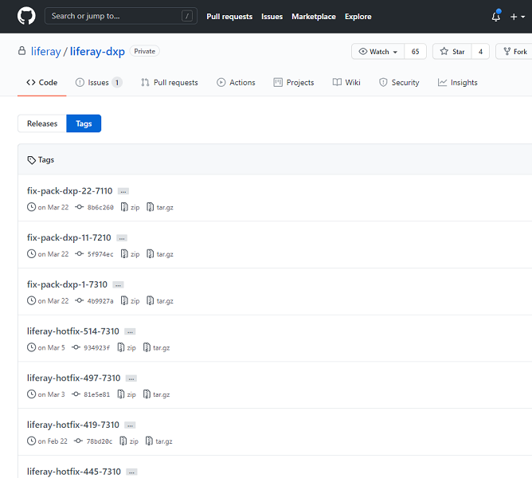
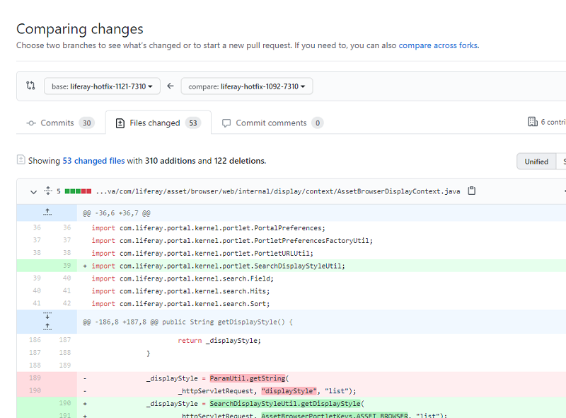

# Accessing DXP Patch Code

Liferay DXP Fix Pack and Hotfix source code is available in a private GitHub repository called `liferay-dxp`. The source code facilitates identifying and understanding changes that may affect your project or your custom code. Fix Packs and Hotfixes have tags that you can access on GitHub.



```note::
   Fix Packs are tagged in their respective DXP version branch (i.e., ``7.0.x``, ``7.1.x``, etc.). Hotfixes have their own branches tagged at the branch head. Since the code at the hotfix branch head and hotfix tag are the same, fetching the branch or tag accesses the same code.
```

Here's what you can do with the code:

* Examine the changed files via diffs
* Compare code from different patches
* View patch implementations
* Download or clone the code to your machine

The figure below shows file diffs between two hotfixes.



```note::
   Tagged branches for Liferay DXP 7.0 and 7.1 patch source code are available starting from these Fix Pack baselines: 

   * Liferay DXP 7.1 Fix Pack 19
   * Liferay DXP 7.0 Fix Pack 96
```

Build files are excluded from the source code because Liferay DXP source code customization is not supported. Liferay DXP's extension points are the only supported customization method. 

* If you want a new extension point or new functionality, please submit a feature request in [JIRA](https://issues.liferay.com).
* If you need assistance customizing Liferay DXP or making a feature request, please contact your Account Executive or Customer Experience Manager.

```note::
   Former Patching Tool source mode commands ``diff`` and ``store`` are not available for DXP 7.3+. They have been removed with no direct replacement. If you've been patching your DXP source code in previous DXP versions and you're upgrading to DXP 7.3+, please examine the new DXP source code and adapt to it.
```

## Requesting Repository Access

The DXP source code in the GitHub repository at <https://github.com/liferay/liferay-dxp> is private and is only for subscribers. Here's how to request repository access:

1. In Help Center, go to the [Projects](https://customer.liferay.com/project-details?_ga=2.57624622.528260345.1619731014-1356934316.1588162379) page.
1. Select your DXP project.
1. Select the *Source Code Access* tab.
1. Click the "+" button. The source code access form appears.
1. Enter the requested information, making sure to include the person's first and last name.
1. Click *Submit*.

```note::
   You can submit access requests on behalf of other project team members.
```

Once your request is approved, you'll receive a repository access invitation email. If you misplace an invitation, access it in GitHub at <https://github.com/liferay/liferay-dxp/invitations>.

```note::
   Requests are processed as soon as possible, in the order they're received. If request volume is high, we may not be able to process your request immediately.
```

Your repository access approval gives you *Read* level permissions. Here are some actions you can perform:

* Pull from the repository
* Fork the repository
* View published releases

Access is maintained for the duration of your Liferay DXP Subscription.

```warning::
   Invitations remain active for seven days and can be accepted even if the team member is no longer listed in the Project Details page. For example, if a GitHub user name is entered incorrectly it belongs to someone, that person can access the repository temporarily. To prevent this, the system checks weekly for new repository collaborators that don't belong to any active Liferay projects and automatically revokes their access.
```

```important::
   GitHub user name changes invalidate respository access. If you change a user name, `remove access for the user <#removing-access>`_ and then request access using the new GitHub user name.
```

## Removing Access

Here's how to remove a repository access for a GitHub user:

1. In [Help Center](https://help.liferay.com/hc/en-us/), go to the [Projects](https://customer.liferay.com/project-details?_ga=2.57624622.528260345.1619731014-1356934316.1588162379) page.
1. Select your DXP project.
1. Select the *Source Code Access* tab.
1. Expand the user's GitHub information.
1. Click *Delete*.

Repository access is removed for the user.

## Privacy

Even though all approved subscribers access the same repository, your GitHub user account and your repository fork remain private by default. Some actions, however, are visible to other repository collaborators. You can maintain privacy by avoiding the following actions and using suggested alternative channels instead.

| Action to Avoid | Alternative Channel |
| :-------------- | :------------------ |
| Editing and deleting your own comments | (1) |
| Opening issues | (1) |
| Closing issues you opened | (1) |
| Reopening issues you closed | (1) |
| Having an issue assigned to you | (1) |
| Sending pull requests from forks | (2) |
| Submitting pull request reviews | (2) |
| Editing wikis | (3) |

**(1) For Issues and Comments:** We close issues raised in the source code repository and leave them unanswered. If there is a Liferay software issue, please notify the Liferay Support team by [creating a support ticket](https://help.liferay.com/hc/en-us/requests/new) in the Help Center. 

**(2) For Code Contributions:** You can contribute code in the public Liferay Portal repository <https://github.com/liferay/liferay-portal>. Approved contributions are included in the next Liferay DXP release. For more information, please see [Contributing to Liferay Development](../../../liferay-internals/contributing_to_liferay_development.html) (Coming soon).

**(3) For Wikis:** The official Liferay DXP documentation is on <https://learn.liferay.com> and the support Knowledge Base is on the [Help Center](https://help.liferay.com/hc/en-us/). We don't use the `liferay-dxp` repository wiki. If you want to suggest article changes or request documentation on a topic, please notify the Liferay Support team by [creating a support ticket](https://help.liferay.com/hc/en-us/requests/new) in the Help Center.

## Additional Information

* [About Open Source at Liferay](https://liferay.dev/open-source)
* [Getting Started with GitHub and Git](https://help.github.com/en/github/getting-started-with-github)
* [Searching for Information on GitHub](https://help.github.com/en/github/searching-for-information-on-github)
* [Cloning a Repository on GitHub](https://help.github.com/en/github/creating-cloning-and-archiving-repositories/cloning-a-repository-from-github)
* [Working with Forks](https://help.github.com/en/github/collaborating-with-issues-and-pull-requests/working-with-forks)
* [Forking Projects](https://guides.github.com/activities/forking/)