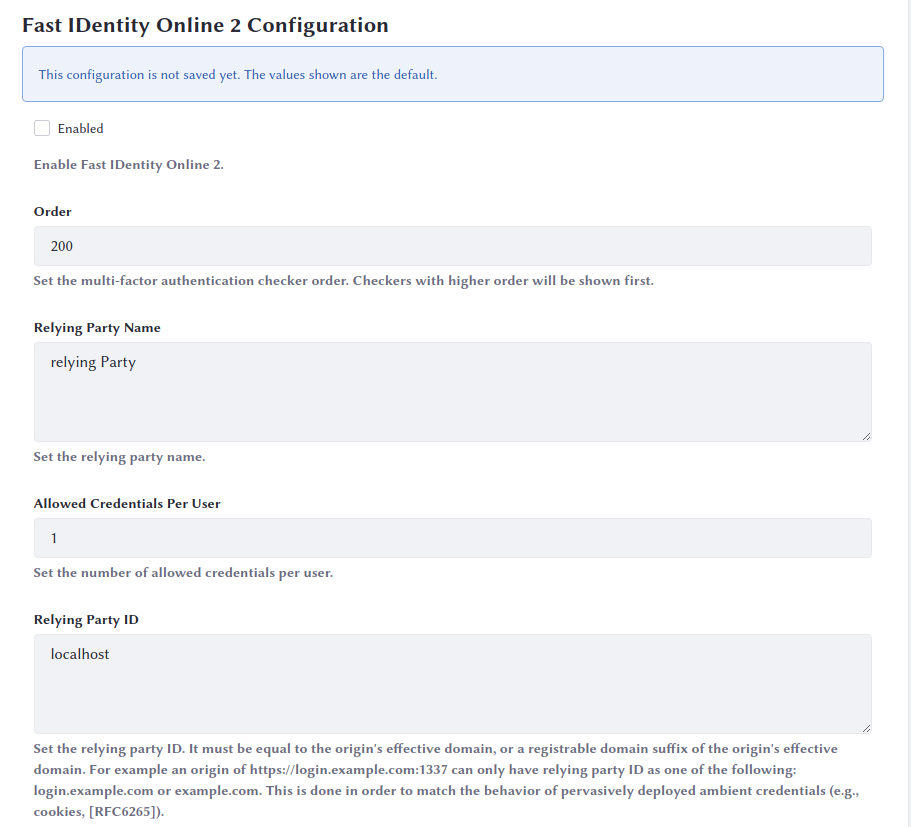
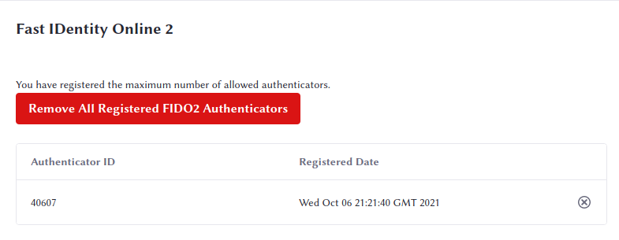
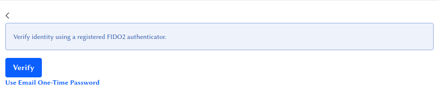

# Fast IDentity Online 2

> Available: Liferay DXP 7.4+

The Fast IDentity Online 2 or FIDO2 standard allows for the use of biometrics (i.e., fingerprint readers), mobile devices, or other security keys for password-less authentication. Administrators need only enable FIDO2 for their instance, and then users can register and use their FIDO2-compliant devices. 

## Enabling FIDO2

1. Go to _Control Panel_ &rarr; _Instance Settings_ &rarr; _Security_ &rarr; _Multi-Factor Authentication_. Make sure you have [enabled multi-factor authentication](./using-multi-factor-authentication.md) before configuring FIDO2. 

1. Click _Fast IDentity Online 2 Configuration_ in the left navigation. 

1. Click the _Enabled_ check box to enable FIDO2. 

This is enough to get started. If you wish to change any of the default settings, you can: 

**Order:** Set the priority for the FIDO2 multi-factor checker. The higher the number, the higher the priority. The default priority is set so that FIDO2 becomes the highest priority checker if enabled. 

**Relying Party Name:** An arbitrary name for your website or installation. 

**Allowed Credentials Per User:** Each user can have this number of FIDO2 devices. 

**Relying Party ID:** The [WebAuthn Relying Party Identifier](https://www.w3.org/TR/webauthn-2/#relying-party). Typically, you set this to the domain name of your website. 

**Origins:** Authenticator responses are compared against this origin URL, which should point to your installation. For security purposes, you should always use `https` to encrypt the connection. 

**Allow Origin Port:** Check this box to include any port number in the origin matching rule. 

**Allow Origin Subdomain:** Check this box to include any origin subdomain in the origin matching rule. 

## Registering a FIDO2 Authenticator

Once FIDO2 is enabled, users can add authenticators in their account settings. 

1. Click your profile picture. 

1. Click _Account Settings_. 

1. A new tab appears at the top, called _Multi-Factor Authentication_. Click it. 

1. Make sure your FIDO2-compliant device is available on the device you're using to browse the site. For example, if it's a laptop with a fingerprint reader, make sure it's active. If it's a USB device such as a [YubiKey](https://www.yubico.com), make sure it's plugged into your device. 

1. To register an authenticator, click the large blue button labeled _Register a FIDO2 Authenticator_. 

Once registered, your device appears in your account settings. 

## Logging in Via FIDO2

Now that your device appears in your profile, you can use it to log in. After supplying your password, the sign-in portlet displays a button offering to verify your identity using a registered FIDO2 authenticator. 

Note that if you don't have your device, you can revert back to the email one-time password. Click _Verify_ to use your device to authenticate. 

Congratulations! You've now authenticated using your FIDO2-compliant device! 
