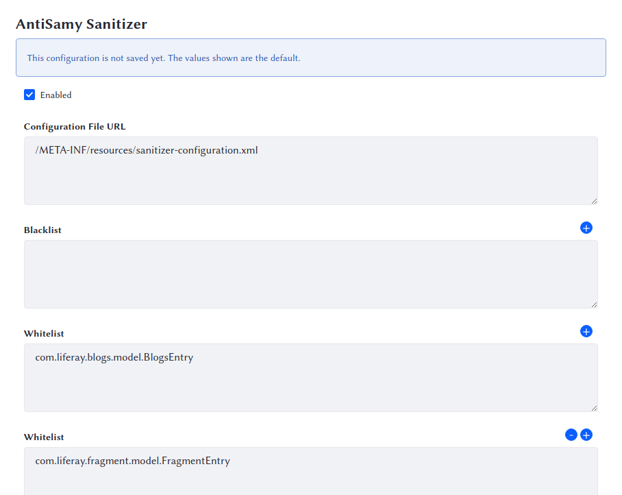

# AntiSamy

Liferay DXP includes an [AntiSamy](https://www.owasp.org/index.php/Category:OWASP_AntiSamy_Project)  module that protects against user-entered malicious code. If your site allows users to post content in message boards, blogs, or other applications, these posts could include malicious code. The AntiSamy module filters HTML/CSS fragments and removes suspect JavaScript code from them. 

The module leverages the powerful [OWASP AntiSamy library](https://www.owasp.org/index.php/Category:OWASP_AntiSamy_Project) to enforce a content policy that's been effective for the auction site [eBay](https://www.ebay.com). The AntiSamy module adds an OWASP AntiSamy implementation to your installation's list of existing sanitizer implementations. Liferay DXP uses the AntiSamy sanitizer and any existing configured sanitizers to scrub user input to blogs entries, calendar events, Message Boards posts, Wiki pages, and Web Content articles.

AntiSamy is enabled by default. 

## Configuring AntiSamy

AntiSamy uses both a blacklist and a whitelist, so you can define subsets of entities that should be sanitized or not sanitized. The whitelist prevents content of that type from being filtered, and the blacklist filters content of that type. 

By default, everything is sanitized except for `JournalArticle`, `BlogsEntry`, and `FragmentEntry`. The assumption is that users posting these kinds of content are trusted, while users posting Message Boards or Wiki articles may not be trusted. If this is not the configuration you want, you can change it: 

1. Navigate to *Control Panel* &rarr; *System Settings* &rarr; *Security Tools* &rarr; *AntiSamy Sanitizer*.

1. Enter a package path you want to sanitize into the *Blacklist* field. 

1. Use the plus (+) button to add further Blacklist fields if you need them. 

1. Enter the fully qualified class name of the object(s) you want sanitized into the _Blacklist_ field(s). 

1. Use the plus (+) button to add further Whitelist fields if you need them. 

1. Enter the fully qualified class name of the object(s) you don't want sanitized into the _Whitelist_ field(s). 

1. If you want to remove a package path from the configuration, click the minus (-) icon. 

1. When finished, click *Save*. 

## Using Wildcards

You can use wildcards in the configuration. For example, if you only want to sanitize message board posts and nothing else, you can

1. Configure the whitelist to `*`

1. Configure the blacklist to `com.liferay.message.boards.*`

The whitelist and the blacklist work together. Without the blacklist, the above configuration's whitelist must include every content type except `com.liferay.message.boards`, which would be a daunting task to configure.

Use AntiSamy to ensure user-generated content stays safe for other users to view. 

## AntiSamy Sanitizer by Class Name

You may notice another way to configure AntiSamy called _AntiSamy Sanitizer by Class Name_. This is a way for developers to create a more nuanced AntiSamy configuration by specifying an AntiSamy configuration XML file for each model class name. At this time, however, it requires developers to provide AntiSamy configuration files by inserting them into the Liferay AntiSamy module (and then re-deploying it), or by creating a fragment bundle project. 

A tutorial is forthcoming for this, but for now you can find more information in the [developer ticket](https://issues.liferay.com/browse/LPS-112978). 
