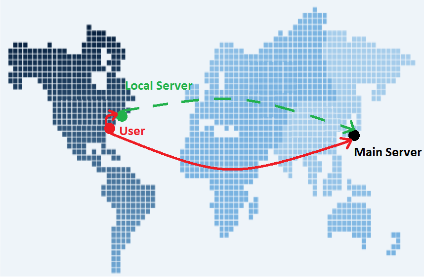
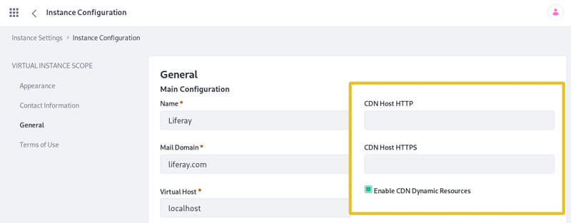

# Using a CDN

A Content Delivery Network (CDN) is a distributed infrastructure for caching static, file-based content. When visitors hit your site, your static content is loaded from the server closest to them, speeding up requests.

The CDN functions as a caching proxy. This means that once static content is copied to a local server, it's stored in a cache for quick and easy retrieval. This improves latency time, because browsers can download static resources from a local server down the street instead of halfway around the world. An algorithm finds the server closest to the request. The figure below depicts using geographical proximity to minimize latency.



The red lines on the map represent the required distances traveled by requests from a server to the user. Because of the reduced wait time for requests and reduced load on your application server, a CDN is a great option to improve performance.

Here are the resources Liferay supports serving via a CDN:

* Files included in Liferay and custom plugins
* Items stored in Documents and Media
* Dynamically generated CSS *
* Dynamically generated JavaScript *
* Dynamically generated images *

_\* Requires enabling CDN dynamic resources._

```{note}
The CDN does not serve resources that are dynamically loaded from external sources.
```

## Liferay CDN Requirements

The CDN must satisfy these requirements:

* *Dynamically store and retrieve resources:* Check with your CDN provider to make sure you don't have to upload anything manually for the CDN to work. The CDN must automatically fetch the resources.

* *Work like a transparent proxy:* A request first goes to the CDN. If the CDN doesn't have the requested resource, the CDN makes an identical request back to the origin (Liferay), caches the resource, then serves the resource.

After setting up a qualified CDN, configure Liferay to use it.

## Configuring Liferay to Use a CDN

Here are the two different methods for configuring a CDN:

1. Set [Content Delivery Network properties](https://docs.liferay.com/dxp/portal/7.3-latest/propertiesdoc/portal.properties.html#Content%20Delivery%20Network) in a [portal properties](../reference/portal-properties.md) file.

1. Use the Control Panel

Here's how to configure your CDN in the Control Panel:

1. In Liferay, click the *Global Menu* () and select the *Control Panel* tab.

1. In the Configuration category, select *Instance Settings*. The Instance Settings page appears.

1. In the Virtual Instance Scope navigation, click *General*. The General Main Configuration page appears and includes these three CDN-related fields:

    * *CDN Host HTTP*
    * *CDN Host HTTPS*
    * *Enable CDN Dynamic Resources*



Make sure to include the protocol and domain when specifying your CDN host(s) URLs:

*CDN Host HTTP:* `http://cdnhost1.liferay.com`
*CDN Host HTTPS:* `https://cdnhost2.liferay.com`

When *CDN Dynamic Resources* is selected (the default), Liferay serves dynamically generated CSS, JavaScript, and images via the CDN. Disabling this allows you to use CDNs that do not support lazy loading of resources.

You've configured the CDN host. Now Liferay generates static resource URLs that replace the old host with your new CDN host so they are automatically cached and served afterwards by the CDN.

## Using a CDN in Custom Plugins

If you want to add a custom resource to the CDN, package it in your plugin. For example, include the resource in your theme plugin or reference a JavaScript file in your portlet plugin's `liferay-portlet.xml` file.

To use a resource via the CDN, prefix the resource reference with the CDN host name, using `themeDisplay.getCDNDynamicResourcesHost()`.

```{important}
Don't put anything on the CDN which requires permission checking or complex policy access
```

Now you know how to serve your site's static resources faster using a CDN.
