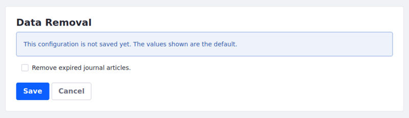

# Data Removal

Current Liferay features may have known unnecessary data. The Data Removal tool removes this data.

Here's how to remove the obsolete data:

1. In the *Control Panel*, navigate to *System Settings* &rarr; *Upgrades* (in the *Platform* category) &rarr; *Data Removal*. The Data Removal screen appears.

    

1. Select the data types you want to remove and click *Save*.

The obsolete data is removed.

## Additional Information

* [Data Cleanup](./data-cleanup.md)
* [Upgrading Via Docker](../upgrade-basics/upgrading-via-docker.md)
* [Using the Upgrade Tool](../upgrade-basics/using-the-database-upgrade-tool.md)