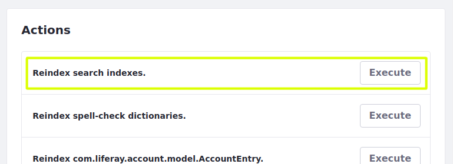
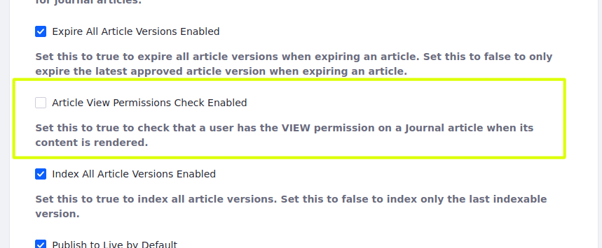

# Post-Upgrade Considerations

After upgrading the database, you should configure Liferay for production again and check up on feature changes that might affect your Liferay instance.

## Re-enable Production Settings

Now that you are done upgrading your database, re-enable your production settings.

### Search Indexing

If you disabled search indexing for upgrading to 7.2, re-enable search indexing by removing the `.config` file you used to disable it or by setting `indexReadOnly="false"` in the `.config` file. For example, 

```bash
rm [Liferay Home]/files/osgi/config/com.liferay.portal.search.configuration.IndexStatusManagerConfiguration.config
```

Reindexing search indexes is required for most upgrades, but is typically not required for applying a service pack or upgrading to a new GA (rolling release) within the same Liferay version. Here's how to reindex:

1. Click on the *Global Menu* () and select the *Control Panel* tab. The Control Panel appears.

1. Click on *Search* in the Configuration section, select the *Index Actions* tab, and click *Execute* for *Reindex all search indexes.* The reindex executes and displays a success message when done.



```note::
   If you upgraded from an older version (7.1 and below) consider `installing Elasticsearch <../../../using-search/installing-and-upgrading-a-search-engine/introduction-to-installing-a-search-engine.md>`_ to handle search indexing.
```

### Database Configurations

Prior to upgrading the database, you may have tuned it for upgrade (see [Database Tuning for Upgrades](../upgrade-stability-and-performance/database-tuning-for-upgrades.md)). Now that the upgrade is complete, restore your production database settings.

```note::
   If you migrated from a sharded environment during data upgrade, then you must make more adjustments to your configurations to complete the transition to virtual instances. See the `Upgrade and Update Properties <../other-upgrade-scenarios/upgrading-a-sharded-environment.md#Upgrade-and-Update-Properties>`_ section for more information.
```

## Installing the Latest Marketplace Apps

If you haven't already installed the latest version of your [Marketplace apps](../../../system-administration/installing-and-managing-apps/installing-apps/downloading-apps.md) for your new Liferay version, install them and use [Gogo shell commands](../upgrade-stability-and-performance/upgrading-modules-using-gogo-shell.md) to check for and execute any database upgrades they require.

## Accounting for Feature Changes

Features and behaviors change with new Liferay versions. Review how the following changes.

### Enable Web Content View Permissions

Prior to 7.1, all users could view Web Content articles by default. Now view permissions are checked by default instead. Here are the main options for opening view permissions:

**Option 1:** Open view permissions for all web content articles by navigating to _Control Panel_ → _Configuration_ → _System Settings_ → _Web Content_ → _Virtual Instance Scope_ → _Web Content_ and de-selecting _Article view permissions check enabled_.



**Option 2:** If few Web Content articles exist, then edit view permissions per Web Content article per role.

### Check Web Content Images

Upgrading to 7.2 moves Web Content images to the [File Store](../../../system-administration/file-storage/configuring-file-storage.md) (also known as the Document Library) and then deletes their former table, `JournalArticleImage`. If an image can't be migrated, Liferay reports the failure.

```
Unable to add the journal article image {filename} into the file repository
```

If there aren't any such messages, all of your images should now be in your File Store. You can preview your Web Content articles to verify the images.

### Account for Deprecations and Features in Maintenance Mode

If you haven't done so already, review the [deprecations and features in maintenance mode](../reference/maintenance-mode-and-deprecations-in-7-3.md) and plan for handling how they affect your Liferay instance.

### Remove Obsolete Data

Clean up data from obsolete features. Please see [Data Cleanup](../reference/data-cleanup.md) for more information.

## Conclusion

Once you've completed all necessary post-upgrade tasks, your Liferay server is ready for normal operations as before. Congratulations!
