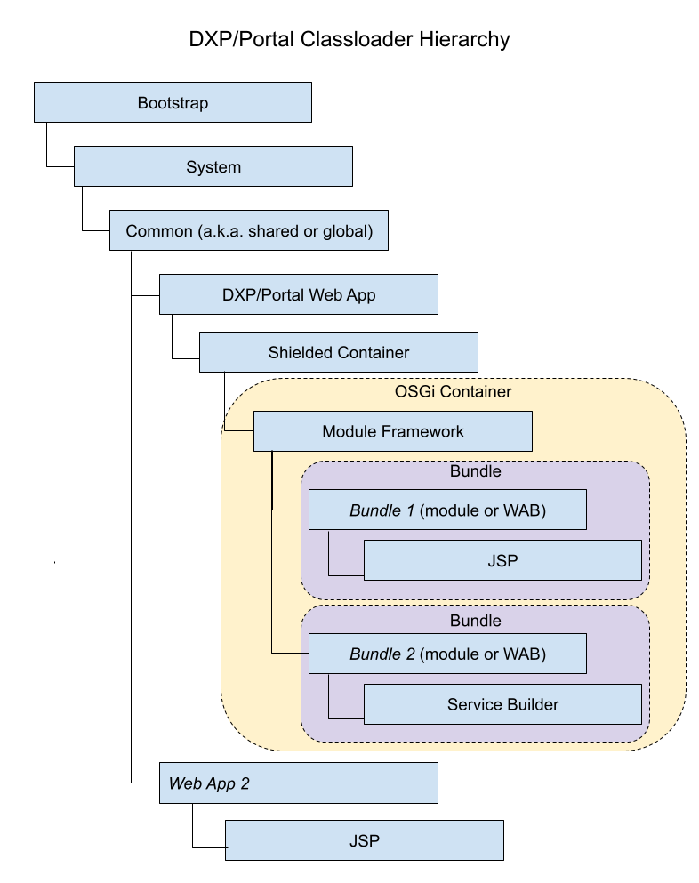

# Liferay Classloader Hierarchy

All Liferay DXP/Portal applications live in an OSGi container. DXP/Portal is a web application deployed on your application server. Its Module Framework bundles (modules) live in the OSGi container and have classloaders. All the classloaders from Java's Bootstrap classloader to classloaders for bundle classes and JSPs are part of a hierarchy.

DXP's classloader has a hierarchy and it can be understood in the following contexts:

* Web application, such as Liferay DXP, deployed on the app server
* OSGi bundle deployed in the Module Framework

The following diagram shows Liferay DXP's classloader hierarchy.

Here are the classloader descriptions:

* **Bootstrap**: The JRE's classes (from packages `java.*`) and Java extension classes (from `$JAVA_HOME/lib/ext`). No matter the context, loading all `java.*` classes is delegated to the Bootstrap classloader.

* **System**: Classes configured on the `CLASSPATH` and or passed in via the application server's Java classpath (`-cp` or `-classpath`) parameter.

* **Common**: Classes accessible globally to web applications on the application server.

* **Web Application (e.g., DXP/Portal)**: Classes in the application's `WEB-INF/classes` folder and `WEB-INF/lib/*.jar`.

    Note, the only Liferay classes that the DXP/Portal web application interacts with are in Liferay's *Shielded Container* JAR files:
    
    * `com.liferay.shielded.container.api.jar`
    * `com.liferay.shielded.container.impl.jar`

* **Shielded Container**: Classes in `WEB-INF/shielded-container-lib/*.jar`.

* **Module Framework**: Liferay's OSGi module framework classloader provides controlled isolation for the module framework bundles.

* **bundle**: Classes from a bundle's packages or from packages other bundles export.

* **JSP**: A classloader that aggregates the following bundle and classloaders:

    * Bundle that contains the JSPs' classloader
    * JSP servlet bundle's classloader
    * Javax Expression Language (EL) implementation bundle's classloader
    * Javax JSTL implementation bundle's classloader

* **Service Builder**: Service Builder classes

The classloader used depends on context. Classloading rules vary between application servers. Classloading in web applications and OSGi bundles differs too. In all contexts, however, the Bootstrap classloader loads classes from `java.*` packages.

Classloading from a web application perspective is up next.

## Web Application Classloading Perspective

Application servers dictate where and in what order web applications, such as Liferay DXP, search for classes and resources. Application servers such as [Apache Tomcat](https://tomcat.apache.org/tomcat-9.0-doc/class-loader-howto.html) enforce the following default search order:

1. Bootstrap classes
1. Web app's `WEB-INF/classes`
1. web app's `WEB-INF/lib/*.jar`
1. System classloader
1. Common classloader

First, the web application searches Bootstrap. If the class/resource isn't there, the web application searches its own classes and JARs. If the class/resource still isn't found, it checks the System classloader and then Common classloader. Except for the web application checking its own classes and JARs, it searches the hierarchy in parent-first order.

Application servers such as [Oracle WebLogic](https://docs.oracle.com/cd/E19501-01/819-3659/beadf/index.html) and IBM WebSphere have additional classloaders. They may also have a different classloader hierarchy and search order. Consult your application server's documentation for classloading details.

## Other Classloading Perspectives

[Bundle Classloading Flow](./bundle-classloading-flow.md) explains classloading from an OSGi bundle perspective.

Classloading for JSPs and Service Builder classes is similar to that of web applications and OSGi bundle classes.

You now know the classloading hierarchy, understand it in context of web applications, and have references to information on other classloading perspectives.

## Additional Information

* [Bundle Classloading Flow](./bundle-classloading-flow.md)