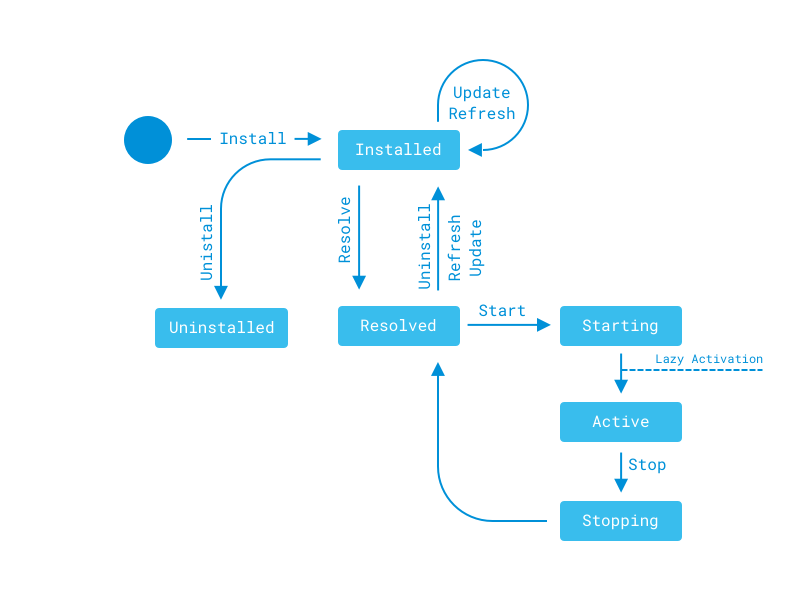

# Module Lifecycle

In OSGi, all components, Java classes, resources, and descriptors are deployed via modules (OSGi bundles). The `MANIFEST.MF` file describes the module's physical characteristics, such as the packages it exports and imports. The module's component description files specify its functional characteristics (i.e., the services its components offer and consume). Also modules and their components have their own lifecycles and administrative APIs. Declarative Services and shell tools give you fine-grained control over module and component deployment.

Since a module's contents depend on its activation, consider the activation steps:

1. *Installation*: Copying the module JAR into the `[Liferay Home]/deploy` folder installs the module to the OSGi framework, marking the module `INSTALLED`.

1. *Resolution*: Once all the module's requirements are met (e.g., all packages it imports are available), the framework publishes the module's exported packages and marks the module `RESOLVED`.

1. *Activation*: Modules are activated *eagerly* by default. That is, they're started in the framework and marked `ACTIVE` on resolution. An active module's components are enabled. If a module specifies a `lazy` activation policy, as shown in the manifest header below, it's activated only after another module requests one of its classes.

    ```properties
    Bundle-ActivationPolicy: lazy
    ```

The figure below illustrates the module lifecycle.

 

The [Apache Felix Gogo Shell](../fundamentals/using-the-gogo-shell/using-the-gogo-shell.md) lets you manage the module lifecycle. You can install/uninstall modules and start/stop them. You can update a module and notify dependent modules to use the update. Liferay's tools, including [Liferay Workspace](../../developing-applications/tooling/liferay-workspace/what-is-liferay-workspace.md), [Blade CLI](../../developing-applications/tooling/blade-cli/installing-and-updating-blade-cli.md), and [Liferay Dev Studio](https://liferay.dev/-/ide) offer similar shell commands that use the OSGi Admin API.

On activating a module, its components are enabled. But only *activated* components can be used. Component activation requires all its referenced services be satisfied. That is, all services it references must be registered. The highest ranked service that matches a reference is bound to the component. When the container finds and binds all the services the component references, it registers the component. It's now ready for activation.

Components can use *delayed* (default) or *immediate* activation policies. To specify immediate activation, the developer adds the attribute `immediate=true` to the [`@Component`](https://docs.osgi.org/javadoc/osgi.cmpn/7.0.0/org/osgi/service/component/annotations/Component.html) annotation.

```java
@Component(
    immediate = true,
    ...
)
```

Unless immediate activation is specified, the component's activation is delayed. That is, the component's object is created and its classes are loaded once the component is requested. In this way, delayed activation can improve startup times and conserve resources.

Gogo Shell's [Service Component Runtime commands](http://felix.apache.org/documentation/subprojects/apache-felix-service-component-runtime.html#shell-command) let you manage components:

* `scr:list [bundleID]`: Lists the module's (bundle's) components.

* `scr:info [componentID|fullClassName]`: Describes the component, including its status and the services it provides.

* `scr:enable [componentID|fullClassName]`: Enables the component.

* `scr:disable [componentID|fullClassName]`: Disables the component. It's disabled on the server (or current server node in a cluster) until the server is restarted.

Service references are static and reluctant by default. That is, an injected service remains bound to the referencing component until the service is disabled. Alternatively, you can specify *greedy* service policies for references. Every time a higher ranked matching service is registered, the framework unbinds the lower ranked service from the component (whose service policy is greedy) and binds the new service in its place automatically. Here's a [`@Reference`](https://docs.osgi.org/javadoc/osgi.cmpn/7.0.0/org/osgi/service/component/annotations/Reference.html) annotation that uses a greedy policy:

```java
@Reference(policyOption = ReferencePolicyOption.GREEDY)
```

Declarative Services annotations let you specify component activation and service policies. Gogo Shell commands let you control modules and components.

## Additional Information

* [Module Projects](../fundamentals/module-projects.md)
* [Gogo Shell Commands](../fundamentals/using-the-gogo-shell/gogo-shell-commands.md)
* [Liferay Workspace](../../developing-applications/tooling/liferay-workspace/what-is-liferay-workspace.md)