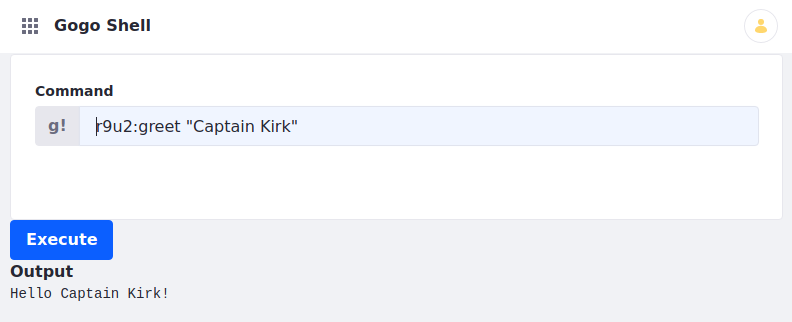

# OSGi and Modularity

Modularity makes writing software, especially as a team, fun! Here are some benefits to modular development on Liferay:

* Liferay's runtime framework is lightweight, fast, and secure.
* The framework uses the [OSGi](https://www.osgi.org/resources/what-is-osgi/) standard. If you have experience using OSGi with other projects, you can apply your existing knowledge.
* Modules publish services to and consume services from a service registry. Service contracts are loosely coupled from service providers and consumers, and the registry manages the contracts automatically.
* Modules' dependencies are managed automatically by the container, dynamically (no restart required). 
* The container manages [module life cycles](./module-lifecycle.md) dynamically. Modules can be installed, started, updated, stopped, and uninstalled while Liferay is running, making deployment a snap.
* Only a module's classes whose packages are explicitly [exported](../fundamentals/exporting-packages.md) are publicly visible; OSGi hides all other classes by default.
* Modules and packages are [semantically versioned](../fundamentals/semantic-versioning.md) and declare dependencies on specific versions of other packages. This allows two applications that depend on different versions of the same packages to each depend on their own versions of the packages. 
* Team members can develop, test, and improve modules in parallel.
* You can use your existing developer tools and environment to develop modules.

There are many benefits to modular software development with OSGi, and we can only scratch the surface here. Once you start developing modules, you might find it hard to go back to developing any other way.

Liferay commonly uses three kinds of modules:

1. **API** modules define interfaces.

1. **Implementation** modules provide concrete classes that implement interfaces.

1. **Client** modules consume the APIs.

You'll learn how to create each one by developing a simple command in [Gogo Shell](../fundamentals/using-the-gogo-shell.md) to greet users when they enter their names.



It's time to see what module projects look like and see Liferay's modular development features in action.

## Deploy the Gogo Shell Command Example

Start using the example.

1. Start a [Liferay Docker container](../../installation-and-upgrades/installing-liferay/using-liferay-docker-images/docker-container-basics.md).

    ```bash
    docker run -it -p 8080:8080 [$LIFERAY_LEARN_PORTAL_DOCKER_IMAGE$]
    ```

1. Download and unzip `liferay-r9u2.zip`.

    ```bash
    curl hhttps://learn.liferay.com/dxp/latest/en/liferay-internals/architecture/liferay-r9u2.zip -O
    ```

    ```bash
    unzip liferay-r9u2.zip
    ```

1. Deploy the example modules.

    ```bash
    cd liferay-r9u2.zip
    ```

    ```bash
    ./gradlew deploy -Ddeploy.docker.container.id=$(docker ps -lq)
    ```

1. Confirm the deployments in the Docker container console.

    ```
    STARTED com.acme.r9u2.api_1.0.0
    STARTED com.acme.r9u2.impl_1.0.0
    STARTED com.acme.r9u2.osgi.commands_1.0.0
    ```

1. Open the [Gogo Shell](../fundamentals/using-the-gogo-shell.md).

1. In the Gogo Shell command field, enter a `r9u2:greet` command to generate a greeting.

    ```groovy
    r9u2:greet "Captain Kirk"
    ```

1. Confirm the output.

    ```
    Hello Captain Kirk!
    ```

The example's client module leverages API and implementation modules to produce the content returned from the `r9u2:greet` Gogo Shell command. Examine each module next.

## API

The API module is first. It defines the contract that a provider implements and a consumer uses. Here is its structure:

```
[project root]
 └── r9u2-api
 │   ├── bnd.bnd
 │   ├── build.gradle
 │   └── src
 │       └── main
 │           └── java
 │               └── com/acme/r9u2
 │                   └── Greeter.java
 │
 └── [Gradle files]
```

The `r9u2-api` module folder contains a `bnd.bnd` metadata file, a `build.gradle` script, and Java code.

Very simple, right? Beyond the Java source file, there are only two other files: a Gradle build script (though you can use any build system you want), and a configuration file called `bnd.bnd`. The `bnd.bnd` file describes and configures the module:

```{literalinclude} ./osgi-and-modularity/resources/liferay-r9u2.zip/r9u2-api/bnd.bnd
```

The `build.gradle` file specifies the module's dependencies.

```{literalinclude} ./osgi-and-modularity/resources/liferay-r9u2.zip/r9u2-api/build.gradle
   :language: groovy
```

It depends on one artifact: the Liferay release API JAR. It is a large JAR packed with Liferay, Bnd, and OSGi artifacts associated with the Liferay product release.

The module's name is *Acme R9U2 API*. Its symbolic name---a name that ensures uniqueness---is `com.acme.r9u2.api`. Its semantic version is declared next, and its package is *exported*, which means it's made available to other modules. This module's package is just an API other modules can implement. 

Finally, there's the Java class, which in this case is an interface:

```{literalinclude} ./osgi-and-modularity/resources/liferay-r9u2.zip/r9u2-api/src/main/java/com/acme/r9u2/Greeter.java
   :language: java
   :lines: 5-10
```

The interface's `@ProviderType` annotation tells the service registry that anything implementing the interface is a provider. The interface's one method asks for a `String` and doesn't return anything. 

That's it! As you can see, creating modules is not very different from creating other Java projects. 

## Implementation

An interface only defines an API; to do something, it must be implemented. This is what the implementation (or provider) module is for. Here's what an implementation module for the Greeter API looks like:

```
[project root]
 └── r9u2-impl
 │   ├── bnd.bnd
 │   ├── build.gradle
 │   └── src
 │       └── main
 │           └── java
 │               └── com/acme/r9u2/internal
 │                   └── R9U2Greeter.java
 │
 └── [Gradle files]
```

It has the same structure as the API module: a build script, a `bnd.bnd` configuration file, and an implementation class. The only differences are the file contents. The `bnd.bnd` file is a little different:

```{literalinclude} ./osgi-and-modularity/resources/liferay-r9u2.zip/r9u2-impl/bnd.bnd
```

The bundle name, symbolic name, and version are all set similarly to the API. 

Finally, there's no `Export-Package` declaration. A client (which is the project's third module) just wants to use the API: it doesn't care how its implementation works as long as the API returns what it's supposed to return. The client, then, only needs to declare a dependency on the API; the service registry injects the appropriate implementation at run time. 

Pretty cool, eh? 

All that's left, then, is the class that provides the implementation:

```{literalinclude} ./osgi-and-modularity/resources/liferay-r9u2.zip/r9u2-impl/src/main/java/com/acme/r9u2/internal/R9U2Greeter.java
   :language: java
   :lines: 7-15
```

The example `greet` method prints an enthusiastic greeting using the given name.

Here is the implementation module `build.gradle` file.

```{literalinclude} ./osgi-and-modularity/resources/liferay-r9u2.zip/r9u2-impl/build.gradle
   :language: groovy
```

It includes a compile-time dependency on the `r9u2-api` module project because it requires the module's `Greeter` class.

That's all there is to an implementation module. 

## Client

The consumer or client uses the API that the API module defines and the implementation module implements. Liferay has many different kinds of consumer modules. [Portlets](../../developing-applications/developing-a-java-web-application/reference/portlets.md) are the most common consumer module type, but since they are a topic all by themselves, this example stays simple by creating an command for the Apache Felix Gogo shell. Note that consumers can, of course, consume many different APIs to provide functionality. 

A consumer module has the same structure as the other module types:

```
[project root]
 └── r9u2-osgi-commands
 │   ├── bnd.bnd
 │   ├── build.gradle
 │   └── src
 │       └── main
 │           └── java
 │               └── com/acme/r9u2/internal/osgi/commands
 │                   └── R9U2OSGiCommands.java
 │
 └── [Gradle files]
```

Again, you have a build script, a `bnd.bnd` file, and a Java class. This module's `bnd.bnd` file is almost the same as the provider's:

```{literalinclude} ./osgi-and-modularity/resources/liferay-r9u2.zip/r9u2-osgi-commands/bnd.bnd
```

There's nothing new here: you declare the same things you declared for the provider. 

The client module depends on the API module and the `release.portal.api` artifact. Here's the `r9u2-osgi-commands` module's `build.gradle` file:

```{literalinclude} ./osgi-and-modularity/resources/liferay-r9u2.zip/r9u2-osgi-commands/build.gradle
   :language: groovy
```

Your Java class has a little bit more going on:

```{literalinclude} ./osgi-and-modularity/resources/liferay-r9u2.zip/r9u2-osgi-commands/src/main/java/com/acme/r9u2/internal/osgi/commands/R9U2OSGiCommands.java
   :language: java
   :lines: 8-21
```

The method above invokes a `Greeter`'s `greet` method. `com.acme.r9u2.Greeter` is the OSGi service type that the implementation module registers. Getting a `Greeter` service from the registry requires adding an [`@Reference`](https://docs.osgi.org/javadoc/osgi.cmpn/7.0.0/org/osgi/service/component/annotations/Reference.html) annotation to the `Greeter` field `_greeter`.

The `R9U2OSGiCommands` class provides an OSGi service of its own type. The two properties define a Gogo shell command with a command function called `greet` in a scope called `r9u2`. The deployed `R9U2OSGiCommands` component provides the Gogo Shell command `r9u2:greet` that takes a `String` as input.

This most basic of examples should make it clear that module-based development is easy and straightforward. The API-Provider-Consumer contract fosters loose coupling, making your software easy to manage, enhance, and support. 

## A Typical Liferay Application

If you look at a typical application from Liferay's source, you'll generally find at least four modules: 

* API module
* Service (provider) module
* Test module
* Web (consumer) module

This is exactly what you'll find for some smaller applications, like the Mentions application that lets users mention other users with the `@username` nomenclature in comments, blogs, or other applications. Larger applications like the Documents and Media library have more modules. In the case of the Documents and Media library, there are separate modules for different document storage back-ends. In the case of the Wiki, there are separate modules for different Wiki engines. 

Encapsulating capability variations as modules facilitates extensibility. If you have a document storage back-end that Liferay doesn't yet support, you can implement Liferay's document storage API for your solution by developing a module for it and thus extend Liferay's Documents and Media library. If there's a Wiki dialect that you like better than what Liferay's wiki provides, you can write a module for it and extend Liferay's wiki. 

Are you excited yet? Are you ready to start developing? Here are some resources for you to learn more. 

## Additional Information

* [OSGi Alliance](https://www.osgi.org/)
* [Getting started with OSGi at OSGi EnRoute](https://enroute.osgi.org/)
* [Developing Applications](../../developing_applications.html)
* [Developer Tools Overview](../../developing-applications/tooling/developer-tools-overview.md)
* [Starting with a Docker Image](../../getting-started/starting-with-a-docker-image.md)
