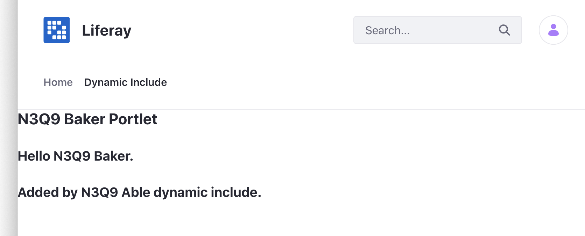

# Customizing JSPs with Dynamic Includes

The
[`liferay-util:dynamic-include` tag](https://learn.liferay.com/reference/latest/en/dxp/taglibs/util-taglib/liferay-util/dynamic-include.html) 
is a placeholder into which you can inject content---JavaScript code, HTML, 
and more. The example project demonstrates how to inject content with a dynamic include.

## Deploy the Example Project

1. Start Liferay DXP. If you don't already have a docker container, use

   ```bash
   docker run -it -m 8g -p 8080:8080 [$LIFERAY_LEARN_DXP_DOCKER_IMAGE$]
   ```

   If you're running a different Liferay Portal version or Liferay DXP, adjust the above command accordingly.

1. Download and unzip [Customizing JSPs with Dynamic Includes](./liferay-n3q3.zip).

   ```bash
   curl https://learn.liferay.com/dxp/latest/en/liferay-internals/extending-liferay/customizing-jsps/liferay-n3q3.zip -O
   ```

   ```bash
   unzip liferay-n3q3.zip
   ```

1. From the module root, build and deploy.

   ```bash
   ./gradlew deploy -Ddeploy.docker.container.id=$(docker ps -lq)
   ```

   ```{note}
   This command is the same as copying the deployed jars to /opt/liferay/osgi/modules on the Docker container.
   ```

1. Confirm the deployment in the Liferay Docker container console.

   ```bash
   STARTED com.acme.n3q9.able.web_1.0.0 [1459]
   STARTED com.acme.n3q9.baker.web_1.0.0 [1460]
   ```

1. Verify that the example module works. Open your browser to `https://localhost:8080`.

1. Navigate to a Site page and click the Edit icon (). Add the N3Q3 Baker Portlet to the page. The widget can be found under Sample widgets.

   

   Note, the first two lines come from the N3Q3 Baker Portlet but the third line is injected from N3Q3 Able module's dynamic include.

## Implement the Dynamic Include

1. Declare the class as an implementation of `DynamicInclude` with the `@Component` annotation.

   ```java
   @Component(service = DynamicInclude.class)
   ```

1. In the `include` method, add your custom content. The sample project uses a simple `PrintWriter` example.

   ```{literalinclude} ./customizing-jsps-with-dynamic-includes/resources/liferay-n3q9.zip/n3q9-able-web/src/main/java/com/acme/n3q9/able/web/internal/servlet/taglib/N3Q9AbleDynamicInclude.java
   :dedent: 1
   :language: java
   :lines: 16-25
   ```

2. In the `register` method, specify the dynamic include tag to use. In the sample, the register method targets the dynamic include of Baker module's `view.jsp`.

   ```java
	@Override
	public void register(DynamicIncludeRegistry dynamicIncludeRegistry) {
		dynamicIncludeRegistry.register("com.acme.n3q9.baker.web#view.jsp");
	}
   ```

## Insert the Dynamic Include

Add the `liferay-util:dynamic-include` tag where you want the dynamic include to be injected. In the sample, the tag is added to the bottom of N3Q3 Baker Portlet's `view.jsp`.

```{literalinclude} ./customizing-jsps-with-dynamic-includes/resources/liferay-n3q9.zip/n3q9-baker-web/src/main/resources/META-INF/resources/view.jsp
   :language: jsp
```

Make sure the dynamic include `key` matches the target set in the `register()` method above. 

See [Using a JSP and MVC Portlet](../../../building-applications/developing-a-java-web-application/using-mvc/using-a-jsp-and-mvc-portlet.md) to learn more about JSPs and portlets.
