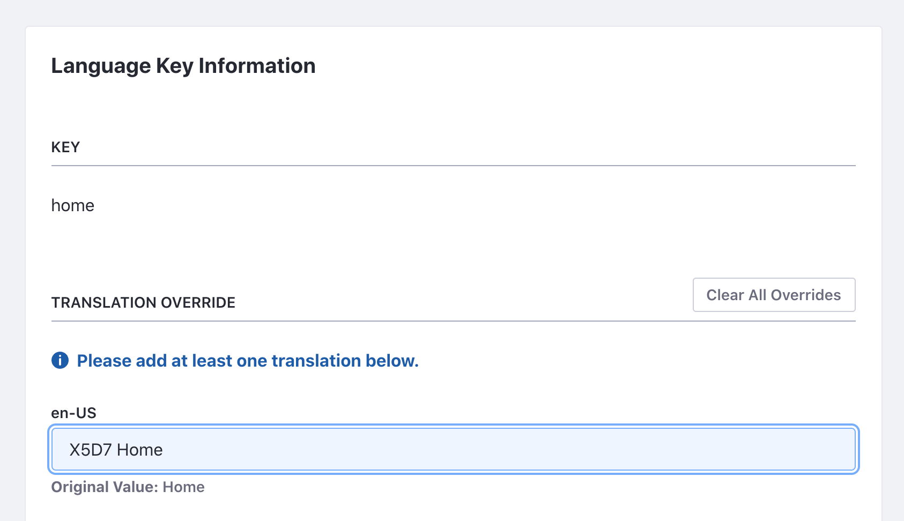

# Overriding Global Language Keys

Liferay uses language keys for user interface messages. Whether the default language or a language for another locale, the global keys can be overridden by using a custom language module.

```Note
Most of Liferay's language keys are found in the global language key files. But some may be located in a specific application's module. The process of `overriding module language keys <./overriding-module-language-keys.md>`_ is different from overriding the global keys.
```

## Examining the Global Language Keys

Liferay's global language keys are in the source code or your bundle.

From the source: 

`/portal-impl/src/content/Language[xx_XX].properties`

From a bundle:

`portal-impl.jar`

You can also view the different language key files in our [GitHub repository](https://github.com/liferay/liferay-portal/tree/master/portal-impl/src/content). You can identify the different languages by the language code in the filename suffix. For example `Language_ja.properties` is for Japanese.

These language key files contain properties that you can override, like the language settings properties: 

```properties
...
lang.user.name.field.names=prefix,first-name,middle-name,last-name,suffix
lang.user.name.prefix.values=Dr,Mr,Ms,Mrs
lang.user.name.required.field.names=last-name
lang.user.name.suffix.values=II,III,IV,Jr,Phd,Sr
...
```

There are also many simple keys you can override to update default messages and labels.

```properties
category.admin=Admin
category.alfresco=Alfresco
category.christianity=Christianity
category.cms=Content Management
...
```

The example code changes the default `publish` language key to a custom key. 

 ```properties
 publish=Publish
 ```

## Deploy the Example

To see an example of overriding a global language key:

1. Start Liferay DXP. If you don't already have a docker container, use

    ```bash
    docker run -it -p 8080:8080 [$LIFERAY_LEARN_DXP_DOCKER_IMAGE$]
    ```

    If you're running a different Liferay Portal CE version or Liferay DXP, adjust the above command accordingly. 

1. Download and unzip [Overriding Global Language Keys](./liferay-x8f3.zip).

    ```bash
    curl https://learn.liferay.com/dxp/latest/en/liferay-internals/extending-liferay/liferay-x8f3.zip -O
    ```

    ```bash
    unzip liferay-x8f3.zip
    ```

1. From the module root, build and deploy.

    ```bash
    ./gradlew deploy -Ddeploy.docker.container.id=$(docker ps -lq)
    ```

    ```note::
       This command is the same as copying the deployed jars to /opt/liferay/osgi/modules on the Docker container.
    ```

1. Confirm the deployment in the Liferay Docker container console.

    ```bash
    STARTED com.acme.x8f3.impl_1.0.0 [3209]
    ```

1. Verify that the example module is working. Open your browser to `https://localhost:8080`

1. Navigate to a page to see a publish button. For example, click the edit icon () of a Site page. The publish button is now showing the custom language key.

    

1. The tutorial code also includes examples for other locales. For example, use the language selector to select Brazilian Portuguese or Japanese to see the custom language key. The module overrides language keys for each locale you include in the module.

    

Now that you've seen the example, let's see how it works. 

## Create the Language Properties File

First select which keys you wish to override. For example, the tutorial code overrides the `Publish` language key.

Once you've decided which keys to override, create a language properties file in your module's `src/main/resources/content` folder. In your file define the keys your way. Make sure the filename of your language properties file matches the locale you wish to override. For example, if overriding Japanese, use `Language_ja.properties`.

## Create the Language Resource Bundle

In your module, create a class that extends `java.util.ResourceBundle` for the locale you're overriding. Here's an example resource bundle class for the `en_US` locale:

```java
@Component(property = "language.id=en_US", service = ResourceBundle.class)
public class X8F3EnglishResourceBundle extends ResourceBundle {

	@Override
	public Enumeration<String> getKeys() {
		return _resourceBundle.getKeys();
	}

	@Override
	protected Object handleGetObject(String key) {
		return _resourceBundle.getObject(key);
	}

	private final ResourceBundle _resourceBundle = ResourceBundle.getBundle(
		"content.Language_en_US", UTF8Control.INSTANCE);

}
```

The class's `_resourceBundle` field is assigned a `ResourceBundle`. The call to `ResourceBundle.getBundle` needs two parameters. The `content.Language_en_US` parameter is the language file's qualified name with respect to the module's `src/main/resources/content` folder. The second parameter is a `control` that sets the language syntax of the resource bundle. To use language syntax identical to Liferay's syntax, import Liferay's `com.liferay.portal.kernel.language.UTF8Control` class and set the second parameter to `UTF8Control.INSTANCE`. 

The class's `@Component` annotation declares it an OSGi `ResourceBundle` service component. Its `language.id` property designates it for the `en_US` locale. 

```java
@Component(property = "language.id=en_US", service = ResourceBundle.class)
```

The class overrides these methods:

**`handleGetObject`:** Looks up the key in the module's resource bundle (which is based on the module's language properties file) and returns the key's value as an `Object`. 

**`getKeys`:** Returns an `Enumeration` of the resource bundle's keys. 

Your resource bundle service component redirects the default language keys to your module's language key overrides.

**Note:** Global language key overrides for multiple locales require a separate resource bundle class for each locale. For example, the tutorial code has one for English, Japanese, and Portuguese. Each resource bundle must specify its locale in the `language.id` component property definition and in the language file qualified name parameter. For example, here is what they look like for the Japanese locale.

Component definition:

```java
@Component(property = "language.id=ja", service = ResourceBundle.class)
```

Resource bundle assignment:

```java
	private final ResourceBundle _resourceBundle = ResourceBundle.getBundle(
		"content.Language_ja", UTF8Control.INSTANCE);
```

## Related Information

* [Overriding Module Language Keys](./overriding-module-language-keys.md)
