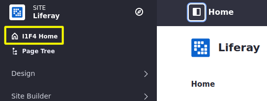

# Overriding Global Language Keys

Liferay utilizes language keys for user interface messages. Whether the default language or a language for another locale, the global keys can be overridden by using a custom language module.

```Note
Most of Liferay's language keys are found in the global language key files. But some may be located in a specific application's module. The process of `overriding a module's language keys <./overriding-a-modules-language-keys.md>`_ is different from overriding the global keys.
```

## Overview

1. [Examining the Global Language Keys](#examining-the-global-language-keys)
1. [Deploy the Example](#deploy-the-example)
1. [Walk Through the Example](#walk-through-the-example)

## Examining the Global Language Keys

Liferay's global language keys are located in the source code or your bundle.

From the source: 

`/portal-impl/src/content/Language[xx_XX].properties`

From a bundle:

`portal-impl.jar`

You can also view the different language key files in our [GitHub repository](https://github.com/liferay/liferay-portal/tree/master/portal-impl/src/content). Note that the language keys for different languages can be identified by the filename ending. For example `Language_ja.properties` would be for Japanese.

These language key files contain properties that you can override, like the language settings properties: 

```properties
##
## Language settings
##

...
lang.user.name.field.names=prefix,first-name,middle-name,last-name,suffix
lang.user.name.prefix.values=Dr,Mr,Ms,Mrs
lang.user.name.required.field.names=last-name
lang.user.name.suffix.values=II,III,IV,Jr,Phd,Sr
...
```

There are also many simple keys you can override to update default messages and
labels.

```properties
##
## Category titles
##

category.admin=Admin
category.alfresco=Alfresco
category.christianity=Christianity
category.cms=Content Management
...
```

In our example code we will change the default `publish` language key to a custom key. 
    
    `publish=Publish`

## Deploy the Example

To see an example of overriding a global language key:

1. Start Liferay DXP. If you don't already have a docker container, use

    ```bash
    docker run -it -p 8080:8080 [$LIFERAY_LEARN_DXP_DOCKER_IMAGE$]
    ```

    If you're running a different Liferay Portal CE version or Liferay DXP, adjust the above command accordingly. 

1. Download and unzip [Overriding Global Language Keys](./liferay-x8f3.zip).

    ```bash
    curl https://learn.liferay.com/dxp/7.x/en/liferay-internals/extending-liferay/liferay-x8f3.zip -O
    ```

    ```bash
    unzip liferay-x8f3.zip
    ```

1. From the module root, build and deploy.

    ```bash
    ./gradlew deploy -Ddeploy.docker.container.id=$(docker ps -lq)
    ```

    ```note::
       This command is the same as copying the deployed jars to /opt/liferay/osgi/modules on the Docker container.
    ```

1. Confirm the deployment in the Liferay Docker container console.

    ```bash
    STARTED com.acme.x8f3.impl_1.0.0 [3209]
    ```

1. Verify that the example module is working. Open your browser to `https://localhost:8080`

1. Navigate to a page to see a publish button. For example, click the edit icon () of a Site page. 

    

Now that you've seen the example, let's see how it works. 

## Walk Through the Example

