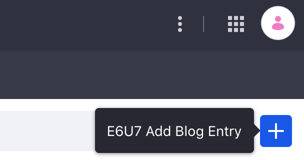
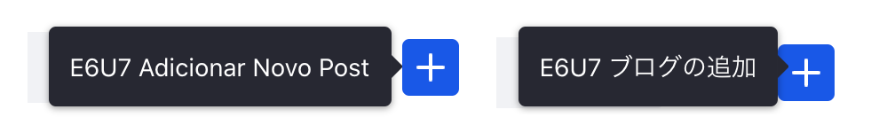

# Overriding Module Language Keys in Earlier Versions

```{important}
If you're working with Liferay DXP/Portal 7.4+, please follow the instructions for [Overriding Global Language Keys](./overriding-global-language-keys.md).
```

Overriding Liferay application specific language keys in earlier versions is similar to overriding global language keys in earlier versions but there are additional steps. 

## Examining Module Language Keys

To override a module's language key, you must first gather information about the module in [Gogo shell](../fundamentals/using-the-gogo-shell/using-the-gogo-shell.md). For example if you wish to override a language key in the blogs module, `grep` for the keyword "blogs". The Gogo command and output might look like this: 

 ```
 g! lb | grep Blogs
 Output
 418|Active     |   10|Liferay Collaboration - Liferay Blogs - API (1.0.0)|1.0.0
 419|Active     |   10|Liferay Blogs API (6.4.5)|6.4.5
 420|Active     |   10|Liferay Blogs Item Selector API (4.0.5)|4.0.5
 421|Active     |   10|Liferay Blogs Recent Bloggers API (4.0.5)|4.0.5
 570|Active     |   10|Liferay Adaptive Media Blogs Editor Configuration (4.0.5)|4.0.5
 571|Active     |   10|Liferay Adaptive Media Blogs Item Selector Web (4.0.5)|4.0.5
 572|Active     |   10|Liferay Adaptive Media Blogs Web (4.0.9)|4.0.9
 573|Resolved   |   10|Liferay Adaptive Media Blogs Web Fragment (4.0.6)|4.0.6
 671|Active     |   15|Liferay Sharing Blogs (2.0.6)|2.0.6
 1126|Active     |   10|Liferay Collaboration - Liferay Blogs - Impl (1.0.0)|1.0.0
 1127|Active     |   10|Liferay Blogs Editor Configuration (4.0.8)|4.0.8
 1128|Active     |   15|Liferay Blogs Item Selector Web (5.0.9)|5.0.9
 1129|Active     |   10|Liferay Blogs Layout Prototype (5.0.8)|5.0.8
 1130|Active     |   10|Liferay Blogs Reading Time (3.0.11)|3.0.11
 1131|Active     |   15|Liferay Blogs Recent Bloggers Web (5.0.11)|5.0.11
 1132|Active     |   10|Liferay Blogs Service (4.0.24)|4.0.24
 1133|Active     |   10|Liferay Blogs UAD (5.0.6)|5.0.6
 1134|Active     |   15|Liferay Blogs Web (5.0.36)|5.0.36
 true
 ```

Take note of the module's ID number. Use the `headers` command to get a list of the bundle's headers. In this case it's 1134 for the Liferay Blogs Web module.

 ```
 g! headers 1134
 Output
 Bundle headers:
 Bnd-LastModified = 1601503219290
 Bundle-ManifestVersion = 2
 Bundle-Name = Liferay Blogs Web
 Bundle-SymbolicName = com.liferay.blogs.web
 Bundle-Vendor = Liferay, Inc.
 Bundle-Version = 5.0.36
 ...
 Web-ContextPath = /blogs-web
 ```

Note the `Bundle-SymbolicName`, `Bundle-Version`, and the `Web-ContextPath`. The `Web-ContextPath` value following the `/` is the module's context name.

Use the bundle symbolic name or context name to find the language keys specific to the module. Find the module's JAR file and examine its language keys. Liferay follows this module JAR file naming convention:

 ```
 [bundle symbolic name]-[version].jar
 ```

For example, the Blogs Web version 5.0.36 module is in `com.liferay.blogs.web-5.0.36.jar`.

Here's where to find the module JAR:

* Liferay's [Nexus repository](https://repository.liferay.com/nexus/content/repositories/liferay-public-releases/com/liferay/)
* `[Liferay Home]/osgi/modules`
* Liferay's [GitHub repository](https://github.com/liferay/liferay-portal/tree/master/modules/apps) for `/modules/apps`

The language property files are in the module's `src/main/resources/content` folder. Identify the language keys you want to override in the `Language[xx_XX].properties` files.

Note that the language keys for different languages can be identified by the filename ending. For example `Language_ja.properties` would be for Japanese.

The example changes the default `Add Blog Entry` language key to a custom key. Now it's time to deploy it. 

1. Start Liferay DXP. If you don't already have a docker container, use

    ```bash
    docker run -it -m 8g -p 8080:8080 [$LIFERAY_LEARN_DXP_DOCKER_IMAGE$]
    ```

1. Download and unzip [Overriding Module Language Keys](./liferay-e6u7.zip).

    ```bash
    curl https://learn.liferay.com/dxp/latest/en/liferay-internals/extending-liferay/liferay-e6u7.zip -O
    ```

    ```bash
    unzip liferay-e6u7.zip
    ```

1. From the module root, build and deploy.

    ```bash
    ./gradlew deploy -Ddeploy.docker.container.id=$(docker ps -lq)
    ```

    ```note::
       This command is the same as copying the deployed jars to /opt/liferay/osgi/modules on the Docker container.
    ```

1. Confirm the deployment in the Liferay Docker container console.

    ```bash
    STARTED com.acme.e6u7.impl_1.0.0 [1650]
    ```

1. Verify that the example module is working. Open your browser to `https://localhost:8080`

1. Navigate to *Content & Data* &rarr; *Blogs*. Move your cursor over the add icon (). The message now shows the custom language key.

    

1. The tutorial code also includes examples for other locales. For example, use the language selector to select Brazilian Portuguese or Japanese to see the custom language key. The module overrides language keys for each locale you include in the module.

    

Now you can see how the code works.

## Create the Language Properties File

First select the keys you wish to override. For example, the tutorial code overrides the `Add Blog Entry` language key.

Once you've decided which keys to override, create a language properties file in your module's `src/main/resources/content` folder. In your file define the keys your way. Make sure the filename matches the locale you wish to override. For example, if Japanese, use `Language_ja.properties`.

## Create the Language Resource Bundle

In your module, create a class that extends `java.util.ResourceBundle` for the locale you're overriding. Here's an example resource bundle class for the `en_US` locale:

```java
@Component(property = "language.id=en_US", service = ResourceBundle.class)
public class E6U7EnglishResourceBundle extends ResourceBundle {

	@Override
	public Enumeration<String> getKeys() {
		return _resourceBundle.getKeys();
	}

	@Override
	protected Object handleGetObject(String key) {
		return _resourceBundle.getObject(key);
	}

	private final ResourceBundle _resourceBundle = ResourceBundle.getBundle(
		"content.Language_en_US", UTF8Control.INSTANCE);

}
```

The class's `_resourceBundle` field is assigned a `ResourceBundle`. The call to `ResourceBundle.getBundle` needs two parameters. The `content.Language_en_US` parameter is the language file's qualified name with respect to the module's `src/main/resources/content` folder. The second parameter is a `control` that sets the language syntax of the resource bundle. To use language syntax identical to Liferay's syntax, import Liferay's `com.liferay.portal.kernel.language.UTF8Control` class and set the second parameter to `UTF8Control.INSTANCE`. 

The class's `@Component` annotation declares it an OSGi `ResourceBundle` service component. Its `language.id` property designates it for the `en_US` locale. 

```java
@Component(property = "language.id=en_US", service = ResourceBundle.class)
```

The class overrides these methods:

**`handleGetObject`:** Looks up the key in the module's resource bundle (which is based on the module's language properties file) and returns the key's value as an `Object`. 

**`getKeys`:** Returns an `Enumeration` of the resource bundle's keys. 

Your resource bundle service component redirects the default language keys to your module's language key overrides.

**Note:** Module language key overrides for multiple locales require a separate resource bundle class for each locale. For example, the tutorial code has one for English, Japanese, and Portuguese. Each resource bundle must specify its locale in the `language.id` component property definition and in the language file qualified name parameter. For example, here is what they look like for the Japanese locale.

Component definition:

```java
@Component(property = "language.id=ja", service = ResourceBundle.class)
```

Resource bundle assignment:

```java
	private final ResourceBundle _resourceBundle = ResourceBundle.getBundle(
		"content.Language_ja", UTF8Control.INSTANCE);
```

## Prioritize Your Module's Resource Bundle

For the target module to use your custom language keys, you must specify your resource bundle in the OSGI manifest header. List your module first to prioritize its resource bundle over the target module resource bundle. This aggregates the two resources together. Here's an example of our tutorial module `com.acme.e6u7.impl` prioritizing its resource bundle over the target module `com.liferay.blogs.web`'s resource bundle:

```properties
Provide-Capability:\
	liferay.resource.bundle;\
		resource.bundle.base.name="content.Language",\
	liferay.resource.bundle;\
		bundle.symbolic.name=com.liferay.blogs.web;\
		resource.bundle.aggregate:String="(bundle.symbolic.name=com.acme.e6u7.impl),(bundle.symbolic.name=com.liferay.blogs.web)";\
		resource.bundle.base.name="content.Language";\
		service.ranking:Long="2";\
		servlet.context.name=blogs-web
```

The example `Provide-Capability` header has two parts: 

1.  `liferay.resource.bundle;resource.bundle.base.name="content.Language"` declares that the module provides a resource bundle with the base name `content.Language`. 

1. The `liferay.resource.bundle;resource.bundle.aggregate:String=...` directive specifies the list of bundles with resource bundles to aggregate, the target bundle, the target bundle's resource bundle name, and this service's ranking:

    * `"(bundle.symbolic.name=com.acme.e6u7.impl),(bundle.symbolic.name=com.liferay.blogs.web)"`: The service aggregates resource bundles from bundles `com.acme.e6u7.impl` and `com.liferay.blogs.web`. Aggregate as many bundles as desired. Listed bundles are prioritized in descending order. 
    * `bundle.symbolic.name=com.liferay.blogs.web;resource.bundle.base.name="content.Language"`: Override the `com.liferay.blogs.web` bundle's resource bundle named `content.Language`. 
    * `service.ranking:Long="2"`: The resource bundle's service ranking is `2`. The OSGi framework applies this service if it outranks all other resource bundle services that target `com.liferay.blogs.web`'s `content.Language` resource bundle. 
    * `servlet.context.name=blogs-web`: The target resource bundle is in servlet context `blogs-web`. 

**Note:** If your override isn't showing, use [Gogo shell](../fundamentals/using-the-gogo-shell/using-the-gogo-shell.md) to check for competing resource bundle services. It may be that another service outranks yours. To check for competing resource bundle services whose aggregates include `com.liferay.blogs.web`’s resource bundle, for example, execute this Gogo shell command:

    services "(bundle.symbolic.name=com.liferay.blogs.web)"

Search the results for resource bundle aggregate services whose ranking is higher.

## Related Information

* [Overriding Global Language Keys](./overriding-global-language-keys.md)
