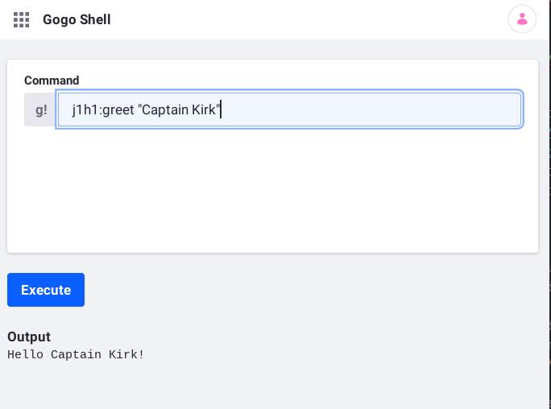

# Module Projects

Liferay applications and customizations are [OSGi modules](https://www.osgi.org/resources/what-is-osgi/): `.jar` files containing Java code and some extra configuration for publishing and consuming APIs.

A module project comprises three things:

1. **Code:** Java classes and resources, such as images, templates, and additional descriptors. Java packages are private by default but can be [exported](./exporting-packages.md) for other modules to use.

1. **Build Scripts:** [Gradle](https://gradle.org/) files for building and deploying the module.

1. **Metadata:** A [Bnd](https://bnd.bndtools.org/) file defines the module artifact and specifies packages and capabilities the module provides and requires.

Here's the module project structure:

```
[project root]
 └── [module 1]
 │    ├── bnd.bnd // Defines the module artifact, provided/required capabilities, and more
 │    ├── build.gradle // Declares dependencies
 │    └── src
 │        └── main
 │            ├── java
 │            │   └── [Java packages]
 │            └── resources
 │                └── [Images, templates, descriptors, etc.]
 │
 └── [module 2]
 │
 └── [module n]
 │
 ├── gradle
 │   └── [Gradle wrapper files]
 ├── gradlew // Invokes the Gradle wrapper to execute tasks
 ├── gradlew.bat
 ├── gradle.properties // Specifies the Liferay product version
 └── settings.gradle // Applies Gradle plugins
```

Liferay commonly uses three kinds of modules:

1. **API** modules define interfaces.

1. **Implementation** modules provide concrete classes that implement interfaces.

1. **Client** modules consume the APIs.

You'll learn how to create each one by developing a simple command in [Gogo Shell](./using-the-gogo-shell/using-the-gogo-shell.md) to greet users when they enter their names.



Here you'll create the API, learn the parts of a module project, deploy the module, and inspect the module at runtime. You'll create the implementation module and client module in the next two tutorials.

Start with deploying the example API module project.

## Deploy a Simple Module

The example module defines an API for generating a greeting.

1. Download and unzip the example.

    ```bash
    curl https://learn.liferay.com/dxp/latest/en/liferay-internals/fundamentals/liferay-k8s2.zip -O
    ```

    ```bash
    unzip liferay-k8s2.zip
    ```

1. Build the module JAR.

    ```bash
    cd liferay-k8s2
    ```

    ```bash
    ./gradlew jar
    ```

    The JAR file is generated to the module's `build/libs` folder.

    ```
    k8s2-api/build/libs/com.acme.k8s2.api-1.0.0.jar
    ```

1. Start a [Liferay Docker container](../../installation-and-upgrades/installing-liferay/using-liferay-docker-images/docker-container-basics.md).

    ```bash
    docker run -it -m 8g -p 8080:8080 [$LIFERAY_LEARN_DXP_DOCKER_IMAGE$]
    ```

1. Deploy the module JAR.

    ```bash
    ./gradlew deploy -Ddeploy.docker.container.id=$(docker ps -lq)
    ```

    Log messages show Liferay processing the JAR and starting the module.

    ```
    Processing com.acme.k8s2.api-1.0.0.jar
    STARTED com.acme.k8s2.api_1.0.0 [1152]
    ```

    The `STARTED` message includes module's ID: `1152`

1. Go to `http://localhost:8080` and sign in using the default credentials:

   **User Name:** `test@liferay.com`
   **Password:** `test`

1. Open the [Gogo Shell](./using-the-gogo-shell/using-the-gogo-shell.md).

1. In the Gogo Shell command field, use `lb` to show the module's information, including its ID. The most recently added module appears last. If you know a keyword in the module name, you can `grep` for it.

    ```bash
    lb | grep -i "k8s2"
    ```

    Output:

    ```
    1152|Active     |   15|Acme K8S2 API (1.0.0)|1.0.0
    ```

    This module's ID is `1152`.

1. Use the `b` command and the module ID to show more information about the module.

    ```bash
    b 1152
    ```

    Output:

    ```
    com.acme.k8s2.api_1.0.0 [1152]
    Id=1152, Status=ACTIVE      Data Root=[Liferay Home]/osgi/state/org.eclipse.osgi/1152/data
      "No registered services."
      No services in use.
      Exported packages
        com.acme.k8s2; version="1.0.0"[exported]
      No imported packages
      No fragment bundles
      No required bundles
    ```

The module is active and exports a package called `com.acme.k8s2`.

Now that you have installed and activated the module, you can learn how it works.

## How to Configure a Module

* [Set Up the Build Infrastructure](#set-up-the-build-infrastructure)
* [Write Code](#write-code)
* [Specify Dependencies](#specify-dependencies)
* [Specify Metadata](#specify-metadata)

### Set Up the Build Infrastructure

Liferay modules are developed in a Gradle build infrastructure. The following Gradle files are in the project's root folder.

| File | Description |
| :--- | :---------- |
| `gradle/` | Contains a Gradle wrapper |
| `gradlew[.bat]`  | Invokes the Gradle wrapper to execute tasks |
| `gradle.properties` | Specifies the Liferay product version |
| `settings.gradle` | Applies Gradle plugins, including the [Liferay Workspace](../../developing-applications/tooling/liferay-workspace.md) plugin. |

You can add more modules in new subfolders, like the example project's `k8s2-api` folder, or create them in a new [Liferay Workspace](../../developing-applications/tooling/liferay-workspace.md).

Here's the `k8s2-api` module structure in the context of the project root.

```
[project root]
 └── k8s2-api
 │   ├── bnd.bnd
 │   ├── build.gradle
 │   └── src
 │       └── main
 │           └── java
 │               └── com/acme/k8s2
 │                   └── Greeter.java
 │
 └── [Gradle files]
```

The `k8s2-api` module folder contains a `bnd.bnd` metadata file, a `build.gradle` script, and Java code.

### Write Code

The example module has only one Java class: an interface called `Greeter`.

```{literalinclude} ./module-projects/resources/liferay-k8s2.zip/k8s2-api/src/main/java/com/acme/k8s2/Greeter.java
   :language: java
   :lines: 5-10
```

The [`@ProviderType`](https://docs.osgi.org/javadoc/osgi.annotation/7.0.0/org/osgi/annotation/versioning/ProviderType.html) annotation tells the service registry that anything implementing the interface provides it (i.e., a `Greeter`). The interface's one method called `greet` asks for a `String` and doesn't return anything.

Add your own Java code and resources in your module's `src/main/java` folder and `src/main/resources` folder, respectively.

### Specify Dependencies

The `build.gradle` file specifies the module's dependencies.

```{literalinclude} ./module-projects/resources/liferay-k8s2.zip/k8s2-api/build.gradle
   :language: groovy
```

It depends on one artifact: the Liferay release API JAR. It is a large JAR packed with Liferay, Bnd, and OSGi artifacts associated with the Liferay product release.

In the `[project root]/gradle.properties` file, the `liferay.workspace.product` property specifies the product release:

```properties
liferay.workspace.product=portal-7.3-ga3
```

Lastly, there's no dependency version. That's because Workspace applies the Liferay product API version associated with the release.

```note::
   Please see `Configuring Dependencies <./configuring-dependencies/configuring-dependencies.md>`_ for more information.
```

### Specify Metadata

The module JAR's `META-INF/MANIFEST.MF` file describes the module. The manifest contains properties called manifest headers that specify packages the module exports/imports and capabilities the module provides/requires. Since the build infrastructure provides Bnd, you need only specify a few initial headers in your module's `bnd.bnd` file. Bnd generates most other values based on its inspection of your module.

#### Initial Metadata

The `bnd.bnd` file describes and configures the module.

```{literalinclude} ./module-projects/resources/liferay-k8s2.zip/k8s2-api/bnd.bnd
```

The module's name is *Acme K8S2 API*. Its symbolic name---a name that ensures uniqueness---is `com.acme.k8s2.api`. Its [semantic version](./semantic-versioning.md) is declared next. Lastly, the module [*exports*](./exporting-packages.md) the Java package `com.acme.k8s2`, making the package available to other modules. You confirmed the package export above when you executed the `b [bundle ID]` Gogo Shell command.

#### Generated Metadata

At build time, Bnd propagates metadata from the `bnd.bnd` file to the JAR file's `META-INF/MANIFEST.MF` and adds metadata based on its inspection.

Here's a `META-INF/MANIFEST.MF` file generated for the example module:

```properties
Manifest-Version: 1.0
Bnd-LastModified: 1598968383025
Bundle-ManifestVersion: 2
Bundle-Name: Acme K8S2 API
Bundle-SymbolicName: com.acme.k8s2.api
Bundle-Version: 1.0.0
Created-By: 1.8.0_252 (Oracle Corporation)
Export-Package: com.acme.k8s2;version="1.0.0"
Javac-Debug: on
Javac-Deprecation: off
Javac-Encoding: UTF-8
Require-Capability: osgi.ee;filter:="(&(osgi.ee=JavaSE)(version=1.8))"
Tool: Bnd-4.3.0.201909301554
```

Bnd propagated all the headers from the `bnd.bnd` file and added more headers and details. For example, the exported `com.acme.k8s2` package has the default package version `1.0.0`.

## Conclusion

That's it! As you can see, module projects are the same as other Java projects, with some added configuration.

Now you know what module projects look like, how to build and deploy them, and how to inspect modules at runtime.

Modules leverage each other's capabilities via APIs like the `Greeter` API. Liferay uses OSGi Services to define, implement, and consume APIS. Next, [APIs as OSGi Services](./apis-as-osgi-services.md) demonstrates *implementing* the `Greeter` API using OSGi services.

```note::
   For details about the module lifecycle, see `Module Lifecycle <../architecture/module-lifecycle.md>`_.
```

## Additional Information

* [APIs as OSGi Services](./apis-as-osgi-services.md)
* [Using an OSGi Service](./using-an-osgi-service.md)
* [Configure Dependencies](./configuring-dependencies/configuring-dependencies.md)
* [Importing Packages](./importing-packages.md)
* [Exporting Packages](./exporting-packages.md)
* [Module Lifecycle](../architecture/module-lifecycle.md)