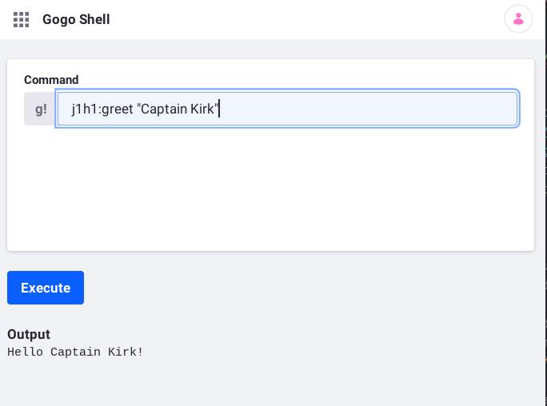

# Using an OSGi Service

Liferay APIs are readily available as OSGi services. You can access a service by creating a field of that service type and annotating the field with [`@Reference`](https://docs.osgi.org/javadoc/osgi.cmpn/7.0.0/org/osgi/service/component/annotations/Reference.html), like this:

```java
@Reference
BlogsEntryService _blogsEntryService;
```

The above `_blogsEntryService` field accesses a [`BlogsEntryService`](https://docs.liferay.com/ce/apps/blogs/latest/javadocs/com/liferay/blogs/service/BlogsEntryService.html) OSGi service.

All Declarative Services components (classes annotated with [`@Component`](https://docs.osgi.org/javadoc/osgi.cmpn/7.0.0/org/osgi/service/component/annotations/Component.html)) can access OSGi services this way. The run time framework injects a component's `@Reference`-annotated fields with their service types. 

The following example demonstrates using an OSGi service called `Greeter`. Three modules demonstrate the *API-Provider-Consumer* pattern used in OSGi services.

* The **API** module defines the `Greeter` service type.
* The implementation module **provides** the `Greeter` service.
* The example module **consumes** the `Greeter` service.

The example module class creates a Gogo Shell command that uses the `Greeter` service to return a personalized greeting. Consider this example to be a "Hello World" for OSGi services.



You can use OSGi services in any Java class.

Liferay service Javadoc is available at these locations:

* [Liferay DXP Apps](https://docs.liferay.com/dxp/apps/)
* [Liferay DXP Portal](https://docs.liferay.com/dxp/portal/7.3-latest/javadocs/)
* [Liferay CE Apps](https://docs.liferay.com/ce/apps/)
* [Liferay CE Portal](https://docs.liferay.com/ce/portal/7.3-latest/javadocs/)

```note::
   For instructions on how to create an OSGi service, please see `APIs as OSGi Services <./apis-as-osgi-services.md>`_.
```

## Deploy the Gogo Shell Command Example

Start using the example.

1. Start a [Liferay Docker container](../../installation-and-upgrades/installing-liferay/using-liferay-docker-images/docker-container-basics.md).

    ```bash
    docker run -it -m 8g -p 8080:8080 [$LIFERAY_LEARN_DXP_DOCKER_IMAGE$]
    ```

1. Download and unzip `liferay-j1h1.zip`.

    ```curl
    curl hhttps://learn.liferay.com/dxp/latest/en/liferay-internals/fundamentals/liferay-j1h1.zip -O
    ```

    ```bash
    unzip liferay-j1h1.zip
    ```

1. Deploy the example modules.

    ```bash
    cd liferay-j1h1.zip
    ```

    ```bash
    ./gradlew deploy -Ddeploy.docker.container.id=$(docker ps -lq)
    ```

1. Confirm the deployments in the Docker container console.

    ```
    STARTED com.acme.j1h1.api_1.0.0
    STARTED com.acme.j1h1.impl_1.0.0
    STARTED com.acme.j1h1.osgi.commands_1.0.0
    ```

1. Open the [Gogo Shell](./using-the-gogo-shell.md).

1. In the Gogo Shell command field, enter a `j1h1:greet` command to generate a greeting.

    ```groovy
    j1h1:greet "Captain Kirk"
    ```

1. Confirm the output.

    ```
    Hello Captain Kirk!
    ```

The example module leverages the API and implementation modules to produce the content returned from the `j1h1:greet` Gogo Shell command.

## How to Use an OSGi Service

* [Write Your Business Logic](#write-your-business-logic)
* [Annotate External Service References](#annotate-external-service-references)
* [Make Your Class a Component](#make-your-class-a-component)

### Write Your Business Logic

In your class, implement business logic using the OSGi service you need. 

1. Import the service.

	```java
	import com.acme.j1h1.Greeter;
	```

1. Use the service.

	```java
	public void greet(String name) {
	    _greeter.greet(name);
	}

	private Greeter _greeter;
	```

The method above invokes a `Greeter`'s `greet` method. `com.acme.j1h1.Greeter` is the OSGi service type that the implementation module registers. Your class must get a `Greeter` instance from the OSGi service registry.

### Annotate External Service References

Getting an OSGi service from the registry requires adding an [`@Reference`](https://docs.osgi.org/javadoc/osgi.cmpn/7.0.0/org/osgi/service/component/annotations/Reference.html) annotation to a field of that service type. Add the `@Reference` to your service field.

```{literalinclude} ./using-an-osgi-service/resources/liferay-j1h1.zip/j1h1-osgi-commands/src/main/java/com/acme/j1h1/internal/osgi/commands/J1H1OSGiCommands.java
   :dedent: 1
   :language: java
   :lines: 18-19
```

The `J1H1OSGiCommands` class has the above private `Greeter` field called `_greeter`. The `@Reference` annotation tells the OSGi runtime to inject the field with a `Greeter` service from the registry. If `J1H1Greeter` is the best matching `Greeter` service component in the registry (it's the only match in this example), the runtime injects `_greeter` with a `J1H1Greeter`.

### Make Your Class a Component

Only Declarative Services components can use the `@Reference` annotation. Add the `@Component` annotation to your class and use a `service` attribute to declare your component as implementing a particular service.

```{literalinclude} ./using-an-osgi-service/resources/liferay-j1h1.zip/j1h1-osgi-commands/src/main/java/com/acme/j1h1/internal/osgi/commands/J1H1OSGiCommands.java
   :language: java
   :lines: 8-12
```

The `J1H1OSGiCommands` class provides an OSGi service of its own type. The two properties define a Gogo shell command with a command function called `greet` in a scope called `j1h1`. The deployed `J1H1OSGiCommands` component provides the Gogo Shell command `j1h1:greet` that takes a `String` as input.

### Add a Dependency on the API

Your consumer module depends on the API. In your `build.gradle` file, add the API to your dependencies. Here's the `j1h1-osgi-commands` module's `build.gradle` file:

```{literalinclude} ./using-an-osgi-service/resources/liferay-j1h1.zip/j1h1-osgi-commands/build.gradle
   :language: groovy
```

The `release.portal.api` artifact provides the Liferay, Bnd, and OSGi services that the module needs from current Liferay product release. The `liferay.workspace.product` in the `[project root]/gradle.properties` file specifies the release.

Since the local project `j1h1-api` provides the `Greeter` service, `j1h1-osgi-commands` can depend on it as a project instead of an artifact. [Specifying Dependencies](./configuring-dependencies/specifying-dependencies.md) on external artifacts is easy too.

## Conclusion

The API and Impl modules defined and provided the `Greeter` service, respectively. The example `j1h1-osgi-commands` module uses the service to create a simple Gogo Shell command. The API-Provider-Consumer contract fosters loose coupling, making your software easy to manage, enhance, and support.

Now that you're familiar with using OSGi services from neighboring projects, you can explore using OSGi services from external artifacts. [Configuring Dependencies](./configuring-dependencies.md) demonstrates finding modules and configuring them as dependencies.

## Additional Information

* [Importing Packages](./importing-packages.md)
* [Exporting Packages](./exporting-packages.md)
* [Semantic Versionings](./semantic-versioning.md)
* [Configuring Dependencies](./configuring-dependencies.md)