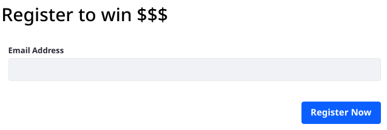
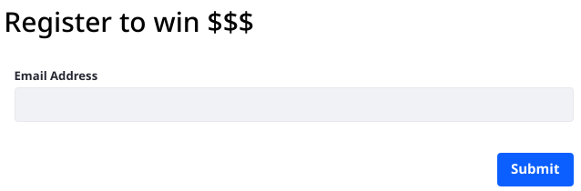

# Customizing the Submit Button

When a User is finished entering data into a form, they must submit the form. By default a button that says _Submit_ is displayed for this purpose.

Sometimes the text _Submit_ isn't the clearest word for the action the User is taking when submitting the form. For example, you might want to use _Register Now_:

1. [Create a form](./creating-forms.md) with a text field called _Email Address_. Give it a name and publish it.

1. Go to the form and see its Submit button:

   

1. Now change the button label. Go back to the form builder view and click the  icon in the upper right.

1. In the Personalization tab, enter _Register Now_ in the Submit Button Label field.

1. Save the form, then go back to the form view and see that the button has your new label:

   

## Localizing the Button
