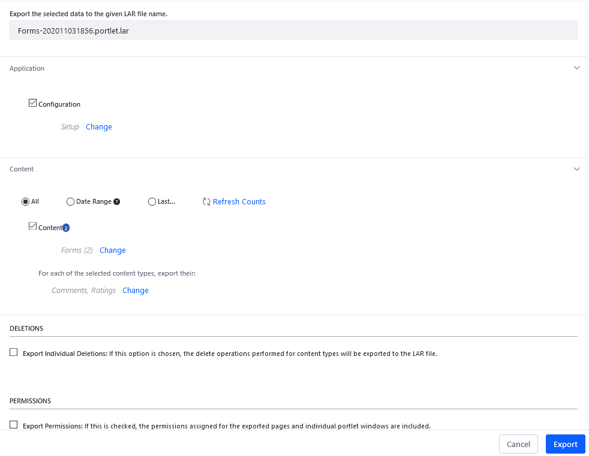
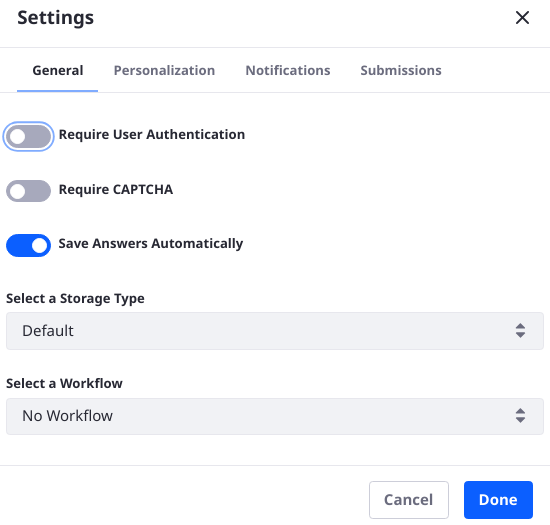
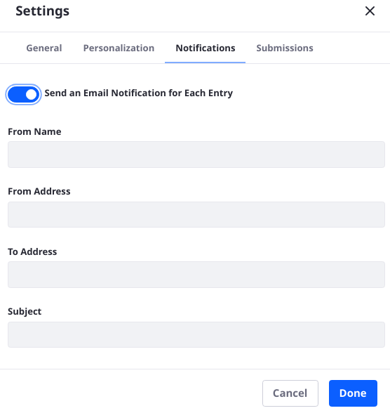
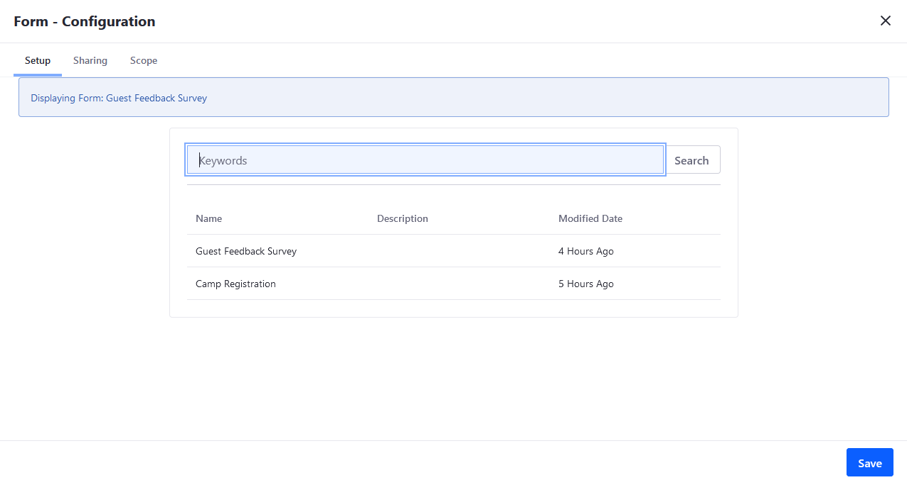
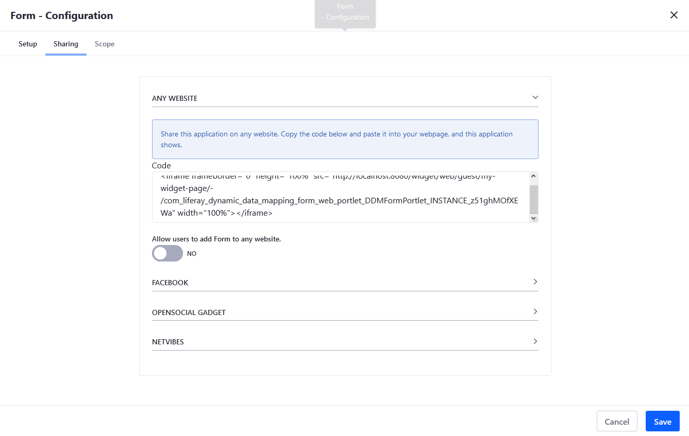
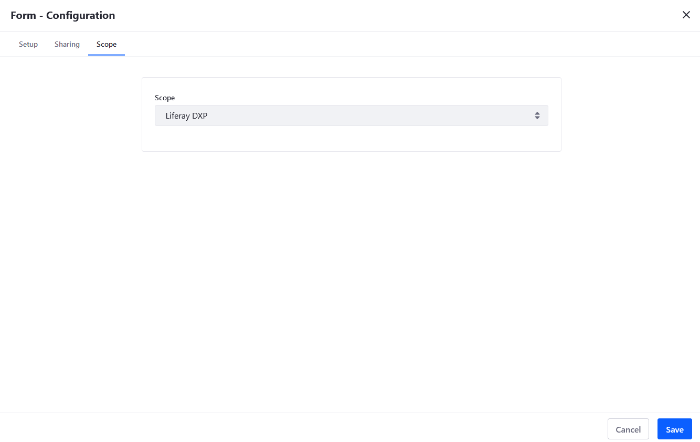
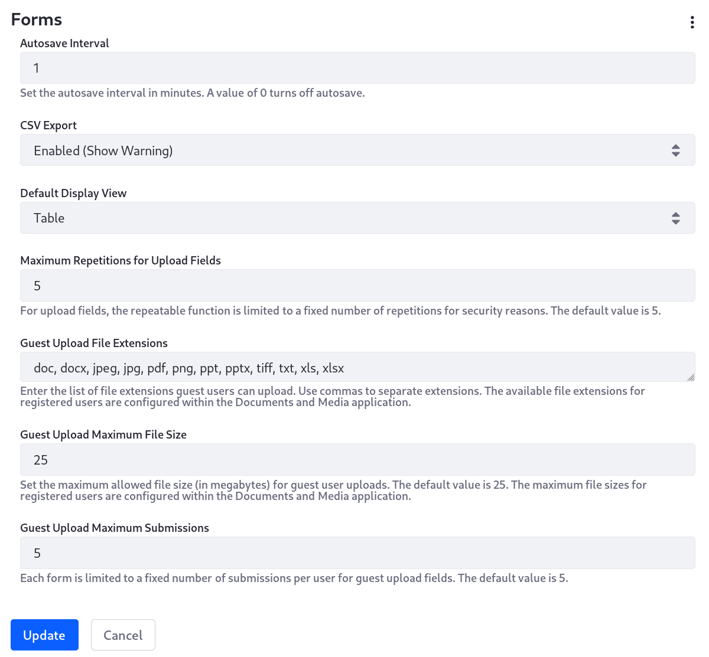

# Forms Configuration Reference

Here's an overview of all the Forms configurations so you can quickly find a configuration you need.

## Forms Options

You can export and import forms between Sites. To access the _Export / Import_ menu, navigate to _Site Administration_ &rarr; _Content and Data_  &rarr; _Forms_. Click the  icon in the upper right then _Export / Import_.



See [Exporting and Importing Forms](./exporting-and-importing-forms.md) and [Importing and Exporting Pages and Content](../../../site-building/building-sites/importing-exporting-pages-and-content.md) to learn more.

## Form Settings

Each form has its own Settings menu.

To access the Settings menu, choose the desired form (for example, _Guest Survey Feedback_). Click the  icon in the upper right.

### Form Options



| Section | Field | <div style="width:290px">Description |
| :--- | :--- | :--- |
| General | Require User Authentication | Require respondents to sign in before submitting the form. |
| General | CAPTCHA | Require answering CAPTCHA questions when submitting the form. |
| General | Save Answers Automatically | Autosave the form periodically as the respondent fills it out. |
| General | Select a Storage Type | Set the [storage adapter](../developer-guide/understanding-form-storage-adapters.md) for managing submitted records; not editable after the form is saved. |
| General | Select a [Workflow](./advanced-forms-usage/using-forms-with-a-workflow.md) | Select a workflow definition to review the form submission; workflow is deactivated by default. |
| Personalization | Redirect URL on Success | Specify a redirect URL once the form is submitted successfully. |
| Personalization | Submit Button Label | Change the label of the Submit button to something more appropriate for your specific use case (e.g, _Vote_ or _Register_). |
| Notifications | Send an Email Notification for Each Entry | Specify whether an [email notification](../sharing-forms-and-managing-submissions/configuring-form-notifications.md) sent to the form creator each time a form record is submitted. |
| [Liferay 7.4 Only] Submissions | Limit to One Submission per User | Do not allow multiple form submissions to logged in Users. This also requires that Users are authenticated to fill out the form. |
| [Liferay 7.4 Only] Submissions | Show Partial Results to Respondents | Allow respondents to view the current [Forms Report](../sharing-forms-and-managing-submissions/form-reports.md#show-partial-results-to-form-respondents) data for the form. Enabling this warns the user against submitting sensitive information. |
| [Liferay 7.4 Only] Submissions | Expiration Date/Never Expire | Set the date when the form expires. After this date, no submissions are allowed. Form users see an expiration notification when accessing the form. You must disable the _Never Expire_ setting to choose an expiration date. |

### Email Notifications

Here you can configure the Forms app to send a notification email each time a form entry is submitted. You should set up a mail server first; see [Configuring Mail](../../../installation-and-upgrades/setting-up-liferay/configuring-mail.md) to learn more.



| Field | Description |
| :--- | :--- |
| From Name | The sender's name; this could be the Site name, the form name, or anything else informative to the recipient. |
| From Address | The sender's email address; You can use `noreply@example.com` to prevent recipients from replying. |
| To Address | The recipient's email address (e.g., `test@example.com`) |
| Subject | An informative subject line tells the recipient what happened. |

To learn more, see [Configuring Form Notifications](../sharing-forms-and-managing-submissions/configuring-form-notifications.md).

## Form Widget Configuration

You can configure the _Form_ widget deployed to a Site Page. To access the _Configuration_ menu, click the  icon next to the widget title &rarr; _Configuration_.

### Setup

Here you can choose the desired Form to be used in this widget.



### Sharing

Here you can embed this application on other platforms besides DXP.



### Scope

Here you can change the widget's scope from Global, Site, or Page.



## Instance Settings

The Forms configuration entry in Instance Settings is identical to the Forms entry in System Settings (below); the instance settings override the system settings, which will set the default values across the system. See [Understanding Configuration Scope](../../../system-administration/configuring-liferay/understanding-configuration-scope.md) for more information.

For a description of each configuration property, see [System Settings](#system-settings).

## System Settings

There is currently only one system level Forms configuration entry. To configure the properties in the Liferay UI,

1. Go to the _Global Menu_ () &rarr; _Control Panel_.
1. Click _System Settings_.
1. Click _Forms_ under the _Content and Data_ section.



Alternatively, configure the backing `DDMFormWebConfiguration` service with a `.config` file named

```
com.liferay.dynamic.data.mapping.form.web.internal.configuration.DDMFormWebConfiguration.config
```

Place the file in `Liferay Home/osgi/configs`. See [Using Configuration Files](../../../system-administration/configuring-liferay/configuration-files-and-factories/using-configuration-files.md) for more information.

| Field | Description |
| :--- | :--- |
| Autosave Interval (`autosaveInterval`)| Sets the value in minutes to auto-save a form; setting 0 disables auto-save. |
| CSV Export (`csvExport`) | Determines whether administrators can download Form Entries as CSVs. |
| Default Display View (`defaultDisplayView`) | Sets how the Forms are displayed in the search container. |
| Guest Upload File Extensions (`guestUploadFileExtensions`) | Enter the comma-separated list of accepted file extensions. By default the following list is supported: `doc`, `docx`, `jpeg`, `jpg`, `pdf`, `png`, `ppt`, `pptx`, `tiff`, `txt`, `xls`, and `xlsx`. |
| Guest Upload Maximum file Size (`guestUploadMaximumFileSize`) | Set the maximum file size Guest User can upload via the Upload field. This is configured for authenticated Users in the Documents and Media application's configuration, and system-wide limits are defined in the Upload Servlet Request System Settings entry, in the field named Overall Maximum Upload Request Size. By default the limit is 25 MB. |
| Maximum Repetitions for Upload Fields (`maximumRepetitionsForUploadFields`) | If the field is configured as repeatable, set maximum number of times the field can be added to the form by the User (applies equally to Guest Users and logged in Users). By default the limit is 5. |
| Maximum Submissions for Guest Upload Fields (`maximumSubmissionsForGuestUploadFields`) | Set the maximum number of times a Guest User can submit a form that includes a Guest-enabled Upload field. The Guest User's IP address is used to keep track of submissions. By default the limit is 5. |

## Additional Information

* [Forms Permissions Reference](./forms-permissions-reference.md)
