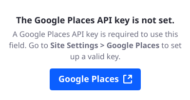
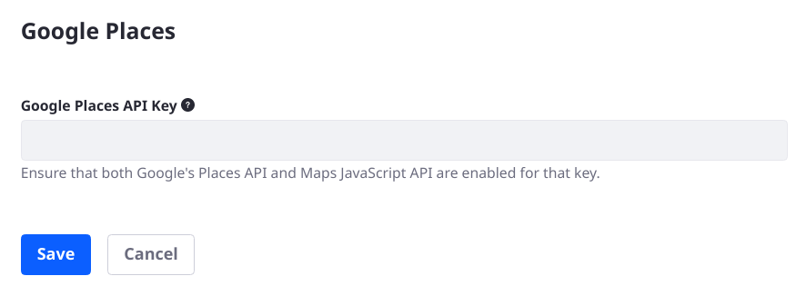

# Using the Search Location Field

Use a Search Location field so a user can interact with Google's Maps JavaScript API and Google Places API, selecting a location and getting these fields autofilled in the form:

- Address (e.g., 1400 Montefino Ave.)
- City (e.g., Diamond Bar)
- State (e.g., California)
- Postal Code (e.g., 91765)
- Country (e.g., USA)

You don't have to display all the fields in the form.

## Adding and Configuring the Search Location Field

To add the Search Location field to a form,

1. Enable the JavaScript Google Maps API and the Google Places API.

   - Add the Search Location field to a form. If a Google Places API key is not configured in the Site, the field displays a warning message.

       

   - Obtain a single API Key for using both the Google Places API and the Maps JavaScript API.
   - Click the link in the field warning message or navigate to Site Settings (Platform) &rarr; Google Places. Alternatively, use the identical Instance Settings configuration entry.

       

   - Enter the Google Places API Key and click _Save_.

1. Now configure the field in the Form. Pay special attention to the field settings Field Label, Visible Fields, and Layout.

    - **Field Label** is for changing the field's label in the form. For example, instead of Search Location you might choose Location Lookup.
    - **Visible Fields** configures which subfields should be shown, and autofilled, in the form. The _Search Location_ text field is always displayed (though the label can be customized). Choose to include Address, City, State, Postal Code, and/or Country subfields.
    - **Layout** determines whether Search Location and its subfields are displayed in a single column or in two columns.

## Entering Data into the Search Location Field

Once the [form is published](./creating-forms.md#publishing-a-form) a user interacts with the Search Location field by entering something about the location: whatever fields have been configured as visible in the field settings are autofilled when a location is selected from the presented options.

## Related Content

- [Site Settings UI Reference](../../../site-building/site-settings/site-settings-ui-reference.md)
- [Creating Forms](creating-forms.md)
- [Using the REST Data Provider to Populate Form Options](../data-providers/using-the-rest-data-provider-to-populate-form-options.md)
