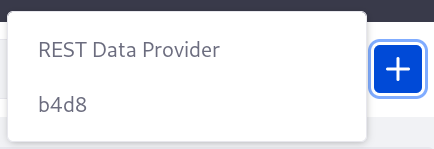
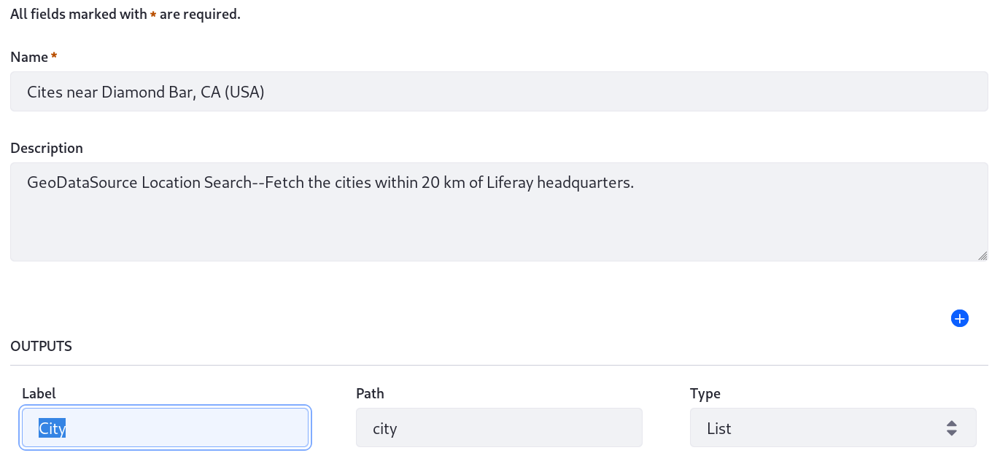
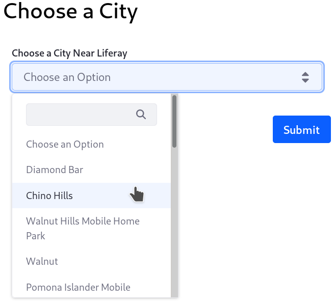
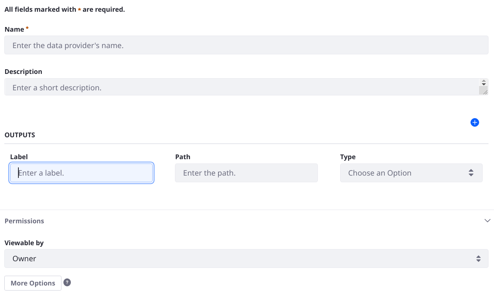
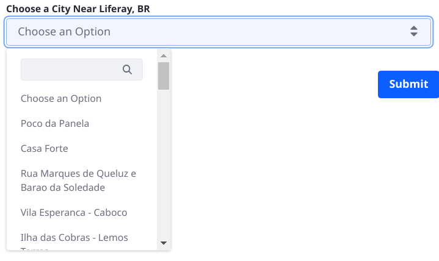

# Writing a Custom Data Provider

Liferay Forms fields can be populated using a [Data Provider](../data-providers/data-providers-overview.md). Out of the box, there's a REST Data Provider that provides a flexible way to consume data from most REST endpoints. See [Using the REST Data Provider to Populate Form Options](../data-providers/using-the-rest-data-provider-to-populate-form-options.md) to learn more.

If the REST Data Provider doesn't serve your purpose, use the `DDMDataProvider` extension point to create your own.

```note::
   The example Data Provider demonstrated here consumes XML data from the `GeoDataSource™ Location Search Web Service <https://www.geodatasource.com/web-service/location-search>`__. The API key of a Liferay employee is hard-coded into this sample; please do not overuse the sample. Never use it in production environments.
```

## Deploy a Custom Data Provider

1. Start Liferay.

   ```bash
   docker run -it -m 8g -p 8080:8080 [$LIFERAY_LEARN_PORTAL_DOCKER_IMAGE$]
   ```

1. Download and unzip the Acme XML Data Provider.

   ```bash
   curl https://learn.liferay.com/dxp/latest/en/process-automation/forms/developer-guide/liferay-b4d8.zip -O
   ```

   ```bash
   unzip liferay-b4d8.zip
   ```

1. From the module root, build and deploy.

   ```bash
   ./gradlew deploy -Ddeploy.docker.container.id=$(docker ps -lq)
   ```

   ```tip::
   This command is the same as copying the deployed jars to /opt/liferay/osgi/modules on the Docker container.
   ```

1. Confirm the deployment of each module in the Liferay Docker container console.

   ```bash
   STARTED com.acme.n4g6.impl_1.0.0
   ```

## Test the Data Provider

To use the data provider in a form,

1. Add an instance of the Data Provider:

   1. In the Site Menu, go to Content and Data &rarr; Forms. 

   1. Open the Data Providers tab and click the _Add_ button.

      

   1. Configure it:
      - **Name:** Cites Near Diamond Bar, CA (USA)
      - **Description:** GeoDataSource Location Search--Fetch the cities within 20 km of Liferay headquarters.
      - **Outputs** 
         - **Label:** City
         - **Path:** city
         - **Type:** List

      

   1. Click *Save*.

1. Add a form that uses the Cities Near Diamond Bar data provider:

   1. In the Site Menu, go to Content and Data &rarr; Forms. 

   1. In the Forms tab, click the Add button.

   1. Add a Select from List fields with these settings:

      1. **Label:** Choose a City Near Liferay

      1. **Create List:** From Data Provider

      1. **Choose a Data Provider:** Cities Near Diamond Bar, CA (USA)

      1. **Choose an Output Parameter:** City

   1. Publish the form and verify that the list is populated from the data provider:

   

This is a nice example, but it hard-codes the URL for the data provider. If you allow the URL to be configurable, you can use this same data provider for other cities, or any other URL that serves XML. 

## Understanding the B4D8 DDM Data Provider

The `Acme B4D8 Implementation` project contains a custom data provider for returning XML from a specific URL. It contains three classes: `B4D8DDMDataProvider`, `B4D8DDMDataProviderSettingsProovider`, and `B4D8DDMDataProviderSettings`.

### Implementing a `DDMDataProvider`

The data provider class implements the `com.liferay.dynamic.data.mapping.data.provider.DDMDataProvider` interface, overriding two methods: `getData` and `getSettings`. These method names capture the essence of a data provider: it provides data based on settings (settings are optional though).

Implementing the interface's methods and providing two `@Component` settings is enough to register the data provider with the Liferay Forms application, so it appears naturally in the forms UI alongside Liferay's default data provider.

```{literalinclude} ./writing-a-custom-data-provider/resources/liferay-b4d8.zip/b4d8-impl/src/main/java/com/acme/b4d8/dynamic/data/mapping/data/provider/internal/B4D8DDMDataProvider.java
   :language: java
   :lines: 38-41,43-46,65-66,67-68,70-71
```

The `getData` method does most of the work. It must return a `DDMDaProviderResponse` that the Forms framework understands. For the B4D8 data provider, these are the highlights:

1. The URL to our XML data source is constructed:

   ```{literalinclude} ./writing-a-custom-data-provider/resources/liferay-b4d8.zip/b4d8-impl/src/main/java/com/acme/b4d8/dynamic/data/mapping/data/provider/internal/B4D8DDMDataProvider.java
      :dedent: 3
      :language: java
      :lines: 49-53
   ```

1. The `_createDDMDataProviderResponse` method is called. This is where the construction of the response object happens. To call this method, give it two parameters: the data provider settings and the XML document returned from the remote API. The logic for both is in separate private utility methods. Importantly, `HttpUtil.URLtoString(url)` is the call that executes the URL to retrieve the XML. 

1. Now the pieces are in place to (based on the output parameter settings of the data provider instance) build the response conditionally. The logic involves 
   - Begin building the response using a static inner `Builder` class's `newBuilder` method:

      ```{literalinclude} ./writing-a-custom-data-provider/resources/liferay-b4d8.zip/b4d8-impl/src/main/java/com/acme/b4d8/dynamic/data/mapping/data/provider/internal/B4D8DDMDataProvider.java
         :dedent: 2
         :language: java
         :lines: 77-78
      ```

   - Loop through the data provider's output parameter settings. In [Test the Data Provider](#test-the-data-provider) you added only one set of outputs (with three nested fields); if you create a data provider with additional outputs, by clicking the plus button in the data provider settings form, this loop parses each one.

   - For each output, get the XML nodes from the returned XML document, the output parameter ID, and the type of output data requested (in the example above you chose List).

   - Check the output parameter type and call the response builder's `withOutput` method. Each call provides the output parameter ID and the content of the matching node (or nodes, if a list is requested). 

      ```{literalinclude} ./writing-a-custom-data-provider/resources/liferay-b4d8.zip/b4d8-impl/src/main/java/com/acme/b4d8/dynamic/data/mapping/data/provider/internal/B4D8DDMDataProvider.java
         :dedent: 2
         :language: java
         :lines: 80-118
      ```


   - At the end of the method, return the response: `return builder.build()`.

### Defining the Settings with `DDMDataProviderSettings`

The data provider settings class defines the settings that this data provider needs, in two parts:

1. The layout of the settings form itself is defined using `@DDMForm*` class-level annotations:

   ```{literalinclude} ./writing-a-custom-data-provider/resources/liferay-b4d8.zip/b4d8-impl/src/main/java/com/acme/b4d8/dynamic/data/mapping/data/provider/internal/B4D8DDMDataProviderSettings.java
      :language: java
      :lines: 10-25
   ```

   Any fields that configure your data provider must be added to the settings form in this `@DDMForm`. This snippet currently uses only the inherited `outputParameters` field which is accessible because the `B4D8DDMDataProviderSettings` class extends `DDMDataProviderParameterSettings`. See [Add Data Provider Settings](writing-a-custom-data-provider.md#add-data-provider-settings) to learn about adding more settings to the form.

1. The class declaration and body determines what fields are available. Currently no additional settings are needed, so the class body is blank.

   ```{literalinclude} ./writing-a-custom-data-provider/resources/liferay-b4d8.zip/b4d8-impl/src/main/java/com/acme/b4d8/dynamic/data/mapping/data/provider/internal/B4D8DDMDataProviderSettings.java
      :language: java
      :lines: 26-28
   ```

   ```note:: 
      In addition to the ``outputParameters`` field, an ``inputParameters`` field is also provided in `DDMDataProviderParameterSettings <https://github.com/liferay/liferay-portal/blob/[$LIFERAY_LEARN_PORTAL_GIT_TAG$]/modules/apps/dynamic-data-mapping/dynamic-data-mapping-api/src/main/java/com/liferay/dynamic/data/mapping/data/provider/DDMDataProviderParameterSettings.java>`__ 
   ```



The settings form currently contains some default fields needed by all data providers that appear in the Forms UI: Name, Description, and a section for defining its permissions. You get these by adding your settings with the `_ddmDataProviderInstanceSettings.getSettings(...)` call. The Outputs field is the inherited `outputParameters` field you added to the layout, which is really a nested field consisting of a Label, Path, and Type.

### Implementing the `DDMDataProviderSettingsProvider`

The settings provider class contains one method, `getSettings`, which returns the `DDMDataProviderSettings` class for a given data provider. It's used to instantiate a settings class in the data provider, so you can get the settings values and configure the data provider accordingly.

Get a reference to the `B4D8DDMDataProviderSettingsProvider` and then call its `getSettings` method from the data provider class's identically named `getSettings` method:

```{literalinclude} ./writing-a-custom-data-provider/resources/liferay-b4d8.zip/b4d8-impl/src/main/java/com/acme/b4d8/dynamic/data/mapping/data/provider/internal/B4D8DDMDataProvider.java
   :dedent: 1
   :language: java
   :lines: 67-70,158-160
```

## Add Data Provider Settings

To add a Data Provider Setting, add an annotated field to the `DataProviderSettings` interface and update the `DataProvider` class to react to the setting's value. 

### Add a URL Field to the Settings

1. First add the new `URL` field to the `DataProviderSettings`. In the class body, add this annotated method:

    ```java
    @DDMFormField(
        label = "%url", required = true,
        validationErrorMessage = "%please-enter-a-valid-url",
        validationExpression = "isURL(url)"
    )
    public String url();
    ```

    It requires this import:

    ```java
    import com.liferay.dynamic.data.mapping.annotations.DDMFormField;
    ```

1. In the class-level annotation that creates the form layout, replace the `@DDMFormLayoutColumn` with

    ```java
    @DDMFormLayoutColumn(
        size = 12, value = {"url", "outputParameters"}
    )
    ```

Now the settings are ready to be used in the `DataProvider` class. 

### Handle the Setting in the Data Provider's `getData` Method

Now the `B4D8DDMDataProvider#getData` method must be updated: 

- Remove the hard-coded String `url` variable.
- Refactor the method to instantiate `B4D8DDMDataProviderSettings` earlier and retrieve the URL setting.
- Set the URL into the response.

If you're making these edits locally, copy the complete `try` block provided below these descriptive steps:

1. To make sure you get a valid URL, now that user input is allowed:

    Remove the line defining the `key` variable---this is now configurable in the URL setting field.

    ```java
    String key = "LAOOBDZVQ5Z9HHYC4OCXHTGZGQLENMNA";
    ```

1. Replace the `String` variable defining the URL with `Http.Options` populated by the data provider setting field.

    ```java
    Http.Options options = new Http.Options();

    options.setLocation(b4d8DDMDataProviderSettings.url());
    ```

1. Use the new `options` in place of `url` in the return statement's call to `_createdDDMDataProviderResponse`. Replace the existing return statement.

    ```java
    return _createDDMDataProviderResponse(
        b4d8DDMDataProviderSettings,
        _toDocument(HttpUtil.URLtoString(options)));
    ```

The above steps omit the refactoring of the method. To compile and test these steps, overwrite the entire `try` block in the `getData` method:

```java
try {
    B4D8DDMDataProviderSettings b4d8DDMDataProviderSettings =
        _ddmDataProviderInstanceSettings.getSettings(
            _getDDMDataProviderInstance(
                ddmDataProviderRequest.getDDMDataProviderId()),
            B4D8DDMDataProviderSettings.class);

    Http.Options options = new Http.Options();

    options.setLocation(b4d8DDMDataProviderSettings.url());

    return _createDDMDataProviderResponse(
        b4d8DDMDataProviderSettings,
        _toDocument(HttpUtil.URLtoString(options)));
}
```

Import Liferay's `Http` class.

```java
import com.liferay.portal.kernel.util.Http;
```

Now you're ready to test the update data provider.

## Deploy and Test the Updated Data Provider

To use the updated data provider in a form,

1. From the module root, rebuild and redeploy.

   ```bash
   ./gradlew deploy -Ddeploy.docker.container.id=$(docker ps -lq)
   ```

1. Add an instance of the Data Provider:
      - **Name:** Cites Near Recife, Pernambuco (Brazil)
      - **Description:** GeoDataSource Location Search--Fetch the cities within 20 km of Liferay's Brazil office.
      - **URL:** 
        ```
        https://api.geodatasource.com/cities?key=LAOOBDZVQ5Z9HHYC4OCXHTGZGQLENMNA&format=xml&lat=-8.0342896&lng=-34.9239708
        ```
      - **Outputs** 
         - **Label:** City
         - **Path:** city
         - **Type:** List

1. Add a form that uses the Cities Near Recife data provider:

   1. In the Site Menu, go to Content and Data &rarr; Forms. 

   1. In the Forms tab, click the Add button.

   1. Add a Select from List fields with these settings:

      1. **Label:** Choose a City Near Liferay, BR

      1. **Create List:** From Data Provider

      1. **Choose a Data Provider:** Cities Near Recife, Pernambuco, (Brazil)

      1. **Choose an Output Parameter:** City

   1. Publish the form and verify that the list is populated from the data provider:

   
