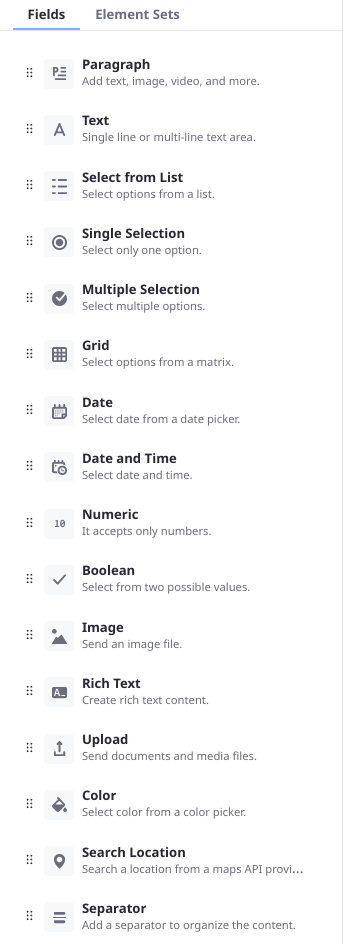
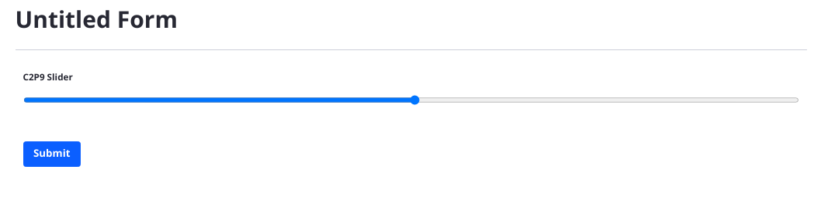
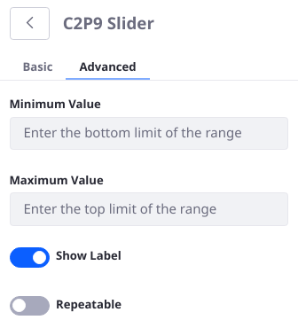

# Writing a Custom Form Field Type

The Forms application contains many highly configurable [field types out-of-the-box](../creating-and-managing-forms/forms-field-types-reference.md). Most use cases are met with one of the existing field types. If your use case can't be met with the default field types, you can create your own.



* [Deploy an example project and see how it works](#examine-the-custom-form-field-in-liferay)
* [Understand the form field's code](#understand-the-form-field-s-code)
* [Add custom settings to the field](#add-custom-settings-to-the-form-field)

```{note}
- **Form field types in other applications:** Forms created with Documents and Media (Metadata Sets), Web Content (Structures), and the Forms application can all consume the same form fields. By default a custom form field is only used in the Forms application. To specify explicitly which applications should enable the form field type, add the component property:

    ```properties
    "ddm.form.field.type.scope=document-library,forms,journal"
    ```

- **Project compatibility:** The example project runs on Liferay 7.4. If you're running Liferay 7.3, the source code is compatible but the [Workspace project](../../../building-applications/tooling/liferay-workspace/what-is-liferay-workspace.md) must be reconfigured for Liferay 7.3. The steps to do this are included in the instructions below.

    If you're running Liferay 7.2, this source code does not run due to a difference in supported front-end frameworks. Please see [Developing a Custom Form Field for Liferay 7.2](./developing-a-custom-form-field-for-liferay-7-2.md) to learn how to adapt the C2P9 Slider code sample for 7.2.
```

## Examine the Custom Form Field in Liferay 

To see how custom form fields work, deploy an example and then add some form data using the new field.

### Deploy the Example

```{include} /_snippets/run-liferay-portal.md
```

Then, follow these steps:

1. Download and unzip [the Custom Form Field Type project](./writing-a-custom-form-field-type/resources/liferay-c2p9.zip).

    ```bash
    curl https://learn.liferay.com/dxp/latest/en/process-automation/forms/developer-guide/liferay-c2p9.zip -O
    ```

    ```bash
    unzip liferay-c2p9.zip
    ```

1. From the module root, build and deploy.

   ```bash
   ./gradlew deploy -Ddeploy.docker.container.id=$(docker ps -lq)
   ```

   ```{tip}
   This command is the same as copying the deployed jars to /opt/liferay/osgi/modules on the Docker container.
   ```

   ```{note}
   For Liferay 7.3, make these adjustments to the project before deploying it:
   - In `c2p9-impl/package.json`, change the `devDependencies` reference from `@liferay/portal-7.4` to `@liferay/portal-7.3`.
   - In `gradle.properties`, change the `liferay.workspace.product` value to `portal-7.3-ga8` (if a Liferay 7.3 version newer than GA8 is available, try to reference it here instead).
   ```

1. Confirm the deployment in the Liferay Docker container console.

   ```bash
   STARTED com.acme.c2p9.impl_1.0.0 [1009]
   ```

### Use the Deployed Slider Field

1. Open your browser to <http://localhost:8080>.

1. Go to the Forms application in _Site Menu_ &rarr; _Content & Data_ &rarr; _Forms_.

1. Click the *Add* button () to open the Form Builder.

1. Add the _C2P9 Slider_ field to the form.

1. You can fill out the Label, Predefined Value, and Help Text, as well as make the field Required. These settings match what many [out-of-the-box fields](../creating-and-managing-forms/forms-field-types-reference.md) provide as basic settings.

1. Publish the form and go submit a record using the slider field.



## Understand the Form Field's Code

A basic form field contains a Java class and a JavaScript file. In the C2P9 Slider field, `C2P9DDMFormFieldType.java` provides a `DDMFormFieldType` implementation by extending the abstract class `BaseDDMFormFieldType` and defining its metadata in the OSGi Component:

```{literalinclude} ./writing-a-custom-form-field-type/resources/liferay-c2p9.zip/c2p9-impl/src/main/java/com/acme/c2p9/internal/dynamic/data/mapping/form/field/type/C2P9DDMFormFieldType.java
   :dedent: 0
   :language: java
   :lines: 10-20
```

`ddm.form.field.type.description`: provide the language key for the description text. Make sure the translated value is defined in the `Language.properties` file.

`ddm.form.field.type.display.order`: set an integer or floating point value to determine where the field is displayed in the Form Builder sidebar. Fields with the same value are ordered randomly.

`ddm.form.field.type.icon`: decide which icon type to use for your field. Choose any [Clay Icon](https://clayui.com/docs/components/icon.html).

`ddm.form.field.type.label`: provide the language key for the label text. Make sure the translated value is defined in the `Language.properties` file.

`ddm.form.field.type.name`: provide the field type identifier. This is used to identify the field internally and in other components.

The `getModuleName` method passes the `Slider.es.js` file path to the `NPMResolver` service.

```{literalinclude} ./writing-a-custom-form-field-type/resources/liferay-c2p9.zip/c2p9-impl/src/main/java/com/acme/c2p9/internal/dynamic/data/mapping/form/field/type/C2P9DDMFormFieldType.java
   :dedent: 1
   :language: java
   :lines: 22-26,38-39
```
Some of the path definition is accomplished in the `package.json` file (see the `name` declaration and the `source-maps` defined in the `scripts` section).

The `getName` method returns the form field identifier. It must match the value in the component property `ddm.form.field.type.name`.

```{literalinclude} ./writing-a-custom-form-field-type/resources/liferay-c2p9.zip/c2p9-impl/src/main/java/com/acme/c2p9/internal/dynamic/data/mapping/form/field/type/C2P9DDMFormFieldType.java
   :dedent: 1
   :language: java
   :lines: 28-31
```

The `isCustomDDMFormFieldType` is used internally. Return `true` if you're returning the result of `NPMResolver.resolveModuleName()` in the `getModuleName` method.

```{literalinclude} ./writing-a-custom-form-field-type/resources/liferay-c2p9.zip/c2p9-impl/src/main/java/com/acme/c2p9/internal/dynamic/data/mapping/form/field/type/C2P9DDMFormFieldType.java
   :dedent: 1
   :language: java
   :lines: 33-36
```

`Slider.es.js` provides the JavaScript logic for the field. Two components are defined in the file; `Main` and `Slider`. 

The import statements bring in functionality from Liferay's base form field, `dynamic-data-mapping-form-field-type`. These are called later using the declared variables `FieldBase` and `useSyncValue`.

```{literalinclude} ./writing-a-custom-form-field-type/resources/liferay-c2p9.zip/c2p9-impl/src/main/resources/META-INF/resources/C2P9/Slider.es.js
   :dedent: 0
   :language: js
   :lines: 1-2
```

The `const Slider =` block defines the field: it's instantiated with the parameters `name`, `onChange`, `predefinedValue`, `readOnly`, and `value`. 

```{literalinclude} ./writing-a-custom-form-field-type/resources/liferay-c2p9.zip/c2p9-impl/src/main/resources/META-INF/resources/C2P9/Slider.es.js
   :dedent: 0
   :language: js
   :lines: 5-17
```

The values for these parameters, along with some others, define the HTML `<input>` tag for the form field. Importantly, the `max` and `min` values that the user can select are hard coded right now. You'll [change this later](#add-custom-settings-to-the-form-field). The field's `value` is defined using a ternary operator: if a value is entered, use it. Otherwise use the predefined value.

The `Main` component is exported at the end of the file; it includes the `Slider` as a child element of the imported `FieldBase`. The `onChange` function gets the slider's position/value each time the event is detected (each time the slider is dragged to a new value).

```{literalinclude} ./writing-a-custom-form-field-type/resources/liferay-c2p9.zip/c2p9-impl/src/main/resources/META-INF/resources/C2P9/Slider.es.js
   :dedent: 0
   :language: js
   :lines: 19-55
```

## Add Custom Settings to the Form Field

Right now the Max and Min settings for the Slider field are hard coded, but it's better if they're configurable. To add custom settings to a form field,

- Adjust the back-end by adding a `DDMFormFieldTypeSettings` class and adding a method to the `DDMFormFieldType`.
- Adapt the front-end for rendering the new settings by adding a `DDMFormFieldTemplateContextContributor` and updating the way the settings are defined in `Slider.es.js`.

### Supporting Custom Settings in the Back-end

The form field's settings are defined in the `DDMTypeSettings` class, which also defines the form that appears in the field's sidebar using the `@DDMForm` annotation. Then the `DDMFormFieldType` itself must know about the new settings definition so it doesn't display the default field settings form. A `DDMFormFieldContextContributor` class sends the new settings to the React component to show it to the end user.

1. Add a `C2P9DDMFormFieldTypeSettings` Java class to the `com.acme.c2p9.internal.dynamic.data.mapping.form.field.type` package.

   ```java
   package com.acme.c2p9.internal.dynamic.data.mapping.form.field.type;
   
   import com.liferay.dynamic.data.mapping.annotations.DDMForm;
   import com.liferay.dynamic.data.mapping.annotations.DDMFormField;
   import com.liferay.dynamic.data.mapping.annotations.DDMFormLayout;
   import com.liferay.dynamic.data.mapping.annotations.DDMFormLayoutColumn;
   import com.liferay.dynamic.data.mapping.annotations.DDMFormLayoutPage;
   import com.liferay.dynamic.data.mapping.annotations.DDMFormLayoutRow;
   import com.liferay.dynamic.data.mapping.form.field.type.DefaultDDMFormFieldTypeSettings;
   
   @DDMForm
   @DDMFormLayout(
      paginationMode = com.liferay.dynamic.data.mapping.model.DDMFormLayout.TABBED_MODE,
      value = {
         @DDMFormLayoutPage(
            title = "%basic",
            value = {
               @DDMFormLayoutRow(
                  {
                     @DDMFormLayoutColumn(
                        size = 12,
                        value = {
                           "label", "predefinedValue", "required", "tip"
                        }
                     )
                  }
               )
            }
         ),
         @DDMFormLayoutPage(
            title = "%advanced",
            value = {
               @DDMFormLayoutRow(
                  {
                     @DDMFormLayoutColumn(
                        size = 12,
                        value = {
                           "dataType", "min", "max", "name", "showLabel",
                           "repeatable", "type", "validation",
                           "visibilityExpression"
                        }
                     )
                  }
               )
            }
         )
      }
   )
   public interface C2P9DDMFormFieldTypeSettings
      extends DefaultDDMFormFieldTypeSettings {
   
      @DDMFormField(
         label = "%max-value",
         properties = "placeholder=%enter-the-top-limit-of-the-range",
         type = "numeric"
      )
      public String max();
   
      @DDMFormField(
         label = "%min-value",
         properties = "placeholder=%enter-the-bottom-limit-of-the-range",
         type = "numeric"
      )
      public String min();
   
   }
   ```

1. There are two language keys for each setting: the `label` and the `placeholder`. Open `c2p9-impl/src/main/resources/content/Language.properties` and add these lines:

   ```properties
   max-value=Maximum Value
   min-value=Minimum Value
   enter-the-bottom-limit-of-the-range=Enter the bottom limit of the range.
   enter-the-top-limit-of-the-range=Enter the top limit of the range.
   ```

1. Update the `DDMFormFieldType` class by adding/overriding the `getDDMFormFieldTypeSettings` method:

   ```java
   @Override
   public Class<? extends DDMFormFieldTypeSettings>
      getDDMFormFieldTypeSettings() {

      return C2P9DDMFormFieldTypeSettings.class;
   }
   ```

### Supporting Custom Settings in the Front-end

The front-end requires updates to the `Slider.es.js` to support user-entered min and max values and a `DDMTemplateContextContributor` so that the front-end can receive the setting values from the back-end.

1. Create a `C2P9DDMFormFieldTemplateContextContributor` class in the `com.acme.c2p9.internal.dynamic.data.mapping.form.field.type` package:

   ```java
   package com.acme.c2p9.internal.dynamic.data.mapping.form.field.type;
   
   import com.liferay.dynamic.data.mapping.form.field.type.DDMFormFieldTemplateContextContributor;
   import com.liferay.dynamic.data.mapping.model.DDMFormField;
   import com.liferay.dynamic.data.mapping.render.DDMFormFieldRenderingContext;
   
   import java.util.HashMap;
   import java.util.Map;
   
   import org.osgi.service.component.annotations.Component;
   
   @Component(
     property = "ddm.form.field.type.name=c2p9-slider",
     service = DDMFormFieldTemplateContextContributor.class
   )
   public class C2P9DDMFormFieldTemplateContextContributor
     implements DDMFormFieldTemplateContextContributor {
   
     @Override
     public Map<String, Object> getParameters(
        DDMFormField ddmFormField,
        DDMFormFieldRenderingContext ddmFormFieldRenderingContext) {
   
        Map<String, Object> parameters = new HashMap<>();
   
        parameters.put("max", (String)ddmFormField.getProperty("max"));
        parameters.put("min", (String)ddmFormField.getProperty("min"));
   
        return parameters;
     }
   
   }
   ```

1. Update the JavaScript component in `Slider.es.js`, removing the hard coded min and max values and instead allowing for the user to enter their values. The full file contents appear below:

   ```javascript
   import {FieldBase} from 'dynamic-data-mapping-form-field-type/FieldBase/ReactFieldBase.es';
   import {useSyncValue} from 'dynamic-data-mapping-form-field-type/hooks/useSyncValue.es';
   import React from 'react';
   
   const Slider = ({max, min, name, onChange, predefinedValue, readOnly, value}) => (
      <input
         className="ddm-field-slider form-control slider"
         disabled={readOnly}
         id="myRange"
         max={max}
         min={min}
         name={name}
         onInput={onChange}
         type="range"
         value={value ? value : predefinedValue}
      />
   );
   
   const Main = ({
      label,
      max,
      min,
      name,
      onChange,
      predefinedValue,
      readOnly,
      value,
      ...otherProps
   }) => {
      const [currentValue, setCurrentValue] = useSyncValue(
         value ? value : predefinedValue
      );
   
      return (
         <FieldBase
            label={label}
            name={name}
            predefinedValue={predefinedValue}
            {...otherProps}
         >
            <Slider
               max={max}
               min={min}
               name={name}
               onChange={(event) => {
                  setCurrentValue(event.target.value);
                  onChange(event);
               }}
               predefinedValue={predefinedValue}
               readOnly={readOnly}
               value={currentValue}
            />
         </FieldBase>
      );
   };
   
   Main.displayName = 'Slider';
   
   export default Main;
   ```

1. Redeploy the form field module. Once it's processed (STOPPED &rarr; STARTED in the console), restart Liferay:

   ```shell
   ./gradlew deploy -Ddeploy.docker.container.id=$(docker ps -lq)
   ```

   ```shell
   docker container restart $(docker ps -lq)
   ```

1. Test the Slider field in a form again. This time make sure you go to the Advanced tab in the field's sidebar settings and try a different min and max setting.

   
