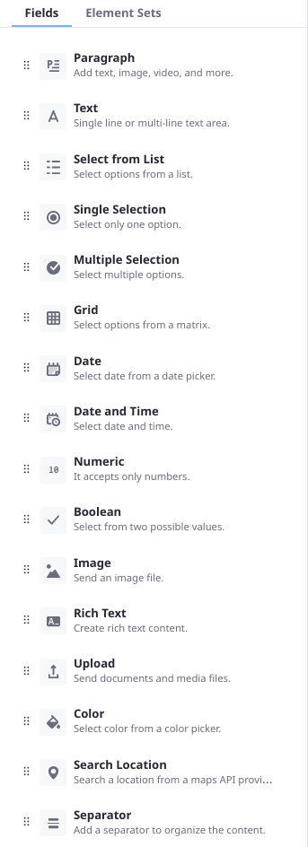

# Writing a Custom Forms Field Type

The Forms application contains many highly configurable [field types out-of-the-box](../creating-and-managing-forms/forms-field-types-reference.md). Most use cases are met with one of the existing field types. If you’re reading this, however, your use case probably wasn’t met with the default field types.



* See how the example project works
* Add custom settings to the field
* Learn how to create form fields for Liferay 7.2

```{note}
The example project here is configured to run on Liferay 7.4. If you're running Liferay 7.3, the source code is compatible but the [Workspace project](../../../building-applications/tooling/liferay-workspace/what-is-liferay-workspace.md) must be reconfigured for Liferay 7.3. The steps to do this are included in the instructions below.

If you're running Liferay 7.2, this source code will not run. Please see the section [Custom Form Fields on 7.2](#custom-form-fields-on-7-2) to learn more.
```

## Examine the Custom Forms Field in Liferay 

To see how storage adapters work, deploy an example and then add some form data using the example adapter.

### Deploy the Example

1. Start Liferay DXP. If you don't already have a docker container, use

    ```bash
    docker run -it -m 8g -p 8080:8080 [$LIFERAY_LEARN_PORTAL_DOCKER_IMAGE$]
    ```

    If you already have a docker container, use

    ```bash
    docker start -i [container_name]
    ```

1. Download and unzip [the Custom Forms Field Type project](./writing-a-custom-forms-field-type/resources/liferay-c2p9.zip).

    ```bash
    curl https://learn.liferay.com/dxp/latest/en/process-automation/forms/developer-guide/liferay-c2p9.zip -O
    ```

    ```bash
    unzip liferay-c2p9.zip
    ```

1. From the module root, build and deploy.

    ```bash
    ./gradlew deploy -Ddeploy.docker.container.id=$(docker ps -lq)
    ```

    ```{tip}
    This command is the same as copying the deployed jars to /opt/liferay/osgi/modules on the Docker container.
    ```

1. Confirm the deployment in the Liferay Docker container console.

    ```bash
    STARTED com.acme.c2p9.impl_1.0.0 [1009]
    ```

### Use the Deployed Forms Field

1. Open your browser to <http://localhost:8080>.

1. Go to the Forms application in _Site Menu_ &rarr; _Content & Data_ &rarr; _Forms_.

1. Click the *Add* button () to open the Form Builder.

1. Add the _C2P9 Slider_ field to the form.

1. You can fill out the Label, Predefined Value, and Help Text, as well as make the field Required. These settings match what many of the [out of the box fields](../creating-and-managing-forms/forms-field-types-reference.md) provide as basic settings.

1. Publish the form and go submit a record using the slider field.


## Understand the Form Field's Code

Form Field Types in Liferay contain Java and JavaScript source code. In the C2P9 Slider field,

- `C2P9DDMFormFieldType.java` provides a `DDMFormFieldType` implementation (by extending the abstract class `BaseDDMFormFieldType` and defining its metadata in the OSGi Component.
- `Slider.es.js` provides the JavaScript logic for the field.
