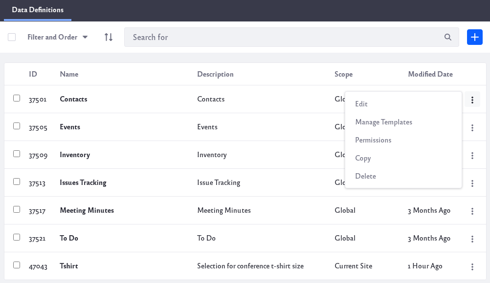

# Managing Data Definitions

There are several ways to manage your data definitions: edit, manage templates, configure permissions, copy, or delete. To begin managing your data definitions,

1. Navigate to *Content & Data* &rarr; *Dynamic Data Lists*. 

1. Click the Options icon () at the top-right and click *Manage Data Definitions*.

1. In the list, click the Actions icon () at the right side of the data definition you wish to manage.

    

The following actions are available:

**Edit:** Edit the data definition. The edit screen uses the same form as [creating data definitions](./creating-data-definitions.md). Note that if you edit a data definition referenced elsewhere (e.g., by a dynamic data list or display template), you must then update that reference.

**Manage Templates:** The Manage Templates screen creates and manages templates for the data definition. For details, see [Using Templates to Display Forms and Lists](./using-templates-to-display-forms-and-lists.md).

**Permissions:** Configure the data definition’s permissions. Note that these permissions are for an individual definition accessed through the Dynamic Data Lists application in Site Administration &rarr; Content &rarr; Dynamic Data Lists. For example, if Site members have View permission for a data definition, any Site member who also has a Role that can access the Dynamic Data Lists app and its data definitions can see this definition listed in the Manage Data Definitions screen. If you don’t want this, remove the View permission for Site Member, and Site members won’t see your data definition listed with the others.

**Copy:** The Copy Data Definition form copies the definition and its templates. In the form, give the copied definition a new name and description and select whether to also copy the original definition’s templates. Click *Copy* when you’re done. The copied definition then appears in the Data Definitions table with existing definitions. You can create new definitions based on existing ones, and then modify the copied one to suit your needs. You can, of course, edit any definition, but if you copy a definition instead, you can still access the original.

**Delete:** Delete the definition.

