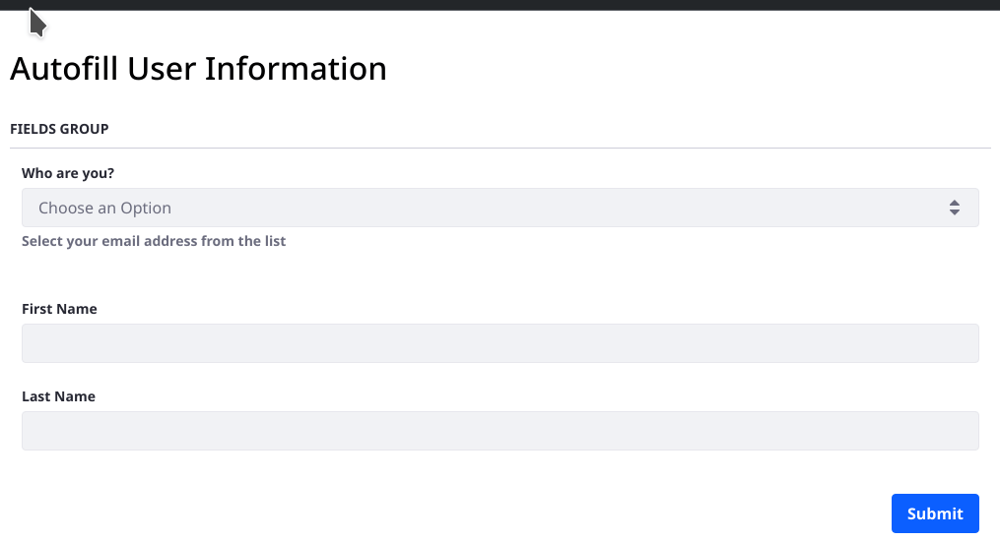
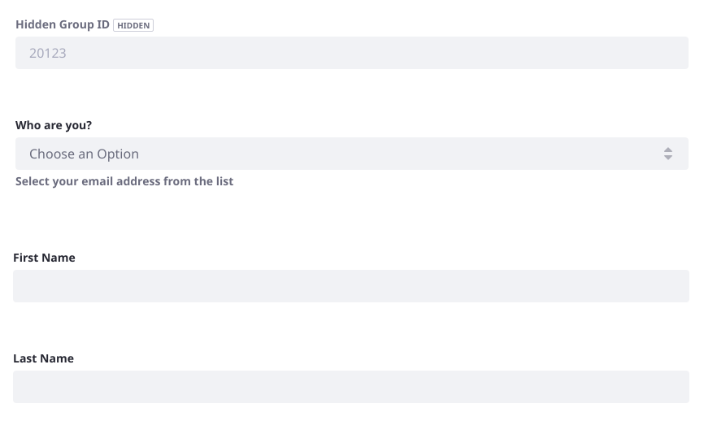

# Example: Using Hidden Fields with Form Rules

Configure Forms fields as hidden in the Advanced configuration tab.

There's a hidden field in this form. It holds the Site's ID number, so that it can be passed to a data provider as an input value:

To follow the example you must first enable local network access in the Data Provider System Settings entry. See [Enabling Access to Data on the Local Network](../data-providers/using-the-rest-data-provider-to-populate-form-options.md#enabling-access-to-data-on-the-local-network) for more information.

This example requires creating two data providers, and a form with four fields and three form rules. The table below contains a summary of the elements:

| Liferay Forms Element | Element Label | Description
| ------------- | ---------------  | ----------------------------------------------------------------------- |
| Data Provider | Get Group Users  | Get the Site's/Group's Users and provide a list of their email addresses.
| Data Provider | Get User by Email | Get the User by the selected email address and provide the first and last name.
| Form Field    | Hidden Group ID  | Use a hidden Numeric field to hold the Group ID of the current site.
| Form Field    | Who are you?     | Use a Select from List field that displays the email addresses returned by the data provider.
| Form Field    | First Name        | Use a Text field for the User's first name.
| Form Field    | Last Name         | Use a Text field for the User's last name.
| Form Rule     | _Not Applicable_  | If the Hidden Group ID field is not empty, autofill the Select from List field with the email addresses of the Site's Users.
| Form Rule     | _Not Applicable_  | If the _Who are you?_ field is not empty, autofill the first and last name fields retrieved from the data provider.
| Form Rule     | _Not Applicable_  | If the _Who are you?_ field is empty, enable the name fields so the User can manually enter data. If the condition isn't met and the first and last name fields are autofilled form the data provider, these fields are disabled on the form.

To configure this example,

1. Configure a data provider with these settings:
    - Name: _Get Group Users_
    - URL: _http://localhost:8080/api/jsonws/user/get-group-users/group-id/{groupId}_

        The `groupId` is passed as an input parameter to the data provider. In this example a hidden form field will be used to provide the group ID.

    - User Name: _test@liferay.com_ (or your administrator's email address)
    - Password: _[Enter the user's password]_
    - INPUTS:
        - Label: _Group ID_
        - Parameter: _groupId_
        - Type: _Number_
    - OUTPUTS:
        - Label: _Email Address_
        - Path: _$..emailAddress_
        - Type: _List_

    Save the data provider.

1. Configure another data provider with these settings:
    - Name: _Get User by Email_
    - URL: _http://localhost:8080/api/jsonws/user/get-user-by-email-address/company-id/20099/email-address/{emailAddress}_

        You must retrieve your Liferay Instance's ID (e.g., 20099). It's the Instance ID displayed in Control Panel &rarr; Virtual Instances.

    - User Name: _test@liferay.com_ (or your administrator's email address)
    - Password: _[Enter the user's password]_
    - INPUTS:
        - Label: _Email Address_
        - Parameter: _emailAddress_
        - Type: _Text_
    - OUTPUTS:
        - Label: _First Name_
        - Path: _$.firstName_
        - Type: _Text_

    Add another output by clicking the plus symbol.
    - OUTPUTS:
        - Label: _Last Name_
        - Path: _$.lastName_
        - Type: _Text_

    Save the data provider.

1. Create a new form and add these fields:
    - Numeric field: _Hidden Group ID_
        - Predefined Value: _[Site ID, e.g. 20123]_

            Find the Site ID in Site Settings &rarr; Site Configuration
    - Select from List field: _Who are You?_
        - Create List: _From Autofill_
    - Text field: _First Name_
    - Text field: _Last Name_

    Give the form a title and save it.

    

1. Go to the Rules tab in the form and create a rule to autofill the _Who are You?_ field's list of options:
    - CONDITION:
        - If _Hidden Group ID_ `Is Not Empty`
    - ACTION:
        - Do `Autofill` From Data Provider _Get Group Users_
            - Data Provider's Input: `groupId` &rarr; _Hidden Group ID_
            - Data Provider's Output: `Email Address` &rarr; _Who are You?_

    Save the rule.

    

1. Go to the Rules tab in the form and create a rule to autofill the _Who are You?_ field's list of options:
    - CONDITION:
        - If _Who are You?_ `Is Not Empty`
    - ACTION:
        - Do `Autofill` From Data Provider _Get User by Email_
            - Data Provider's Input: `emailAddress` &rarr; _Who are You?_
            - Data Provider's Output: `First Name` &rarr; _First Name_
            - Data Provider's Output: `Last Name` &rarr; _Last Name_

    Save the rule.

    

1. Go to the Rules tab in the form and create a rule to only enable the name fields if an email address hasn't been selected:
    - CONDITION:
        - If _Who are You?_ `Is Empty`
    - ACTION:
        - Do `Enable` _First Name_
        - Do `Enable` _Last Name_

    Save the rule.

    

1. Save and publish the form. Saving the rules did not save the form so you must go back to the Form tab and click _Save_, and _Publish_ if the form is not already published.

To test the form, go to its dedicated URL and select an email address. Note the following behavior:

- Use the _Who are you?_ field to choose your email address from a list of Users that belong to the current Site. This list is populated by a data provider calling the JSON web service _get-group-users_.
- Choosing an email address from the selector autofills the First Name and Last Name fields, and disables these fields so they cannot be edited.
- Leaving the _Who are you?_ field blank (e.g., _Choose an Option_ is displayed) enables both name fields so the user can input data directly.

## Related Content

- [Publishing a Form](../creating-and-managing-forms/creating-forms.md#publishing-a-form)
- [Data Providers Overview](../data-providers/data-providers-overview.md)
- [Using the Autofill Rule](./using-the-autofill-rule.md)
- [Forms Field Types Reference](../creating-and-managing-forms/forms-field-types-reference.md)
