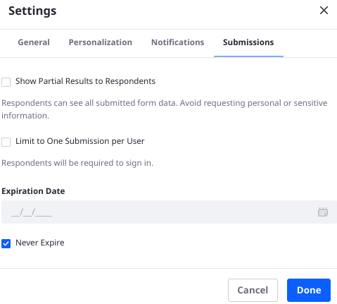

# Using Forms to Poll Users

In previous versions of Liferay, Site Administrators had access to a dedicated Polls application in the Site Administration &rarr; Content and Data menu. This application was [deprecated in Liferay 7.3](../../installation-and-upgrades/upgrading-liferay/reference/maintenance-mode-and-deprecations-in-7-3.md#features-deprecated-in-7-3) and [removed in Liferay 7.4](../../installation-and-upgrades/upgrading-liferay/reference/maintenance-mode-and-deprecations-in-7-3.md#features-deprecated-in-7-4).

Liferay Forms has been enhanced to fulfill the use cases that the Polls application handled in older Liferay versions. To create new polls, use Liferay Forms with the features described here.

If you're upgrading from an earlier Liferay version, your Polls are automatically upgraded to use Forms. However, some steps will need to be completed manually to fully enable your new Forms-based polls.
<!-- what's the upgrade path? 7.3 > 7.4 is surely supported but what about earlier versions? -->

```{note}
A comprehensive listing of form settings is included in the [Forms configuration reference](creating-and-managing-forms/forms-configuration-reference.md).
```

## Creating Polls

Three settings were added to the Form Settings modal, in the Submissions section, to enabled polls-like functionality in Liferay Forms: Limit to One Submission Per User, Expiration Date, and Show Partial Results to Respondents.



### Limit to One Submission Per User

Limit submissions to one per User. Do not allow multiple form submissions to logged in Users. In addition to limiting the number of submissions, enabling this setting also requires that Users are authenticated to fill out the form.

### Add an Expiration Date

By default, forms never expire. If you disable the Never Expire setting, you can then set the date when the form expires. After this date, no submissions are allowed. Form users see an expiration notification when accessing the form.

### Show Partial Results to Respondents

Allow respondents to see aggregated data on the currently submitted form records. Respondents can view the current [Forms Report](../sharing-forms-and-managing-submissions/form-reports.md#show-partial-results-to-form-respondents) data for the form. Enabling this warns the user against submitting sensitive information.

## Upgrading Polls to Forms
