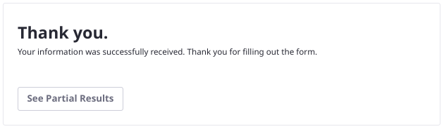
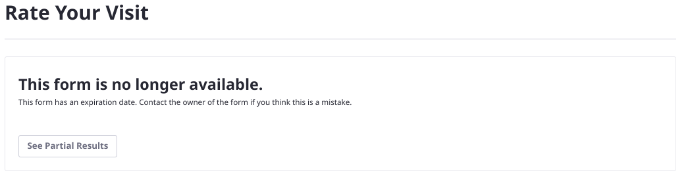
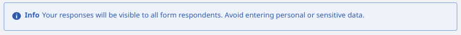

# Using Forms to Poll Users

In previous versions of Liferay, Site Administrators had access to a dedicated Polls application in the Site Administration &rarr; Content and Data menu. This application was [deprecated in Liferay 7.3](../../installation-and-upgrades/upgrading-liferay/reference/maintenance-mode-and-deprecations-in-7-3.md#features-deprecated-in-7-3) and [removed in Liferay 7.4](../../installation-and-upgrades/upgrading-liferay/reference/maintenance-mode-and-deprecations-in-7-3.md#features-deprecated-in-7-4).

Liferay Forms has been enhanced to fulfill the use cases that the Polls application handled in older Liferay versions. To create new polls, use Liferay Forms with the features described here.

If you're upgrading along the path of Liferay 7.2 &rarr; 7.3 &rarr; 7.4, your Polls are automatically upgraded to use Forms.

```{note}
A comprehensive listing of form settings is included in the [Forms configuration reference](creating-and-managing-forms/forms-configuration-reference.md).
```

## Creating Polls

Three settings were added to the Form Settings modal, in the Submissions section, to enabled polls-like functionality in Liferay Forms: Limit to One Submission per User, Expiration Date, and Show Partial Results to Respondents.


### Limit to One Submission Per User

Limit submissions to one per User. Do not allow multiple form submissions to logged in Users.

```{warning}
Enabling Limit to One Submission per User also requires that Users are authenticated to fill out the form. This requirement overrides the permissions set on the form and the form setting _Require User Authentication: False_.
```



### Add an Expiration Date

By default, forms never expire. If you disable the Never Expire setting, you can then set the date when the form expires. After this date, no submissions are allowed. Form users see an expiration notification when accessing the form.



### Show Partial Results to Respondents

Allow respondents to see aggregated data on the currently submitted form records. Respondents can view the current [Forms Report](../sharing-forms-and-managing-submissions/form-reports.md#show-partial-results-to-form-respondents) data for the form. Enabling this warns the user against submitting sensitive information.



### Creating a Poll with Liferay Forms

Use Forms-based polls to keep site visitors engaged with your site's content.

Two applications make and display a poll: the *Forms* application in the Site Menu and the *Form* widget you add to a page.

1. From the Site Menu, go to *Content* &rarr; *Polls*. 

1. Click the  button and fill out the Title and Description.

1. Configure the form to behave like a poll: open the Form Settings window, got to the Submissions section, and 

   - **Show Partial Results to Respondents**: Enabled
   - **Limit to One Submission per User**: Enabled
   - **Never Expire**: Unchecked if desired (set the expiration date)

1. Now configure the poll question. Add a required multi-line Text field to the form.

   -  **Label:** How was your visit?
   -  **Field Type:** Multiple Lines
   -  **Required Field:** Enabled

1. Click *Publish* to make the form available to Users.

   Forms are accessed by a direct link or by displaying the form on a Liferay page. See [Publishing a Form](creating-and-managing-forms/creating-forms.md#publishing-a-form) for details. 

## Upgrading Polls to Forms

If you're upgrading Liferay along the path of Liferay 7.2 &rarr; 7.3 &rarr; 7.4, your Polls are automatically upgraded to use Forms. During the 7.4 lifecycle the upgrade process to accomplish this task was enhanced; as of Liferay 7.4 GA/Update 26 it can now

- Convert the entities in the back-end so that Polls become Form entities and can be managed with the Forms application and APIs.
- Enable the form settings that provide polls-like behavior.
- If the Poll was displayed on a page in the Polls Display widget, post-upgrade it's displayed on the page in a Form widget.

```{warning}
For installations [upgraded](../../installation-and-upgrades/upgrading-liferay.md) to Liferay 7.4 versions prior to DXP Update 26/CE GA 26, the upgrade process was incomplete. To fully upgrade the Polls you must

- make sure that the _Limit to One Submission per User_ setting is configured in the form.
- manually replace any Polls Display widget you had on a page with a Form widget.
```
<!-- Make sure to use the Update/GA version when all the tickets are released. See https://issues.liferay.com/browse/LPS-153046 -->
<!--If it is important enough for U1-25 users, we can share a Groovy script that takes the form Ids that match convertedFromPolls:true and automatically set them to use the polls settings -->

## Additional Information

- [Creating and Managing Forms](./creating-and-managing-forms.md)
- [Maintenance Mode and Deprecations in 7.4](../../installation-and-upgrades/upgrading-liferay/reference/maintenance-mode-and-deprecations-in-7-4.md)
