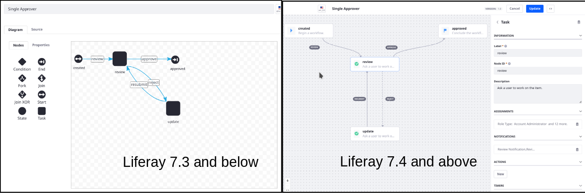

# Workflow Designer

```{toctree}
:maxdepth: 3

workflow-designer/workflow-designer-overview.md
workflow-designer/creating-workflow-tasks.md
workflow-designer/configuring-workflow-actions-and-notifications.md
workflow-designer/workflow-nodes.md
workflow-designer/using-forks-and-joins.md
workflow-designer/using-condition-nodes.md
workflow-designer/assigning-task-nodes.md
```

```{note}
The Workflow Designer user interface was refreshed in a Liferay 7.4 update. The look and feel of the new builder is improved, and the user experience is more intuitive. The documentation is updated based on the new interface. The steps presented in these sections may need to be adjusted if you are using the earlier Workflow Designer on Liferay 7.3 and below.


```

- [Workflow Designer Overview](./workflow-designer/workflow-designer-overview.md)
- [Creating Workflow Tasks](./workflow-designer/creating-workflow-tasks.md)
- [Configuring Workflow Actions and Notifications](./workflow-designer/configuring-workflow-actions-and-notifications.md)
- [Assigning Task Nodes](./workflow-designer/assigning-task-nodes.md)
- [Using Forks and Joins](./workflow-designer/using-forks-and-joins.md)
- [Using Condition Nodes](./workflow-designer/using-condition-nodes.md)
- [Workflow Nodes](./workflow-designer/workflow-nodes.md)

