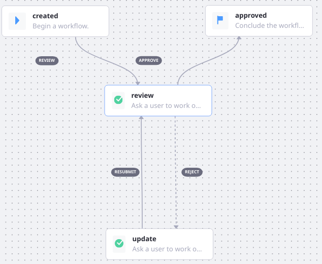
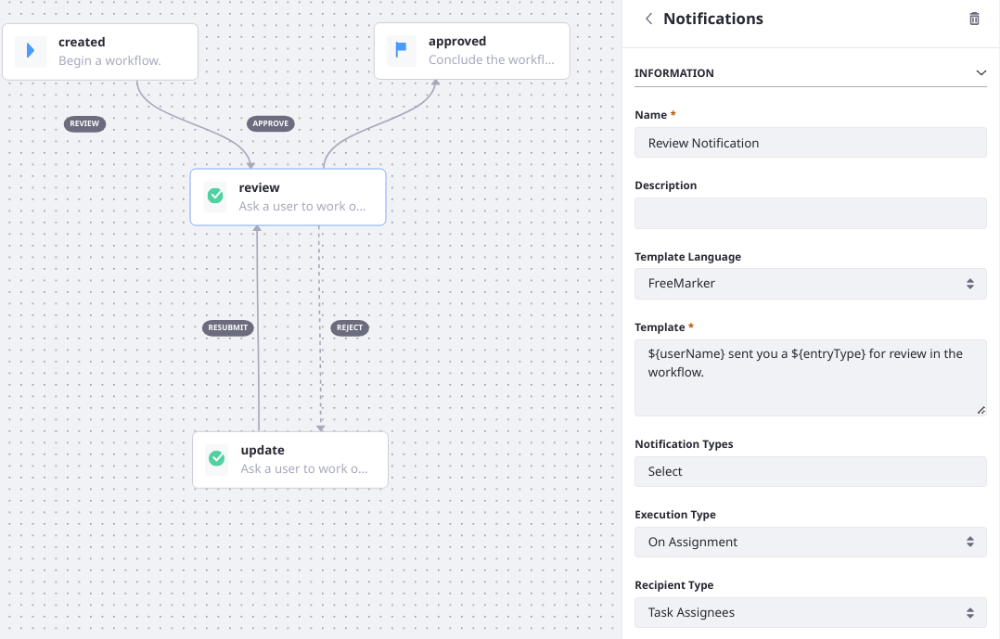
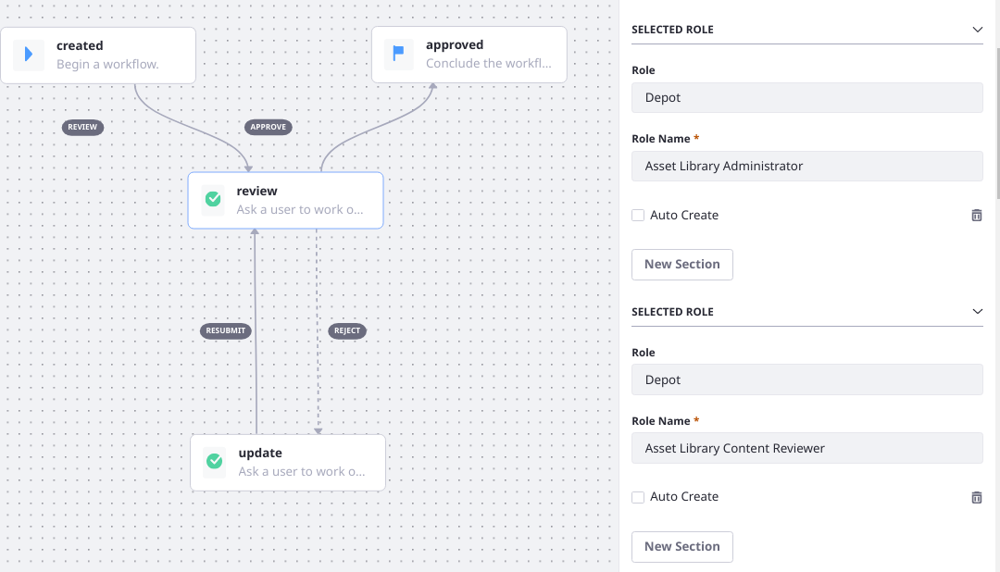
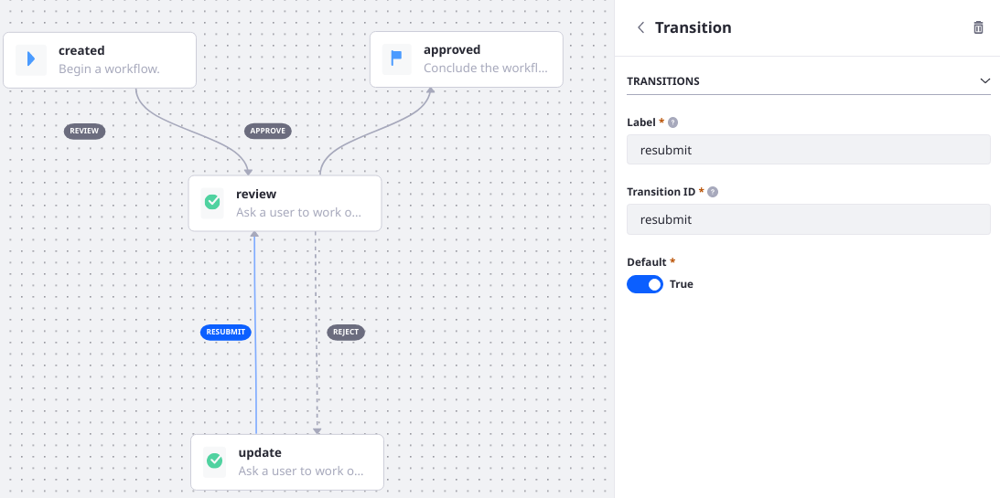

# Creating Workflow Tasks

> Subscribers

The default [Single Approver Definition](./workflow-designer-overview/resources/single-approver-definition.xml) offers a simple introduction to workflow tasks. It has only two task nodes: Review and Update. The workflow enters the Review node when a content creator submits an asset for review. In review, the asset can be accepted or rejected. If it's rejected, the process moves to the Update task. The submitter can then modify the asset and resubmit it for review.



Task nodes are often the most complex parts of a workflow definition. They can have Assignments which can assign the task to users or a Resource Action (see [Using Task Nodes](./assigning-task-nodes.md)).

Task nodes also contain Notifications and Actions--to which complexity can be added with [scripts](../../developer-guide/using-the-script-engine-in-workflow.md). See [Configuring Workflow Actions and Notifications](./configuring-workflow-actions-and-notifications.md).

When the review is finished and the approved transition is triggered, the workflow advances to the next node. In th Single Approver process, it simply moves to the Approved End node.

## Creating the Single Approver Workflow

You'll create the workflow in 4 steps: 

* Create the workflow and give it a name
* Create the Review node
* Create the Update node
* Configure the End node

### Creating the Workflow

1. Go to the Global Menu &rarr; Applications &rarr; Process Builder.
1. Click the _Workflows_ tab.
1. Click _Add_ ().
1. Give your workflow a descriptive name, like My Single Approver.

### Creating the Review Node

1. In the workflow designer Canvas, delete the old transition (connector line) between the Start node and End node: select it with your mouse and hit the Delete key on your keyboard.
1. Drag and drop a Task node onto the canvas. 
1. Connect the Start node to the Task node by making sure no nodes are selected and then moving your pointer to the edge of the start node. When the cursor changes shape, you can click and drag a transition from the Start node to the Task node.
1. Select the transition and rename it _review_.
1. Click the Task node to begin updating its properties.
1. Double click the Name field and give the node a name: _review_.
1. Double click _Notifications_.
1. Enter this information:

    * **Name**: Review Notification
    * **Template Language**: Freemarker
    * **Template**: Enter this Freemarker notification: `${userName} sent you a ${entryType} for review in the workflow.`
    * **Notification Type**: Use the Ctrl key to select _Email_ and _User Notification_; this is a multiple select field.
    * **Execution Type**: On Assignment
    * **Recipient Type**: Task Assignees

    

    Click _Add Section_.

    Enter this information:

   * **Name:** Review Completion Notification
   * **Template Language:** Freemarker
   * **Template:** Enter this Freemarker notification: `Your submission was reviewed<#if taskComments?has_content> and the reviewer applied the following ${taskComments}</#if>.`
   * **Notification Type:** Email
   * **Execution Type:** On Exit
   * **Recipient Type:** User

1. Click _Save_ when finished.
1. Double click _Assignments_. You can assign the review task to a Role, Role Type, a specific User, or a Resource Action. In this example, assign the review Task to a Role Type. Select these Roles, clicking _Add Section_ each time you must add a new Role:

   * Asset Library Administrator
   * Asset Library Content Reviewer
   * Asset Library Owner
   * Organization Administrator
   * Organization Content Reviewer
   * Organization Owner
   * Administrator
   * Portal Content Reviewer
   * Site Administrator
   * Site Content Reviewer
   * Site Owner

   For more information about Roles and Permissions, see [Understanding Roles and Permissions](../../../../users-and-permissions/roles-and-permissions/understanding-roles-and-permissions.md) and [Assigning Users to Roles](../../../../users-and-permissions/roles-and-permissions/assigning-users-to-roles.md).

   

1. Click _Save_ when finished.

1. Click the End node and rename it to _Approved_.

1. Connect the Review node to the Approved End node. Name the connector _approve_.

This Task node is now configured; it sends a notification that a submission is ready for review to those Users assigned to a specific Role.

You can also assign the Task node to a Resource Action instead of another user or a Role Type. To learn more see [Using Task Nodes](./assigning-task-nodes.md).

### Create the Update Node

1. Drag and drop another Task node onto the canvas. 
1. Connect the review node to the new Task node by making sure no nodes are selected and then moving your pointer to the edge of the start node. When the cursor changes shape, you can click and drag a connector from the review node to the new Task node. 
1. Select the connector and rename it _reject_. 
1. Click the Task node to begin updating its properties. 
1. Double-click the _Name_ field to give the node a name: _update_. 
1. Double-click _Notifications_. 
1. Enter this information: 

   * **Name:** Creator Modification Notification
   * **Template Language:** Freemarker
   * **Template:** Enter this Freemarker notification: `Your submission was rejected by ${userName}; please modify and resubmit.` 
   * **Notification Type:** Use the Ctrl key to select _Email_ and _User Notification_; this is a multiple select field. 
   * **Execution Type:** On Assignment
   * **Recipient Type:** Task Assignees

1. Double-click _Assignments_. Select _User_ and click _Save_. 
1. Double-click _Actions_. Enter this information: 

   * **Name:** reject
   * **Script:**  
     ```groovy
      import com.liferay.portal.kernel.workflow.WorkflowStatusManagerUtil;
      import com.liferay.portal.kernel.workflow.WorkflowConstants;

      WorkflowStatusManagerUtil.updateStatus(WorkflowConstants.getLabelStatus("denied"), workflowContext);
      WorkflowStatusManagerUtil.updateStatus(WorkflowConstants.getLabelStatus("pending"), workflowContext);
     ```
   * Leave the rest of the defaults: (Language _groovy_, Execution type _On Assignment_)

1. Click _Save_. 
1. Make sure nothing is selected and move your mouse pointer to the edge of the _update_ node. Drag a connector from the _update_ node back to the _review_ node. 
1. Name the new connector _resubmit_. 



### Configuring the End Node

The only thing left to do is rename the end node and configure it to set the workflow status to approved. 

1. Drag a connector from the review node to the End Node. 
1. Rename the connector _approve_. 
1. Double-click on the _End Node_ and rename it to _Approved_. 
1. Click the _Publish_ button at the bottom to publish your workflow. 

Now that you've walked through a workflow creation and learned how to use the workflow designer, look into adding node types that can take your workflow processes to the next level; such as [Forks and Joins](./using-forks-and-joins.md) or [Conditions](./using-condition-nodes.md).

## Additional Information

* [Activating Workflow](../../using-workflows/activating-workflow.md)
* [Workflow Nodes](./workflow-nodes.md)
* [Configuring Workflow Actions and Notifications](./configuring-workflow-actions-and-notifications.md)
* [Using Task Nodes](./assigning-task-nodes.md)
