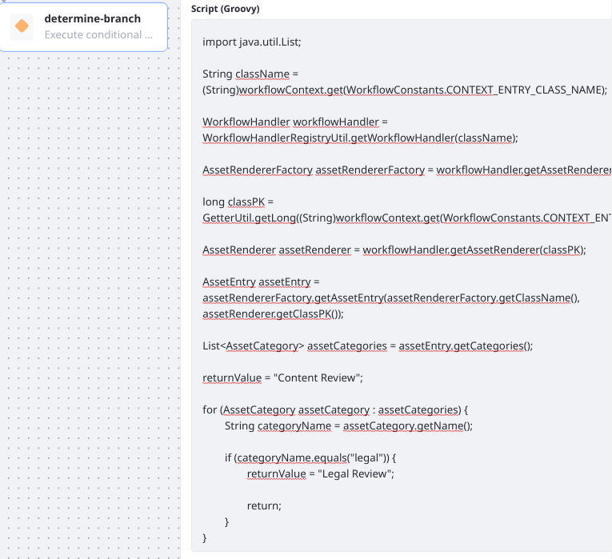
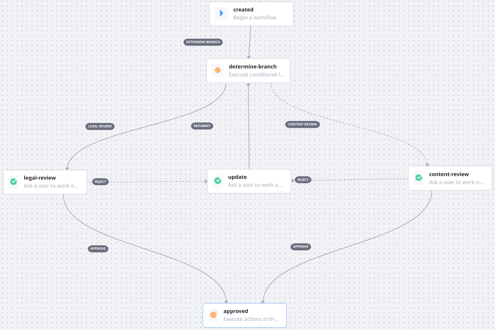

# Using Condition Nodes

{bdg-primary}`Subscription`

_Condition_ nodes are useful for acting  (transitioning, assigning, etc.) conditionally in the workflow. Perhaps you have multiple reviewers and must determine which reviewer should be assigned a task. For example, different documents might require review by the Legal department or the Marketing team.

Conditions act as a gatekeeper by checking whether the specified conditions are met, and then acting on the asset---assigning the right reviewer, or transitioning to a certain task, based on those conditions.

The [Category Specific Definition](https://github.com/liferay/liferay-learn/blob/master/docs/dxp/latest/en/process-automation/workflow/designing-and-managing-workflows/workflow-designer/workflow-designer-overview/resources/category-specific-definition.xml) contains a Condition node. The conditional logic checks the asset category to choose whether to transition to the _Legal Review_ task or the _Content Review_ task. To add a Condition node to your workflow,

1. Navigate to the _Global Menu_ &rarr;  _Applications_ &rarr; _Workflow_ &rarr; _Process Builder_.
1. Click the () to add a new workflow.
1. In the workflow designer Canvas, enter a name for the workflow.
1. Open the _Source_ view.
1. Find the [Category Specific Definition](https://github.com/liferay/liferay-learn/blob/master/docs/dxp/latest/en/process-automation/workflow/designing-and-managing-workflows/workflow-designer/workflow-designer-overview/resources/category-specific-definition.xml). Either copy its raw contents into the source view, overwriting all the existing content, or click _Import A File_ and upload the definition's XML file.
1. Open the _Diagram_ view.
1. Click the Condition node, _Determine Branch_, to configure the node's properties.
1. Find the _Script (Groovy)_ field. Resize the field (make it bigger) to see the contents more clearly:


    

   The script loops through the asset's categories looking for the string `legal`. If it's found, workflow continues along the Legal Review path. Otherwise, it continues along the Content Review path. 

   The full contents are available in [The Category Specific Definition's Condition Script](#the-category-specific-definition-s-condition-script).

1. Click the back arrow () or _Save_ (if using an earlier version of the Workflow Designer) when finished working with the condition's script.



Notice how the _Condition_ node is connected to three different Task nodes:

* If the document is in the `legal` category, the asset is sent to the Legal Department.
* Otherwise, the asset is sent to the Marketing team.
* The _update_ node sends the processing back to the Condition once it's updated by the original creator (if the asset was rejected in one of the review nodes).

See [Creating Workflow Tasks](./creating-workflow-tasks.md) and [Assigning Task Nodes](./assigning-task-nodes.md) to learn how to configure Task nodes.

## The Category Specific Definition's Condition Script

```groovy
import com.liferay.asset.kernel.model.AssetCategory;
import com.liferay.asset.kernel.model.AssetEntry;
import com.liferay.asset.kernel.model.AssetRenderer;
import com.liferay.asset.kernel.model.AssetRendererFactory;
import com.liferay.asset.kernel.service.AssetEntryLocalServiceUtil;
import com.liferay.portal.kernel.util.GetterUtil;
import com.liferay.portal.kernel.workflow.WorkflowConstants;
import com.liferay.portal.kernel.workflow.WorkflowHandler;
import com.liferay.portal.kernel.workflow.WorkflowHandlerRegistryUtil;

import java.util.List;

String className = (String)workflowContext.get(WorkflowConstants.CONTEXT_ENTRY_CLASS_NAME);

WorkflowHandler workflowHandler = WorkflowHandlerRegistryUtil.getWorkflowHandler(className);

AssetRendererFactory assetRendererFactory = workflowHandler.getAssetRendererFactory();

long classPK = GetterUtil.getLong((String)workflowContext.get(WorkflowConstants.CONTEXT_ENTRY_CLASS_PK));

AssetRenderer assetRenderer = workflowHandler.getAssetRenderer(classPK);

AssetEntry assetEntry = assetRendererFactory.getAssetEntry(assetRendererFactory.getClassName(), assetRenderer.getClassPK());

List<AssetCategory> assetCategories = assetEntry.getCategories();

     returnValue = "Content Review";

for (AssetCategory assetCategory : assetCategories) {
String categoryName = assetCategory.getName();

if (categoryName.equals("legal")) {
    returnValue = "Legal Review";

    return;
    }
}
```

## Additional Information

* [Managing Workflows](../managing-workflows.md)
* [Workflow Nodes](./workflow-nodes.md)
* [Using Forks and Joins](./using-forks-and-joins.md)
* [Configuring Workflow Actions and Notifications](./configuring-workflow-actions-and-notifications.md)
