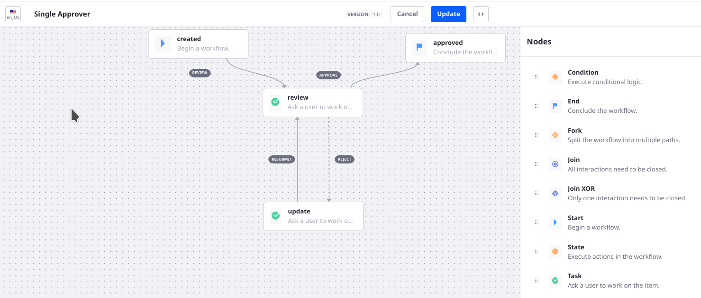
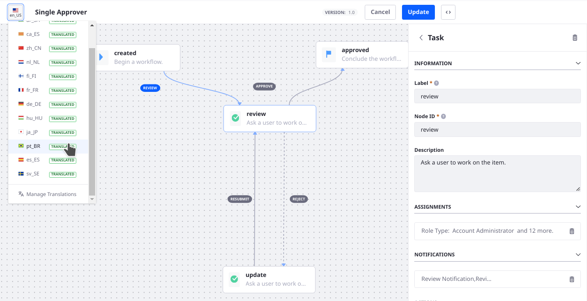

# Workflow Designer Overview

> Subscribers

The Process Builder's workflow designer is a graphical interface for creating workflow process definitions. The convenient drag and drop interface makes workflow design easier than [writing XML definitions by hand](../../developer-guide/crafting-xml-workflow-definitions). It's accessed in the Control Panel &rarr; Workflow &rarr; Process Builder.



```{tip}
Alternatively, you can write or upload XML definitions from the Source View in the Process Builder. See [Managing Workflows](../managing-workflows.md#uploading-a-new-workflow-definition).
```

The workflow designer supports all [workflow node](./workflow-nodes.md) types:

* [Start and End nodes](./workflow-nodes.md#start-and-end-nodes)
* [Fork and Join nodes](./using-forks-and-joins.md)
* [Condition nodes](./using-condition-nodes.md)
* [State nodes](./workflow-nodes.md#state-nodes)
* [Task nodes](./creating-workflow-tasks.md)

In addition to the functionality provided by the drag and drop interface, you have the full power of Groovy (a Java-based scripting language) to perform [programmatic actions](./../../developer-guide/using-the-script-engine-in-workflow.md) on assets being moved through your workflows.

By default, only one workflow definition is installed: the Single Approver Workflow definition. You can see additional examples in the Liferay source code:

* [Category-Specific Definition](https://github.com/liferay/liferay-learn/blob/master/docs/dxp/latest/en/process-automation/workflow/designing-and-managing-workflows/workflow-designer/workflow-designer-overview/resources/category-specific-definition.xml)
* [Legal Marketing Definition](https://github.com/liferay/liferay-learn/blob/master/docs/dxp/latest/en/process-automation/workflow/designing-and-managing-workflows/workflow-designer/workflow-designer-overview/resources/legal-marketing-definition.xml)
* [Single Approver Definition with Scripted Assignment](https://github.com/liferay/liferay-learn/blob/master/docs/dxp/latest/en/process-automation/workflow/designing-and-managing-workflows/workflow-designer/workflow-designer-overview/resources/single-approver-definition-scripted-assignment.xml)
* [Single Approver Definition](https://github.com/liferay/liferay-learn/blob/master/docs/dxp/latest/en/process-automation/workflow/designing-and-managing-workflows/workflow-designer/workflow-designer-overview/resources/single-approver-definition.xml)

## Building Workflows

To build a workflow, navigate to the Global Menu () &rarr; Control Panel &rarr; Process Builder.

Click the () to begin.

Each Workflow Node represents a specific point in an approval process, whether it starts the review process, approves or rejects the asset, or reassigns the task.

[Workflow transitions](./workflow-transitions.md) link each node to create the desired flow in the review process. On exiting the first node, processing continues to the next node indicated by the transition.

Ready to work on workflows? Your next step is [creating workflow tasks](./creating-workflow-tasks.md).

## Localizing the Workflow

A workflow process's text is experienced by Users in these ways:

- Administrators and workflow participants (e.g., workflow task assignees) see the workflow definition's title in the list of workflows.
- Workflow participants (e.g., workflow task assignees) see the Node and Transition labels while managing their workflow content (e.g., in My Workflow Tasks).

<!-- TODO: adjust this update number as needed -->
As of Liferay 7.4 U20, the Workflow text that appears in the UI is translatable.

To translate the workflow,

1. Open a workflow or add a new one from the Global Menu &rarr; Applications &rarr; Process Builder. 
1. If it's a new workflow connect the start node to the end node with a [transition](./workflow-transitions.md).
1. All of the localizable fields were created in the instance's default language. To begin translating, click the Language Selector near the workflow's title field:

   

1. Select the language to begin translating.
1. Go through the workflow and translate the node labels, transition labels, and the workflow title.
1. Save the workflow.

Once the workflow definition is published and [associated to an asset](../../using-workflows/activating-workflow.md), participants like workflow task assignees will interact with the workflow in their language.

## Additional Information

* [Managing Workflows](../managing-workflows.md)
* [Workflow Nodes](./workflow-nodes.md)
* [Using Forks and Joins](./using-forks-and-joins.md)
* [Using Condition Nodes](./using-condition-nodes.md)
* [Creating Workflow Tasks](./creating-workflow-tasks.md)
* [Configuring Workflow Actions and Notifications](./configuring-workflow-actions-and-notifications.md)
