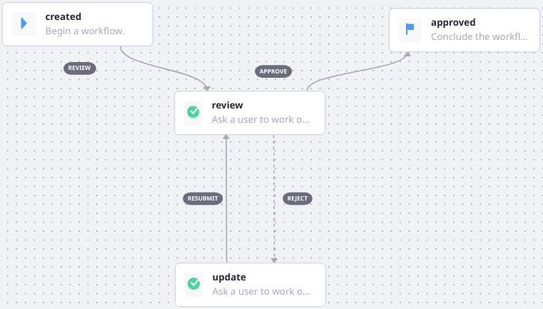
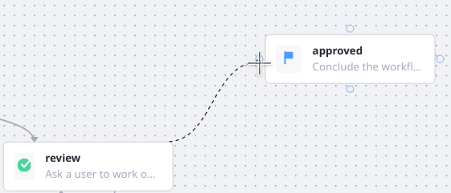
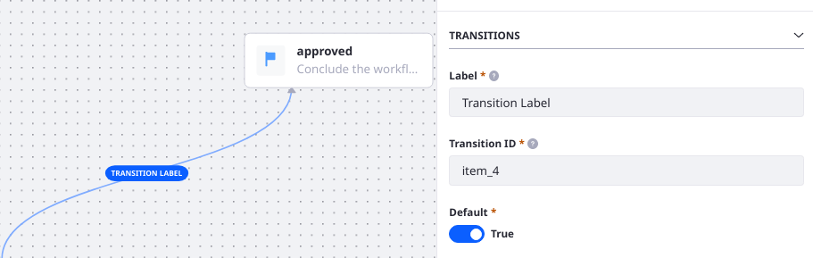

# Workflow Transitions

{bdg-primary}`Subscription`

Transitions represent the paths a workflow can traverse. In the Workflow Designer's palette, transitions are the arrows connecting the workflow nodes:



To create transitions in the designer, 

1. Mouse over the midpoint of one of the originating node's sides.
1. When the cursor changes to a plus symbol () click and hold.
1. Drag the transition to the destination node. When the cursor becomes a plus symbol () again, release the mouse button.



To edit a Transition's properties, click its label in the designer palette and its properties are displayed in the sidebar:



**Label** is the displayed text that represents the transition. When a User is working on a [task node](../../developer-guide/workflow-task-node-reference.md), they'll see the transition label as the action they can take when performing the review (e.g., reject or approve).

**Transition ID** is the identifier used to identify the transition in your custom code, scripts, or when editing the workflow definition's XML. It's a good idea to make this memorable and perhaps link it to the Label: if the Label is _Review_, you might make the Transition ID _review_. For longer labels, consider using camel case or snake case. It is not advisable to change the Transition ID once the workflow is published.

**Default** sets whether the Transition is the default for the node. Only one outgoing transition can be the default for each node. If there's only one transition, it's automatically the default. The default appears as the first option in the UI for a workflow task assignee, so it makes sense to make the default transition the one that leads to the best, or most expected, workflow path.

In the XML each node's transitions are defined in a `transitions` element: 

```xml
<transitions>
    <transition>
        <labels>
            <label language-id="en_US">
                approve
            </label>
        </labels>
        <id>approve</id>
        <target>approved</target>
        <default>true</default>
    </transition>
    <transition>
        <labels>
            <label language-id="en_US">
                reject
            </label>
        </labels>
        <id>reject</id>
        <target>update</target>
        <default>false</default>
    </transition>
</transitions>
```
