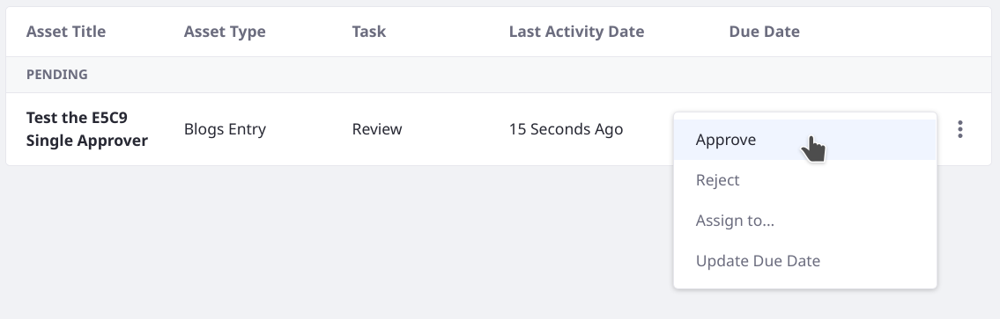

# Creating an Action Executor

Workflow nodes can contain `<action>` elements that execute custom logic via [Groovy scripts](./using-the-script-engine-in-workflow.md).

```xml
<action>
    <name>approve</name>
    <script>
        <![CDATA[
            import com.liferay.portal.kernel.workflow.WorkflowConstants;
            import com.liferay.portal.kernel.workflow.WorkflowStatusManagerUtil;

            WorkflowStatusManagerUtil.updateStatus(WorkflowConstants.getLabelStatus("approved"), workflowContext);
        ]]>
    </script>
    <script-language>groovy</script-language>
    <execution-type>onEntry</execution-type>
</action>
```

Instead of writing the Groovy action logic directly in a workflow definition `<script>` element, you can execute Java logic by implementing the `ActionExecutor` interface.

1. Write the Java implementation.
2. Call the Java class from the workflow definition XML file.

First deploy and observe a working `ActionExecutor`.

## Deploy an Action Executor

1. Start Liferay.

   ```bash
   docker run -it -m 8g -p 8080:8080 [$LIFERAY_LEARN_DXP_DOCKER_IMAGE$]
   ```

1. Download and unzip the Acme E5C9 Implementation project.

   ```bash
   curl https://learn.liferay.com/dxp/latest/en/process-automation/workflow/developer-guide/liferay-e5c9.zip -O
   ```

   ```bash
   unzip liferay-e5c9.zip
   ```

1. From the module root, build and deploy.

   ```bash
   ./gradlew deploy -Ddeploy.docker.container.id=$(docker ps -lq)
   ```

   ```{tip}
   This command is the same as copying the deployed jars to `/opt/liferay/osgi/modules` on the Docker container.
   ```

1. Confirm the deployment in the Liferay Docker container console.

   ```bash
   STARTED com.acme.e5c9.impl_1.0.0
   ```

```{note}
For convenience, the `activate` method of the `ActionExecutor` autoloaded a E5C9 Single Approver workflow definition. This code achieved the same thing as navigating to the Workflow Process Builder and uploading a workflow definition. See [Uploading a New Workflow Definition](../designing-and-managing-workflows/managing-workflows.md#uploading-a-new-workflow-definition)_.
```

## Test the Action Executor

To use the Acme E5C9 Action Executor, set the workflow definition for use with Blogs Entries and add a new Blogs Entry with the administrative User.

1. In the Applications tab of the Global Menu, go to Workflow &rarr; Process Builder.

1. In the Configuration tab, assign the E5C9 Single Approver definition to the Blogs Entry Asset Type.

1. Click _Save_.

1. Using the default administrative User Test Test, open the Site menu &rarr; Content & Data &rarr; Blogs.

1. Click the _Add_ button ().

1. Enter something into the Title and Content fields, then click _Submit for Publication_.

1. Back in the main Blogs view, confirm that the entry is visible and that the status is marked as _Pending_.

   The workflow framework set the status as pending. From this point onward, the status updates are made using the logic in the action executor.

1. [Approve the Blogs Entry in the workflow](../using-workflows/reviewing-assets.md#approving-or-rejecting-a-task).

   

If you assign the Single Approver workflow to Blogs Entries, you can see it work identically to the E5C9 Single Approver.

## Understanding the E5C9 Action Executor

The Acme E5C9 Implementation project extracts the status-setting logic of the Single Approver definition's workflow scripts into its single Java class, `E5C9ActionExecutor`.

In addition to the action executor, the project includes and autoloads a workflow definition called the E5C9 Single Approver, which has the same logic as the default Single Approver but uses the action executor class's logic instead of Groovy scripting directly in the workflow definition.

```{literalinclude} ./creating-an-action-executor/resources/liferay-e5c9.zip/e5c9-impl/src/main/java/com/acme/e5c9/internal/workflow/kaleo/runtime/scripting/internal/action/E5C9ActionExecutor.java
   :dedent: 4
   :language: java
   :lines: 49-50
```

### Implementing an ActionExecutor

The action executor class implements the `com.acme.e5c9.internal.workflow.kaleo.runtime.scripting.internal.action.ActionExecutor` interface, overriding its single `execute` method. Set the action's scripting language as `java` in a component property.

```{literalinclude} ./creating-an-action-executor/resources/liferay-e5c9.zip/e5c9-impl/src/main/java/com/acme/e5c9/internal/workflow/kaleo/runtime/scripting/internal/action/E5C9ActionExecutor.java
   :dedent: 0
   :language: java
   :lines: 31-35
```

The `execute` method does not return anything. Instead, logic is executed arbitrarily within the method and the workflow processing continues according to the XML definition. Often times the status of the workflow is updated within the action execution.

The `execute` method takes two parameters, a `KaleoAction` and an `ExecutionContext`. Because the workflow engine is responsible for calling the action executor in the workflow process, your code isn't responsible for instantiating and constructing these objects. However, you can obtain useful information from them. For example, the E5C9 Action Executor retrieves the `workflowContext` (of the type `Map`) from the `ExecutionContext`:

```{literalinclude} ./creating-an-action-executor/resources/liferay-e5c9.zip/e5c9-impl/src/main/java/com/acme/e5c9/internal/workflow/kaleo/runtime/scripting/internal/action/E5C9ActionExecutor.java
   :dedent: 3
   :language: java
   :lines: 43-44
```

The `workflowContext` is used to get the transition most recently executed, so that conditional logic can determine which status to set for the asset in the workflow. 

```{literalinclude} ./creating-an-action-executor/resources/liferay-e5c9.zip/e5c9-impl/src/main/java/com/acme/e5c9/internal/workflow/kaleo/runtime/scripting/internal/action/E5C9ActionExecutor.java
   :dedent: 3
   :language: java
   :lines: 46-59
```

### Calling the ActionExecutor in the Workflow Definition

The E5C9 Single Approver workflow definition auto-loaded by the Acme E5C9 Implementation project is nearly identical to the Single Approver definition that ships with Liferay. The differences are entirely in the script elements of the state and task nodes, which are greatly simplified in the E5C9 Single Approver definition because all logic is outsourced to the action executor class. Both of the definition's actions (reject and approve) have identical script tags:

```{literalinclude} ./creating-an-action-executor/resources/liferay-e5c9.zip/e5c9-impl/src/main/resources/com/acme/e5c9/internal/workflow/kaleo/runtime/scripting/internal/action/dependencies/e5c9-workflow-definition.xml
   :dedent: 4
   :language: xml
   :lines: 62-65
```

The script tags are still necessary, but now they point the workflow framework to the action executor that holds the logic.

You aren't limited to calling a single action executor in your workflow definition. For example, the `E5C9ActionExecutor` has logic to determine the transition before setting the workflow status. However, if the logic was more complex each action in the workflow could be backed by a separate `ActionExecutor` implementation, and these implementations can be reused in other workflow definitions.
