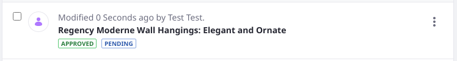

# Introduction to Workflow

Liferay DXP ships with a workflow engine that allows users to review and approve content such as Blogs, Web Content, Wikis before they are published. The Workflow application makes it possible to define any number of business processes/workflows, deploy them, and manage them through a portal interface. Workflow processes are written in `XML` format and several sample workflow processes are available for reference. Lastly, workflow processes can integrate with Users, Groups, and Roles as reviewers and approvers. After you defined your review process, you can select which types of content require a review process before publication.

## Activating Workflow

When a workflow is activated for a particular asset, the _Publish_ button is replaced by a _Submit for Publication_ button, and instead of instant publication, the asset's status is set as _Pending_. It must proceed through the workflow before publication.

The out-of-the-box workflow process is called _Single Approver_; that means one person is required to review and approve submissions before publication.

To learn more, see the [Activating Workflow](./using-workflows/activating-workflow.md) and [sending assets through review](./using-workflows/reviewing-assets.md) articles.

## Building a Workflow

Workflow allows users to build more complex workflows that can have multiple reviewers and approvers. Learn how to build an effective workflow:

* [Crafting Review Processes in XML](./developer-guide/crafting-xml-workflow-definitions.md)
* [Visually Designing Review Processes](./designing-and-managing-workflows/workflow-designer/workflow-designer-overview.md) (Subscriber)
* [Uploading Workflow Definitions](./designing-and-managing-workflows/managing-workflows.md#uploading-a-new-workflow-definitions)
* [Managing Workflow Definitions](./designing-and-managing-workflows/managing-workflows.md)

To start building your own workflows, see [Building Workflows](./designing-and-managing-workflows/building-workflows.md).

### Using Workflow Metrics to Implement SLAs

> Subscription

The _Metrics_ function can be used to measure Service Level Agreements (SLAs) performance in a workflow process. SLAs define the deadlines on a workflow process's events. They can be formally agreed-upon deadlines between you and your customers, or informally created to meet internal goals, tracking events such as:

* Total time to resolution
* Time to complete a specific workflow task

Once an SLA is set, workflow submissions that trigger the SLA timer are automatically reported on by the workflow metrics framework, and given the status _on time_ or _overdue_.

See the [Using Workflow Metrics](./using-workflows/using-workflow-metrics.md) article to learn how to add SLAs into your workflows.

## Understanding Workflow Status

An asset in a workflow process always has a status. The status is used to determine important things like whether the asset can be displayed to end users. There are many statuses, but some of the most common and important ones to understand are described here:

- The _draft_ status is assigned to content that can be saved before being ready for either review in the workflow or for viewing by end users. 
- The _pending_ status denotes that the asset is in a workflow process that's not yet completed.
- The _approved_ status means the asset is ready for display in the UI for all user's with permission to see it.
- The _denied_ status is for assets that have failed to make it through a workflow. This status may be used to trigger a notification to the original submitter of the asset, perhaps to prompt a revision and resubmission of the content.

See the source code's [WorkflowConstants class](https://github.com/liferay/liferay-portal/blob/[$LIFERAY_LEARN_PORTAL_GIT_TAG$]/portal-kernel/src/com/liferay/portal/kernel/workflow/WorkflowConstants.java) to view all the available statuses.

### Versioned Assets Can Have Multiple Statuses

Versioned assets can have two statuses.

Most asset's default to displaying the newest approved version. If an already approved asset is updated, a new version is created and sent through the workflow. While the new version is not yet approved in the workflow, a second status is displayed for the asset (e.g., _pending_). The last approved version will continue to be used until the new version is approved.

## What's Next

* [Activating Workflow](./using-workflows/activating-workflow.md)
* [Managing Workflows](./designing-and-managing-workflows/managing-workflows.md)
* [Workflow Designer Overview](./designing-and-managing-workflows/workflow-designer/workflow-designer-overview.md)
