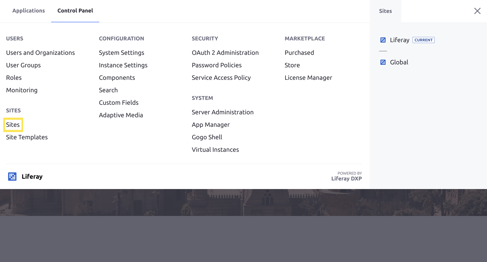

# Adding a Site

To add a new Site to your Liferay Portal instance:

1. Open the [Global Menu](../../getting-started/navigating-dxp.md) (  ) and navigate to the Control Panel, and then select *Sites*.

    

1. Click the Add icon () at the top right of the page.

1. Select a Site Template. See [Site Templates](./building-sites-with-site-templates.md) for more information on creating Site Templates.

1. Enter a Name for the Site.

   ```{note}
   In Liferay DXP 7.3, if you are using a Site Template with pages, then you can check the box to make the default pages private.
   ```

1. Click *Save*.

```{tip}
In order to view a newly created *blank site*, you must first create a page for it. See [Adding a Page to a Site](../creating-pages/adding-pages/adding-a-page-to-a-site.md) for more information.
```

The new Site now selected in the Site Menu. See [Site Settings UI Reference](../site-settings/site-settings-ui-reference.md) for an overview of all of the available Site settings.

## Related Information

* [Introduction to Site Building](../introduction-to-site-building.md)
* [Building Sites with Site Templates](./building-sites-with-site-templates.md)
* [Adding Members to Sites](./site-membership/adding-members-to-sites.md)
