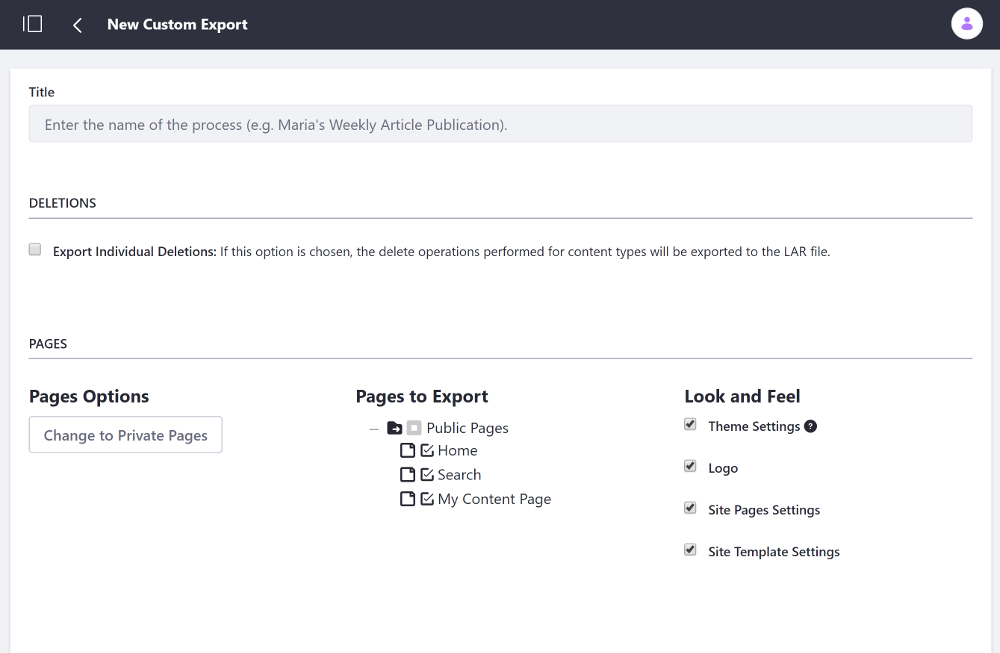
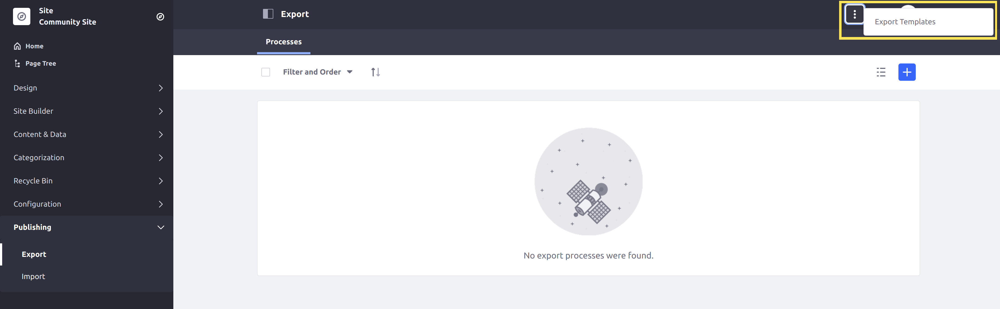

# Importing/Exporting Sites and Content

Export/Import lets you export and restore your Site and app data as a LAR (Liferay Archive). There are two primary places Export/Import is used: Sites and apps. You can learn more about exporting/importing app data in [Exporting/Importing Widget Content](../creating-pages/using-widget-pages/configuring-widgets/exporting-importing-widget-data.md). In this section, you'll learn how to export and import content and pages for Sites.

## Site LAR Properties and Requirements

LARs have these properties and requirements:

* LARs are version dependent. They can be imported into a Site on another Liferay Portal server, as long as the Liferay Portal versions on each server are the same.
* Some naming collisions are handled automatically. For example, if the LAR you're importing and the Site both have a page with the same friendly URL, a number is appended to the friendly URL and incremented until the collision no longer occurs. The same is true for category names that collide.
* You can restore your Site with the latest LAR, but to do so you must delete your Site entirely and then create a new Site with the same name to import the LAR into. This avoids potential data conflicts between content that exists both in the LAR and in the Site.

```{note}
Periodically exporting LARs is *not* a backup solution; it should only be used to migrate information between two environments. Please refer to the [Backing up a Liferay Portal Installation](../../installation-and-upgrades/maintaining-a-liferay-installation/backing-up.md) section for information on backing up Liferay Portal.
```

## Importing and Exporting Pages

Follow these steps to export and import your Site's pages:

1. Open the Site Menu and go to *Publishing* &rarr; *Export*.

1. Click the *Add* icon ().

    A *New Custom Export* page loads. You can choose the pages and content you want to export from your Site:

    * Site pages (you can select exactly which ones)
    * Page settings
    * Theme
    * Theme settings
    * Logo
    * Application configurations
    * Application content
    * Archived setups
    * User preferences

    

1. Enter a Title.

1. Under *Pages*, select the Pages and  settings you want to export.

1. Under the *Content* category, select *All* to export all content or specify a date range or time to filter the content to export.

    ```{note}
    If you select one of the *Choose* radio selectors or *Change* links, you're given checkboxes for options to choose. Application content can also be selected for export, including the Documents and Media Library, Message Boards, and Web Content assets. You can even export the theme you're using.
    ```

1. Select whether the permissions for your exported pages and content are included.

1. Click *Export*. The menu automatically switches to the *Processes* tab, where you see the status of your exported LAR file.

1. Select the *Download* icon () to download the export to your local machine and copy it to a secure location for safekeeping or import it into another installation of Liferay Portal.

1. To rebuild or revert back to this version of your Site, you can import this file by clicking the *Import* button from the *Publishing* menu, browsing to it, and selecting it. You can also drag a LAR file inside the dotted area, which also executes the import process.

## Creating Export Templates

Instead of manually creating an export process every time you export pages and/or content, you can create an Export Template to store the export process settings so they can be reused. To create an Export Template, follow these steps:

1. Open the Site Menu and navigate to *Publishing* &rarr; *Export*

1. Select the *Options* icon () from the top right corner of the screen and select *Export Templates*.

    

1. Click the *Add* button ().

1. Provide a *Name* and *Description* for the template.

1. Fill out the configuration options for your export process.

1. Click *Save*.

Your template is now available to use from the *Export Templates* menu.

## Using Export Templates

To use an Export Template, follow these steps:

1. Click the *Actions* () Menu next to the Export Template and select *Export*.

    This automatically fills in the fields and options for exporting pages and their content.

1. Give the export a name.

1. Click *Export* to generate your LAR file.
