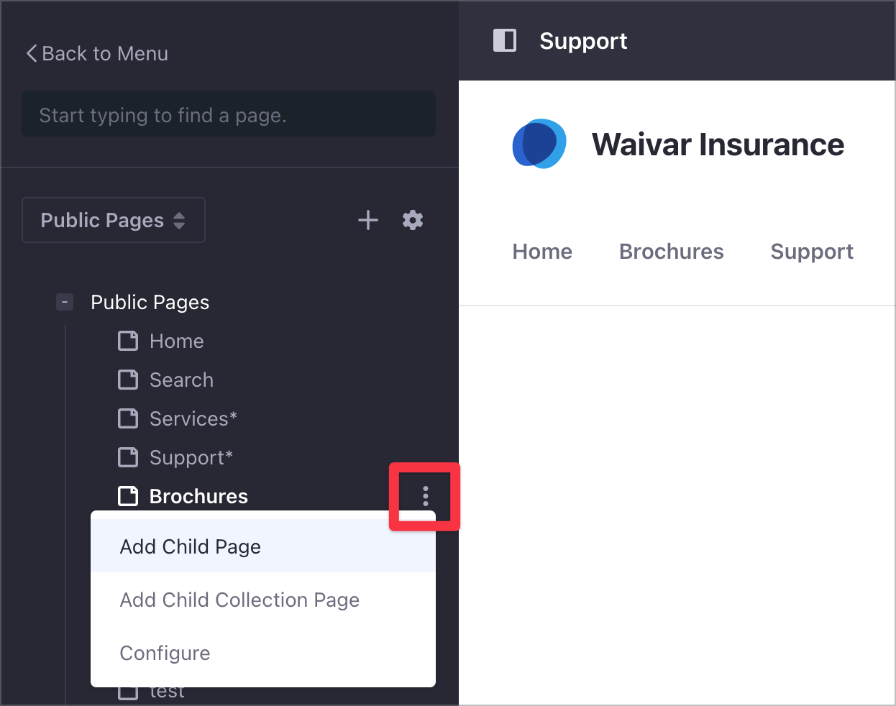
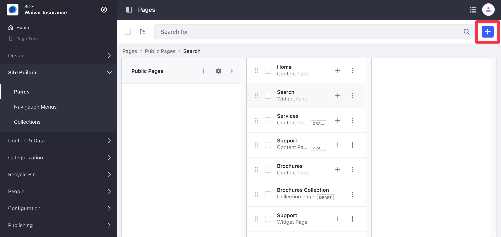
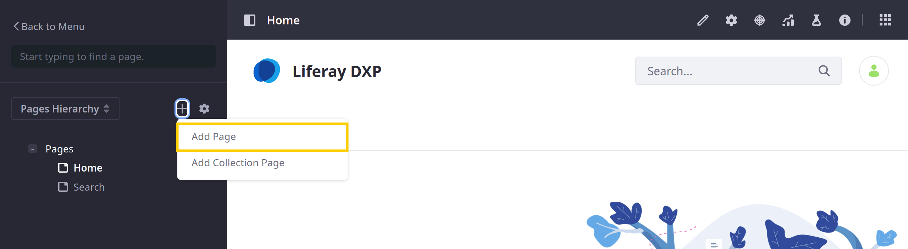
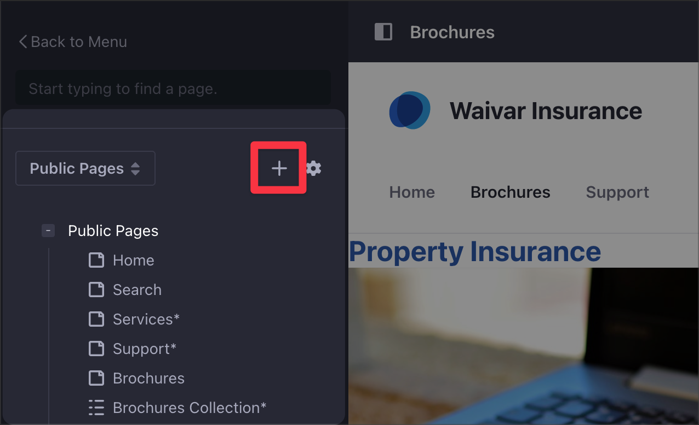
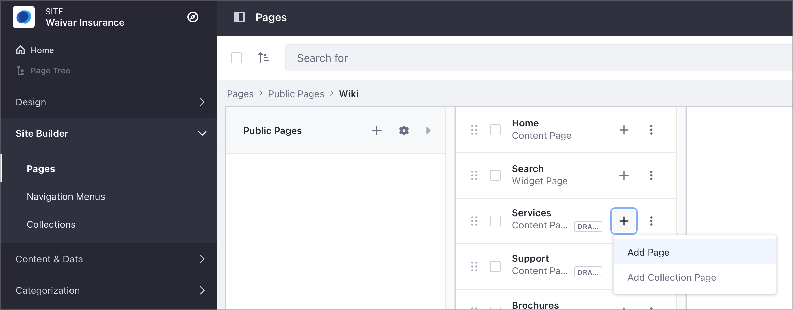

# Adding a Page to a Site

The steps below describe how to add a new Page to your Site and configure the general options. To learn how to configure the remaining Page settings, see [Configuring Individual Pages](../page-settings/configuring-individual-pages.md), or see [Configuring Page Sets](../page-settings/configuring-page-sets.md) to configure options for a [Page Set](../understanding-pages/understanding-pages.md#page-sets).

```{note}
For Liferay 7.4 U22+ and GA22+, private Pages are disabled for new installations. However, you can enable them if desired. See [Enabling Private Pages](../understanding-pages/understanding-pages.md#enabling-private-pages) for more information.
```

## Adding a New Page

You can add a new Page from the Pages administration screen or from the Page Tree (Liferay DXP 7.3+ only).

### Adding a New Page from Pages Administration

1. Open the *Site Menu* (), expand *Site Builder*, and click *Pages*.

1. Click the *Add* button () and select *Page*.

   

1. Under Page Template Sets, select a Basic or Global template.

   To start with an empty [Content Page](../understanding-pages/understanding-pages.md#page-types), click the *Blank* [Master Page Template](../defining-headers-and-footers/master-page-templates.md).

   Alternatively, select from other available templates.

   

1. In the Add Page dialog, enter a name and click *Add*.

If you created a Content Page, then you're redirected to the draft Content Page where you can begin adding fragments and widgets.

If you created a Widget Page, then you're redirected to the Page's configuration options.

```{tip}
By default, new pages are included in the Navigation Menu for the Site. To configure this Navigation Menu, see [Managing Site Navigation](../../site-navigation/managing-site-navigation.md).
```

### Adding a New Page from the Page Tree Menu

> Available: Liferay DXP/Portal 7.3+.

1. Open the *Site Menu* () and click *Page Tree* ().

1. Click the *Add* button () to add a new Page.

   

1. Follow the standard steps for creating a page, as outlined [above](#adding-a-new-page).

```{tip}
Pages in the draft status have an asterisk (*) next to their name in the Page Tree.
```

## Adding a Child Page

You can add child Pages from the Page administration or the Page Tree (Liferay DXP 7.3+ only).

### Adding a Child Page from Pages Administration

1. Open the *Site Menu* (), expand *Site Builder*, and click *Pages*.

1. Click the *Add* button () for the an existing Page.

   

1. Follow the standard steps for creating a Page, as outlined [above](#adding-a-new-page).

```{tip}
Using the Actions Menu () next to the Page, you can preview a Content Page draft (Liferay DXP 7.2+) or approve a draft (Liferay DXP 7.2 only). These options are available for Pages in draft status and Users with page editing permission.
```

### Adding a Child Page from the Pages Tree

> Available: Liferay DXP/Portal 7.3+.

1. Open the *Site Menu* () and click *Page Tree* ().

1. Click the the *Actions* button () for the desired Page and select *Add Child Page*.

    

1. Follow the standard steps for creating a Page, as outlined [above](#adding-a-new-page).

## Related Information

- [Understanding Pages](../understanding-pages/understanding-pages.md)
- [Using Content Pages](../using-content-pages.md)
- [Managing Site Navigation](../../site-navigation/managing-site-navigation.md)
