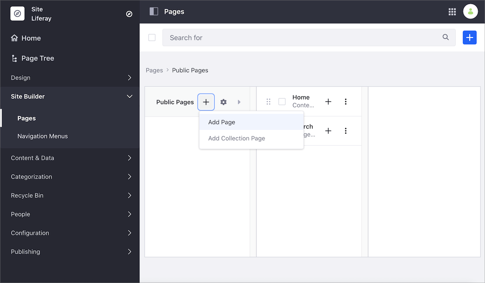

# Adding Elements to Content Pages

After you [create a Content Page](../adding-pages/adding-a-page-to-a-site.md), you define Page content and structure by adding the different [Content Page elements](./content-pages-overview.md).

1. Under the Site Menu, go to *Site Builder* &rarr; *Pages*.

1. Click *Add* () at the level where you want to add the new Page, and select *Add Page*.

    

1. Select the *Blank* template or one of the existing templates.

1. In the Add Page dialog, type your Page's *Name*.

1. Alternatively, click the an existing Content Page's *Actions* Menu () and select *Edit*.

    

1. From the Content Page sidebar, select *Fragments and Widgets* () and start adding the [Fragments](../../displaying-content/using-fragments/using-page-fragments.md) and [Widgets](./using-widgets-on-a-content-page.md) for your content. You can browse for the component or use the *Search* field to find a specific element.

    

    ```note::
       New Content Pages start empty and in a *Draft* status. The Page is not visible until you plublish it.
    ```

1. Configure the look and content preferences of the Fragments and Widgets. For more information, see [Configuring Elements on Content Pages](./configuring-elements-on-content-pages.md).

    ```tip::
       In progress work on a Content Page is automatically saved.
    ```

1. Click the *Publish* button in the top right to make the updates available to the live Page.

## Related Information

- [Content Pages Overview](./content-pages-overview.md)
- [Configuring Elements on Content Pages](./configuring-elements-on-content-pages.md)
- [Content Pages User Interface Reference](./content-page-editor-user-interface-reference.md)
- [Using Page Fragments](../../displaying-content/using-fragments/using-page-fragments.md)
