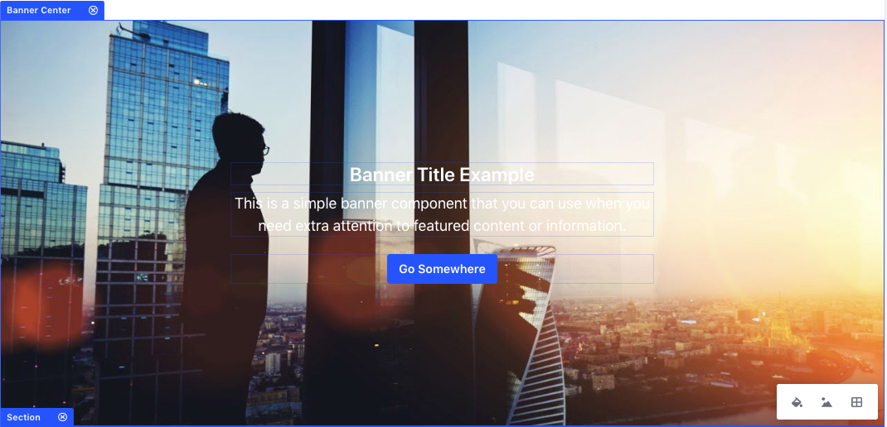
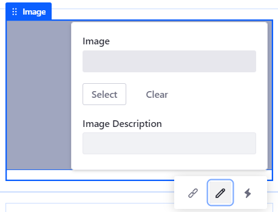

# Building Content Pages

```note::
   Liferay DXP 7.3+. For previous Liferay DXP versions, see `Liferay DXP 7.1 and 7.2 <#liferay-dxp-7-1-and-7-2>`_.
```

## Editing Options in Content Pages

The Liferay Page Editor helps you design your pages. 

### Page Editing Modes

When you open the Page Editor, you can edit your content in two ways:

- *Page Design*: You can design pages when you have permission to update the page and the page content.
- *Content Editing*: You can edit content when you have permission to update the page but not the page content.


The editing options available in the Content Page sidebar depend on the editing mode you choose.

### Undo, Redo, and Page Edit History

1. You can revert any action using the *Undo* () or *Redo* () buttons, or you can return to a previous version of your edits using the *History* () button.

   

1. To preview your Content Page, click the *Preview* button ().

### Screen Layout Controls

You can also use the screen layout controls to target a specific screen layout. For example, if you want to optimize the page layout for phones, you can edit and preview the content using a phone screen layout. These layout controls include

- Desktop
- Tablet
- Landscape Phone
- Portrait Phone


```note::
   The Fragments and Widgets and Page Design options in the Content Page sidebar are only available in the Desktop layout.
```

In the Tablet and Phone layouts, you can further adjust the screen size using the resize handlebar.


## Adding Elements to Content Pages

Once you've [added a Content Page](../adding-pages/adding-a-page-to-a-site.md), you can build it by adding and configuring various [Content Page elements](./content-pages-overview.md).

1. Under the Site Menu, go to *Site Builder* &rarr; *Pages*.

1. Click the *Add Page* button () at the level where you want to add the new Page, and select *Add Page*.

    

1. Select the *Blank* template or one of the existing templates.

1. In the Add Page dialog, type your Page's *Name*.

1. Alternatively, click the Actions Menu () of an existing Content Page and select *Edit*.

    

1. From the Content Page sidebar, select the *Fragments and Widgets* button () and start adding the Fragments and Widgets for your content. You can browse for the component or use the *Search* field to find a specific Fragment or Widget.

    

    ```note::
       New Content Pages start empty and in a *Draft* status. The Page is not visible until it is published.
    ```

1. Configure the look and content preferences of the Fragments and Widgets using the following configuration options:

    - [Setting the Layout Style](#setting-the-layout-style)
    - [Editing Text Inline](#editing-text-inline)
    - [Editing Hyperlinks](#editing-hyperlinks)
    - [Editing Images](#editing-images)
    - [Configuring the Grid Fragment](#configuring-the-grid-fragment)
    - [Copying a Fragment](#copying-a-fragment)
    - [Saving a Fragment Composition](#saving-a-fragment-composition)
    - [Mapping Content](#mapping-content)

    

    ```tip::
       In progress work on a Content Page is automatically saved.
    ```

1. Click the *Publish* button in the top right to make the updates available to the live page.


## Liferay DXP 7.1 and 7.2

Content Pages, like Widget Pages, are built by dragging and dropping elements onto the page and then configuring the way those elements appear. There are three kinds of elements: 

**Sections** are fragments that define a space to place other elements. A section fills the entire width of the Page. Sections can be thought of as *complete* Fragments that serve a purpose by themselves. A large banner image with a text overlay is an example of something you might build as a section.



**Layouts** are special Sections that define spaces where you can add fragments or widgets. Each layout you add fills the width of the Page. You can add any number of layouts to the Page.


**Components** are small design elements that add functionality to the Page. A component might be an image with formatting or a block of text with styling pre-applied. Components must be added to the Page inside a Layout. If you add a component outside an existing Layout, a one-column layout is added automatically to contain the Component. While Sections should be complete by themselves, Components work together to build pages piece by piece. 


Liferay DXP ships with a plethora of Layouts, Sections, and Components to use to build pages, and a [web developer can create their own Fragments](../..//developer-guide/developing_page_fragments.md) to add to these. 

## Editable Elements

Fragments can have editable elements. After a Fragment has been added to a page, you can click on an editable area to provide your own text, image, or links in place of the default defined in the Fragment.

You can also map these elements to content. You can set the *Content* for the element (web content article, document, or blog) and choose its applicable *Field* to display (e.g., title, author name, tags, etc.). You can configure this by selecting the element's *Map* button ().

```note::
   Many mapping improvements were released in Liferay DXP 7.2 SP1+ and Liferay Portal 7.2 GA2+. For example, mapping editables to text/URL fields of existing content and mapping Fragment background images to image fields of existing content. You can also map [custom fields](https://help.liferay.com/hc/en-us/articles/360028818872-Custom-Fields). To ensure you leverage the latest editable element mapping features, upgrade to these versions.
```

For more information on developing these elements, see 
[Fragment Specific Tags](../../developer-guide/reference/fragments/fragment-specific-tags-reference.md).

Now you'll learn about each editable type.

### Editable Text

Editable text can be plain or rich text. Plain text has no special styling. Rich
text enables text styles, typographical emphasis, alignment, and list
formatting.


### Editable Images

Editable image elements allow replacing the image URL or an image from your Documents and Media library. You can provide a link target for the image.

To edit an image from the Content Page editor,

1. Click on the image you want to replace.
1. Click .



From here, you can click *Select* to upload an image from Docs and Media or define an image URL. Click *Clear* to reset the image. You can also specify an image description.

You can also specify a background image for a layout from Section Builder. Click the Layout, select *Layout Background Image*, and define the image to display.

```note::
   Mapping a Layout background image is available in Liferay DXP 7.2 SP1+ and Liferay Portal 7.2 GA2+.
```

For more information on developing editable images, see 
[Making Images Editable](../../developer-guide/reference/fragments/fragment-specific-tags-reference#making-images-editable).

You can also define a link for your image. You'll learn about this next.

### Editable Links

Editable links can be associated with entities that redirect you to a content type or Page (e.g., buttons).

To edit a link from the content page editor,

1. Click on the link or button that you want to edit.
1. Click on  to edit the link text.
1. Click on  to edit the link properties.
1. Click on  to edit the link mapping (described earlier).

From the Link Properties pop-up, you can define the following link options:

*Manual:* defines a manual link or map it to an existing content field.

* *URL:* sets the link's URL.
* *Target:* set the link's behavior.

*From Content Field:*

* *Content:* sets the content type.
* *Field:* sets the field to display for the selected content.

Some of the content fields include

* Categories
* Tags
* Display Page URL
* Description
* Publish Date
* Summary
* Title
* Last Editor Name
* Author Name
* Basic Web Content

For more information on developing editable links, see [Creating Editable Links](../../developer-guide/reference/fragments/fragment-specific-tags-reference.md#creating-editable-links).

Next you'll learn about the Content Page Editing Interface.

## Related Information

* [Developing a Page Fragment](../../developer-guide/developing-page-fragments/developing-fragments-intro.md)
* [Using Master Pages](../defining-headers-and-footers/master-page-templates.md)
* [Editing Content Pages](./editing-content-pages.md)
* [Content Page Personalization guide](../../personalizing-site-experience/personalizing-site-experience.md)
