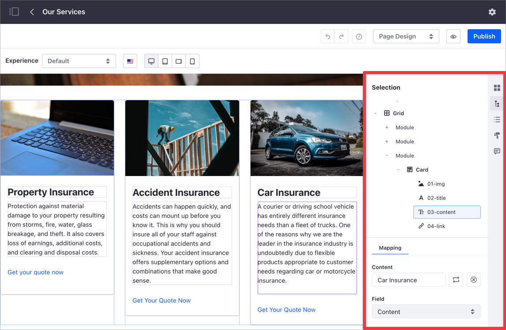
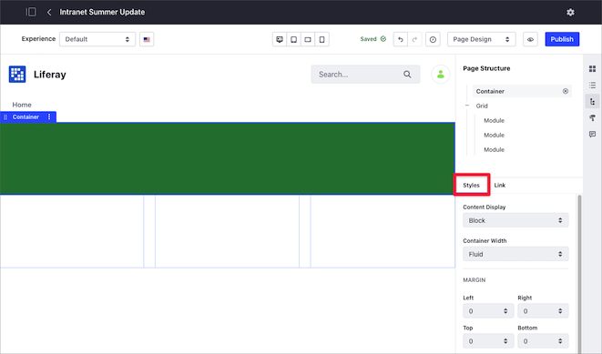
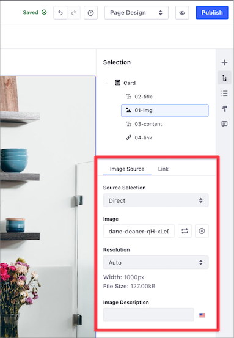
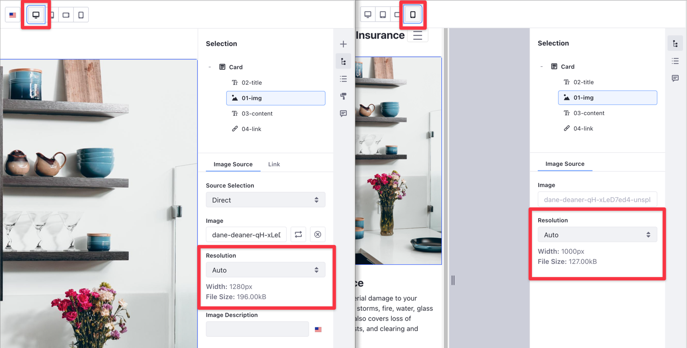
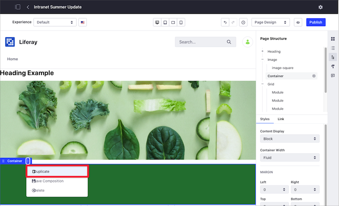

# Configuring Elements on Content Pages

After [adding elements to your Content Page](./adding-elements-to-content-pages.md), you can configure and customize these elements in different ways.

To configure elements on a Content Page, click the element and select your options in the Content Page editor sidebar. For a description of the sidebar options, see [Content Page Editor User Interface Reference](./content-page-editor-user-interface-reference.md).

Because [Content Pages](./content-pages-overview.md) are built using Fragments, configuring your Pages requires working with Fragments. For a description of the Fragments user interface in the Content Page editor, see [Page Fragments User Interface Reference](./page-fragments-user-interface-reference.md).



These are common configuration options:

- [Setting the Layout Style](#setting-the-layout-style)
- [Editing Text In-Line](#editing-text-in-line)
- [Editing Hyperlinks](#editing-hyperlinks)
- [Editing Images](#editing-images)
- [Configuring the Grid Fragment](#configuring-the-grid-fragment)
- [Copying a Page Fragment](#copying-a-page-fragment)
- [Saving a Fragment Composition](#saving-a-fragment-composition)
- [Mapping Content](#mapping-content)

## Setting the Layout Style

You can set different style options like background color, background image, margins, and opacity for your Content Page layout.

1. Click the layout element you want to change.
1. In the Content Page sidebar, under the *Styles* tab, configure the style options for your content:

    - Content Display and Container Width
    - Margin
    - Padding
    - Background and Border color
    - Effects

      

```note::
   The available color palette can be configured by the Fragment developer. See `Fragment Configuration Types Reference <../../../site-building/developer-guide/reference/fragments/fragment-configuration-types-reference.md>`_ for more information.
```

## Editing Text In-Line

1. Double-click the page element containing your text to enter edit mode.
1. Select the text that you want to edit.
1. Use the inline text editor to update the text styles, typographical emphasis, alignment, and other text formatting options.

    

```note::
   Heading fragments cannot have line breaks. This is because Heading fields use ``text`` while Paragraph fragments use ``rich-text`` fields; only the latter can have multiple line texts separated by a line break.
```

## Editing Hyperlinks

1. Click on the link, button, or image that you want to edit.
1. On the Content Page sidebar, under the *Link* tab, choose the options for your link:

    - *Link:* defines a manual link or maps it to an existing content field
    - *URL:* set the link's URL
    - *Target:* set the link's behavior

   

   When you choose the *From Content Field* option for your link, you can configure these options:

   - *Content:* Set the content type.
   - *Field:* Set the field to display for the selected content. Here are some of the field types:

       - Categories
       - Tags
       - Display Page URL
       - Description
       - Publish Date
       - Summary
       - Title
       - Last Editor Name
       - Author Name
       - Basic Web Content

   - *Target*: Set where to open the linked content.

## Editing Images

1. Click the image you want to edit.
1. In the Content Page sidebar, you can configure:

    - *Image Source*: select *Direct* to use an image from your computer or from the Documents and Media library, or choose *Mapping* to [map the image from existing content](#mapping-content). Optionally, set an [image *Resolution*](#configuring-image-resolution-with-adaptive-media) (available in Liferay DXP 7.4+) and *Image Description*.
    - *Link*: Select the URL or Page to open when you click the image.
    - *Image*: select an image from your computer or from the Documents and Media library.

    

You can also specify a background image for a layout by [setting the layout style](#setting-the-layout-style) or provide a link for your image by [editing hyperlinks](#editing-hyperlinks).

### Configuring Image Resolution with Adaptive Media

> Available: Liferay DXP 7.4+.

Starting with Liferay DXP 7.4, you can use [Adaptive Media](../../../content-authoring-and-management/documents-and-media/publishing-and-sharing/serving-device-and-screen-optimized-media/how-adaptive-media-works.md) to adjust the image resolution dynamically, based on the target screen size.

```note::
   Adaptive Media is enabled by default in Liferay DXP. 
```

After you [enable an image resolution](../../../content-authoring-and-management/documents-and-media/publishing-and-sharing/serving-device-and-screen-optimized-media/managing-image-resolutions.md) in Adaptive Media, the resolution is available in the Resolution drop-down menu for your Content Page image.


Consider the following when setting the image resolution in Content Pages:

- When you set the image resolution to Auto, Adaptive Media selects the best resolution for the target screen size automatically.

   

- You can define a fixed Resolution for a specific screen size using the [Device Display controls](./content-page-editor-user-interface-reference.md#device-display) of the Editing Toolbar and choosing the desired resolution.
- If Adaptive Media cannot find an appropriate resolution for the target screen, the Content Page shows the original image resolution.

To learn more about how to use Adaptive Media, read [Using Adapted Images in Site Content](../../../content-authoring-and-management/documents-and-media/publishing-and-sharing/serving-device-and-screen-optimized-media/using-adapted-images-in-site-content.md).

## Configuring the Grid Fragment

1. Click the Grid fragment you want to configure.
1. In the Content Page sidebar, under the *Styles* tab, select the style options for your content.
1. Under the General tab, select the *Number of Modules* (from 1 to 6) to specify the number of columns for the grid.
1. Click *Show Gutter* to show the spacing between modules.

You can adjust the module's width to customize the layout:

1. Click on the Grid to select it. A blue dot appears between each of the modules, indicating that they can be resized.
1. Click one of the blue dots and drag to the left or right to adjust the module size.

   

   ```tip::
      You can use the Grid Fragment to customize the content layout for the different screens on desktop and mobile devices. For more information, see `Building Responsive Layouts with the Grid Fragment <../../optimizing-sites/building-a-responsive-site/building-responsive-layouts-with-the-grid-fragment.md>`_
   ```

## Copying a Page Fragment

To save time, you can duplicate a Fragment (Component, Section, Row, etc.):

1. Click the Fragment you want to copy.
1. Click the Options Menu () for the container and select *Duplicate*.

    

```note::
  When you duplicate a Fragment, you also duplicate the mappings and customizations.
```

```warning::
  Layouts (Sections or Rows) containing instanceable Widgets cannot be duplicated. In this case, a message appears indicating the Widget preventing the duplication.
```

## Saving a Fragment Composition

You can save customized Fragment compositions (Section or Row layout Fragments) as new Fragments, so you can reuse them in your other Fragment-based pages:

1. Click the Row or Section composition you want to save.
1. Click the Options Menu () for the container and select *Save Composition*.

      

1. In the Save as Fragment dialog that appears, provide a name and other optional information:

    - Fragment *Description* and *Thumbnail*.
    - *Save Inline Content* option, for including inline content such as fragment entries (links, images, text, etc.)
    - *Save Mapping Configuration* option, for including [mapped content](#mapping-content).
    - *Collection* to save the Fragment.

      

```note::
   If no Site-specific Fragment Collection exists, the saved Fragment composition is saved automatically to a new Fragment Collection called Saved Fragments.
```

You can use the saved Fragment composition immediately using the Fragments sidebar or through the Page Fragments administrative application.


Compositions can be exported or imported between Sites just as any other Fragment.

```note::
  The latest version of the `Liferay Fragments Toolkit <../../developer-guide/developing-page-fragments/using-the-fragments-editor.md>`_ supports creation, export/import, and preview of Fragment compositions.
```

## Mapping Content

You can also map these elements to existing content. You can set the Content for the element (web content article, document, or blog) and choose its applicable Field to display (e.g., title, author name, tags, etc.).

To map your elements to existing content,

1. Click the Page element you want to map.
1. In the Content Page sidebar, under the *Mapping* tab, click the *Add* button ().
1. Select the content you want to map to your Content Page element.
1. Select the *Field* of your content that you want to map.

   

## Related Information

- [Adding Elements to Content Pages](./adding-elements-to-content-pages.md)
- [Content Pages Overview](./content-pages-overview.md)
- [Content Pages User Interface Reference](./content-page-editor-user-interface-reference.md)
- [Adaptive Media](../../../content-authoring-and-management/documents-and-media/publishing-and-sharing/serving-device-and-screen-optimized-media/how-adaptive-media-works.md)
