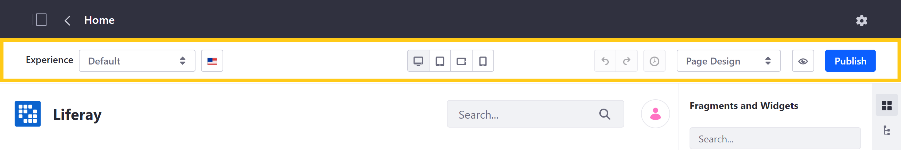
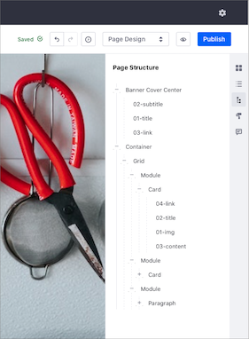

# Content Page Editor User Interface Reference

Using the Content Page Editor, you can [add](./adding-elements-to-content-pages.md) and [configure](./configuring-elements-on-content-pages.md) elements in your [Content Page](./content-pages-overview.md). To open the Content Page Editor, click *Edit* () at the top right of the *Application Bar*. This reveals the editing toolbar and sidebar, which contain tools and components for building your Content Pages.

- [Editing Toolbar](#editing-toolbar)
- [Editing Sidebar](#editing-sidebar)


## Editing Toolbar

The Content Page toolbar contains tools for creating unique user experiences, setting localized translations, switching between edit modes, and more.



### Experiences

Using the Experience drop-down menu, you can create copies of the current page to customize for a specific audience. See [Content Page Personalization](../../personalizing-site-experience/experience-personalization/content-page-personalization.md) for more information.

### Translations

Click on the *language flag* to access the translation drop-down menu. Here, you can view the status of active languages for a Page, as well as switch between languages to view and edit translations directly. See [Configuring Site Languages](../../site-settings/site-localization.md) for more information.

If you use [Experiences](../../personalizing-site-experience/experience-personalization/content-page-personalization.md) for Content Page Personalization, you can configure the Experience using the languages available for your site. See [Managing Experience Localization](../../personalizing-site-experience/experience-personalization/content-page-personalization.md#managing-experience-localization) for more information.

### Device Display

Click the device icons to access DXP's Responsive Layout Editor, where you can view and configure your Content Page layout for different screen sizes, such as desktop, phone, or tablet. These layout controls include

- Desktop
- Tablet
- Landscape Phone
- Portrait Phone


```note::
   The Fragments and Widgets and Page Design options in the Content Page sidebar are only available in the Desktop layout.
```

In the Tablet and Phone layouts, you can further adjust the screen size using the resize handlebar.


### Edit History

Click History () to view changes you've made to the Content Page during your current edit session. Use the undo and redo buttons to reverse or restore those changes.


### Edit Mode Selector

The editing options available in the Content Page sidebar depend on the editing mode you choose.

| Edit Mode | Description | Available Options |
| --- | --- | --- |
| Page Design | You can design pages when you have permission to update the page and the page content. | <ul><li>[Selection](#selection)</li><li>[Contents](#contents)</li><li>[Comments](#comments)</li></ul> |
| Content Editing | You can edit content when you have permission to update the page but not the page content. | All options in Page Design mode plus: <ul><li>[Fragments and Widgets](#fragments-and-widgets)</li><li>[Page Design Options](#page-design-options)</li></ul> |


### Preview and Publish

After making your changes, click *Preview* () to show the published view of your Page. While previewing your changes, you can select which experience, language, and device layout to view. When finished, click *Publish*. By default, publishing makes your changes live immediately. However, if you've enabled a custom [Workflow](../../../process-automation/workflow/introduction-to-workflow.md) to direct the review and publishing process, clicking Publish initiates your defined procedure.

## Editing Sidebar

Depending on your selected editing mode, you can access these options in the edit sidebar:

-  - [Fragments and Widgets](#fragments-and-widgets)
-  - [Selection](#selection)
-  - [Contents](#contents)
-  - [Page Design Options](#page-design-options)
-  - [Comments](#comments)


### Fragments and Widgets

In the Fragments and Widgets sidebar panel (), you can access both out-of-the-box and custom Page elements for building your Page.

- **Fragments**: Fragments are extensible, reusable, drag-and-drop elements that serve as the primary building blocks for Content Pages. Examples include layout elements, videos, and banner images with text overlay. See [Using Page Fragments](../../displaying-content/using-fragments/using-page-fragments.md) to learn more about DXP's out-of-the-box fragments, or [Developing Fragments](../../developer-guide/developing-page-fragments/developing-fragments-intro.md) to learn how to create your own.

   ```note::
      For a description of the different Page Fragments in the Content Page editor, see `Page Fragments User Interface Reference <./page-fragments-user-interface-reference.md>`_.
   ```

- **Widgets**: As in other DXP contexts, widgets are [applications](../../../developing_applications.html) that add dynamic functionality to a Page. Examples include blogs, message boards, and calendars. See [Using Widgets on Content Pages](./using-widgets-on-a-content-page.md) for more information.

### Selection

In the Selection sidebar panel (), you can view a hierarchical outline of all Page elements, as well as select, configure, or remove those elements. Similarly, clicking any element on the Page while in the Design mode opens the Selection panel and highlights the selected Page element in the hierarchy. When an element is selected, you can access its General, Styles, and Link options, if it has any. See [Using Page Fragments](../../displaying-content/using-fragments/using-page-fragments.md) for more information.



```note::
   A Page's Header and Footer are not listed in the Selection panel hierarchy. This is because you can only modify them in the `Master Page Template <../defining-headers-and-footers/master-page-templates.md>`_.
```

### Contents

Here you can view, edit, and manage all web content on the Page. This includes content displayed in widgets and mapped to content fields. See [Managing Web Content on Content Pages](./managing-web-content-on-content-pages.md) for more information.

### Page Design Options

Click *Look and Feel* () to change the theme or manage other options for the Page. See [Page Configuration UI Reference](../page-settings/page-configuration-ui-reference.md#look-and-feel) for more information about these options.

### Comments

Use Page Fragment comments to collaborate with team members while developing your Content Page. Once made, you can view, edit, delete, or reply to open comments in the Content Page sidebar's Comments panel (). If [mentions](../../../collaboration-and-social/notifications-and-requests/user-guide/mentioning-users.md) are enabled, you can tag Users with Page update permissions as part of your comment.

```note::
   For versions prior to 7.3+, comments are disabled by default. To enable Page comments, go to *Control Panel* → *Configuration* → *System Settings* → *Pages* → *Content Page Editor*. Then, check the *Comments Enabled* checkbox, and click *Update*.
```

## Additional Information

- [Content Pages Overview](./content-pages-overview.md)
- [Adding Elements to Content Pages](./adding-elements-to-content-pages.md)
- [Configuring Elements on Content Pages](./configuring-elements-on-content-pages.md)
- [Using Page Fragments](../../displaying-content/using-fragments/using-page-fragments.md)
