# Creating Content Page Compositions Using the Container Fragment

Layout and composition are the foundation of your [Content Page](./content-pages-overview.md) design. When you get this right, your Content Page is easier to read and navigate, resulting in a richer and more consistent user experience. Using the [Container Fragment](./page-fragments-user-interface-reference.md#container) in Liferay DXP, you can define drop zones for other Fragments, create Page compositions with a high degree of customization, and reuse these compositions across your Site Pages.

```tip::
   In addition to the Container Fragment, you can use the `Grid Fragment <./page-fragments-user-interface-reference.md#grid>`_ to customize the Content Page layout and create a responsive design. For more information, see `Building Responsive Layouts with the Grid Fragment <../../optimizing-sites/building-a-responsive-site/building-responsive-layouts-with-the-grid-fragment.md>`_.
```

When you [create a new Content Page](../adding-pages/adding-a-page-to-a-site.md), a default drop zone appears. You can add any Fragment to this area, but using the Container Fragment as the first element in your composition has important advantages:

- Greater layout control over the rest of the elements on your Content Page design, including the *Flex* Display Properties for [advanced compositions](#creating-advanced-compositions-with-the-container-fragment) (Liferay DXP 7.4+.)
- Fragment compositions that you can [save and reuse](../../displaying-content/using-fragments/saving-a-fragment-composition.md) in other Content Pages.
- Redirect users to another Page or URL when they click on the Fragment composition.
- Leverage [Style Books](../../site-appearance/style-books/using-a-style-book-to-standardize-site-appearance.md) to standardize your Site appearance.

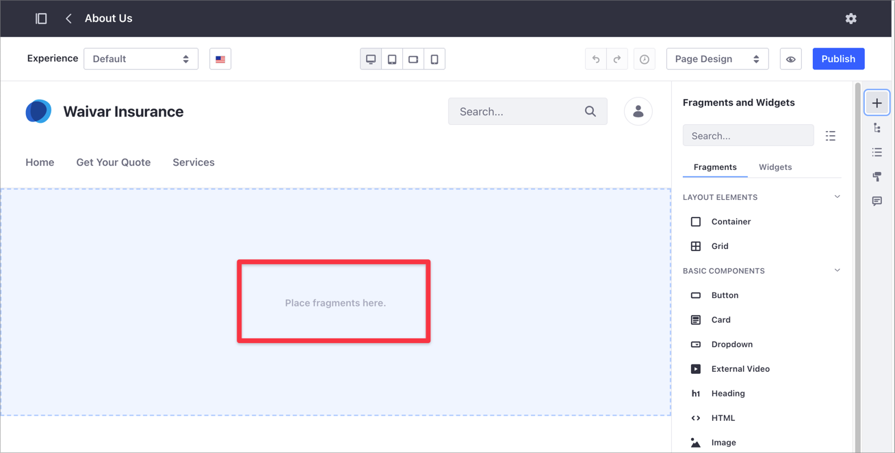

```note::
   When designing your Content Page layout, start with the Container Fragment. Add other Fragments on top of this Container for maximum flexibility and layout control.
```

## Example: Using the Container Fragment for a Banner Composition

This step-by-step example shows you how to create a banner-style composition using nested Container Fragments. The example also illustrates how to save the composition and adjust its settings in the Style Book.


- [Step 1: Creating a New Content Page](#step-1-creating-a-new-content-page).
- [Step 2: Configuring the Container Fragment](#step-2-configuring-the-container-fragment).
- [Step 3: Saving the Fragment Composition](#step-3-saving-the-fragment-composition).
- [Step 4: Setting the Default Container Width in the Style Book](#step-3-setting-the-default-container-width-in-the-style-book).

### Step 1: Creating a New Content Page

1. Under the Site Menu, go to *Site Builder* &rarr; *Pages*.

1. Click *Add* () at the level where you want to add the new Page and select *Add Page*.

1. Select the *Blank* template or one of the existing templates.

1. In the *Add Page* dialog, type your Page's *Name*.

### Step 2: Configuring the Container Fragment

1. From the Content Page sidebar, select *Fragments and Widgets* () and drag and drop the *Container* Fragment over the default drop-zone.

    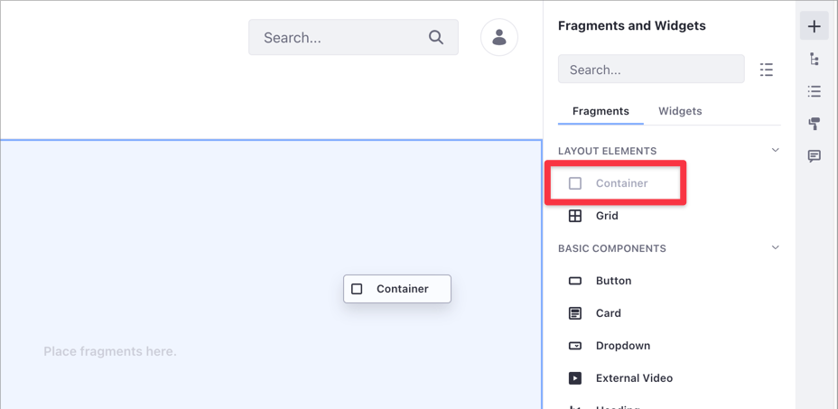

1. Click the Container Fragment and in the *Selection* () panel, click *Styles*.

1. Under the Padding area, set the four Padding options to `5` (A).

1. Still in the Styles area, in the *Background Color* selector, select a gray color value of `200` (B).

    

1. Select *Fragments and Widgets* () and drop a new Container Fragment over the existing one. This creates a nested Container composition that appears when you click on the *Selection* () panel.

    

1. From the Fragments and Widgets () panel, under Basic Components, drag and drop a *Heading* Fragment inside the inner Container in the composition.

    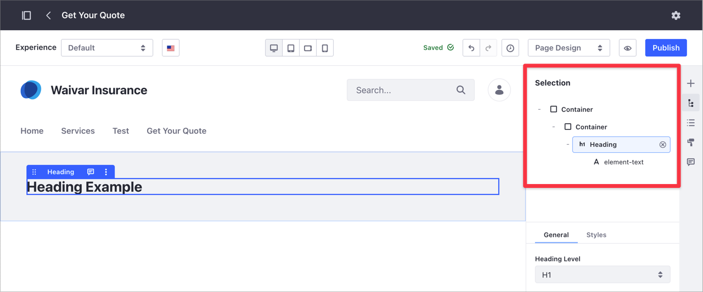

1. Drag and drop a *Paragraph* Fragment right below the Heading. Select the Paragraph in the composition and under the *Styles* section, choose a *Margin Top* of `3`.

    

1. From the Selection () panel, click the inner Container. Under the *General* tab, type the URL where you want to redirect users when they click on this area.

    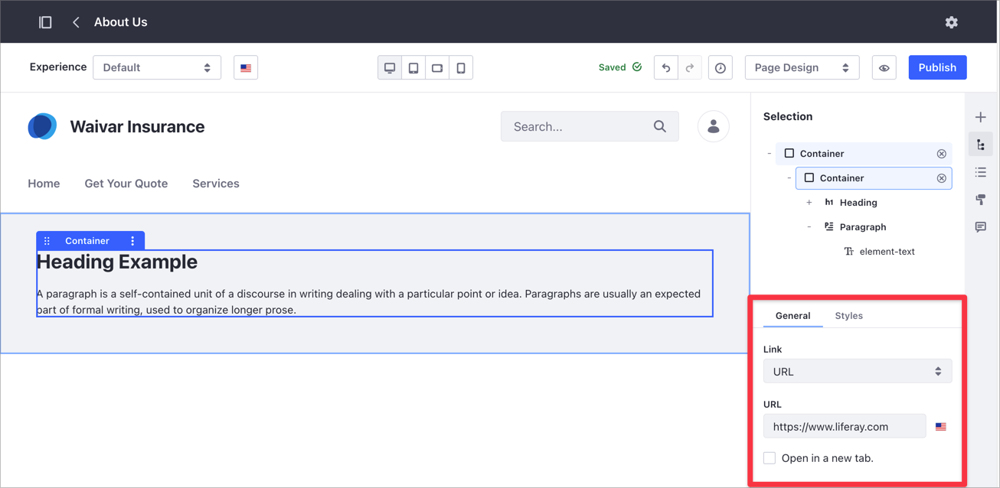

1. From the Fragments and Widgets () panel, under Basic Components, drag and drop a *Button* Fragment in the composition, right below the paragraph.

1. Select the _Button_ and under the Styles section, set a *Margin Top* of `3`. Under the *General* section, click the *Type* drop-down menu and choose _Link_.

    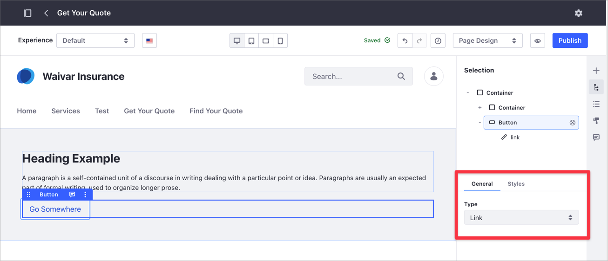

1. In the Selection () panel, click the *link* for the Button Fragment. Under the Link section, type the URL you want to redirect users when they click the button.

    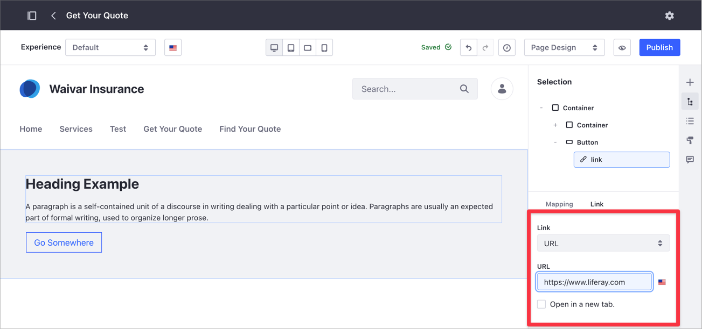

```note::
   You don't need to Publish the Content Page. In-progress work on a Content Page is automatically saved as a draft.
```

### Step 3: Saving the Fragment Composition

You can save Fragment compositions as new Fragments and reuse them in other Content Pages. To learn more, read [Saving a Fragment Composition](../../displaying-content/using-fragments/saving-a-fragment-composition.md).


### Step 4: Setting the Default Container Width in the Style Book

By default, the Container Fragment uses a *Fluid* width configuration. You can change the default setting to *Fixed Width*, and make this property available for other Content Pages based on the same Style Book. In this example with two nested Containers, you may want to configure the outer Container to adapt to the Page width while limiting the maximum width of Container with the text. To learn more about Style Books in Liferay DXP, read [Using a Style Book to Standardize Site Appearance](../../site-appearance/style-books/using-a-style-book-to-standardize-site-appearance.md).

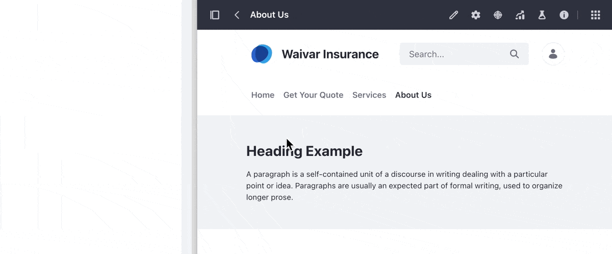

```warning::
   To avoid breaking your Site layout configuration, use a test environment when working with Style Books. Do not update a Style Book configuration for testing purposes on a production Site.
```

1. From the Selection () panel, click the inner Container Fragment.

1. Under the Styles area, set the *Container Width* property to *Fixed Width*.

    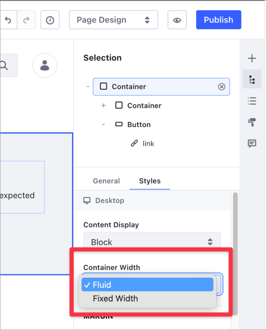

1. Click the *Page Design Option* panel (A) and under the *Style Book* section (B), verify the active Style Book (C).

    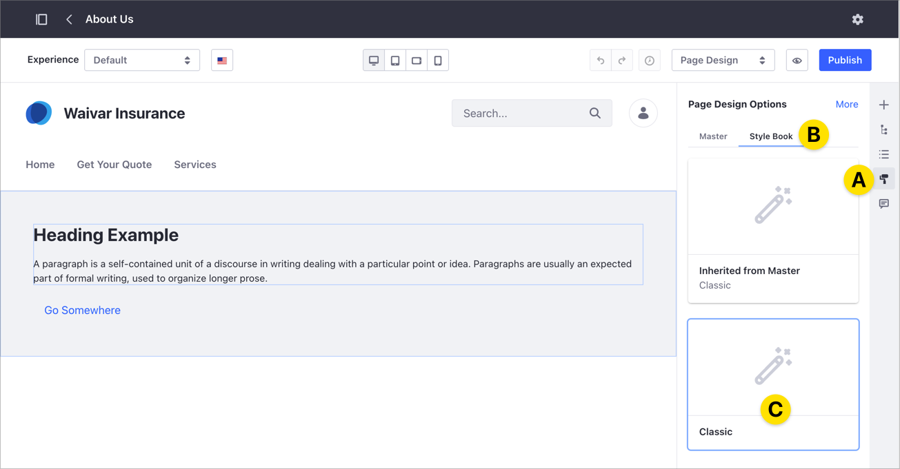

1. Under the Site Menu, go to *Design* &rarr; *Style Books*.

    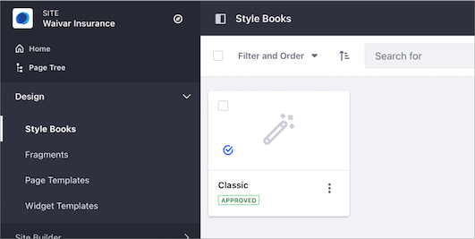

1. Click the *Actions* () menu for the Style Book corresponding to your Content Page and select *Edit*.

1. On the Style Book editor, select your Content Page from the *Page Preview* drop-down menu.

    

1. Select the *Layout* option on the right-hand side drop-down menu, and set a maximum width value (in pixels) for the fixed width elements in the *Extra Large* option.

    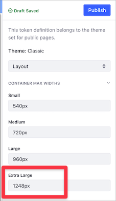

1. Click *Publish* to update your Style Book with the new configuration.

## Creating Advanced Compositions with the Container Fragment

> Available: Liferay DXP 7.4+.

When you configure one or more Containers inside another Container Fragment, you can define advanced display options using a *Flex* display.

1. Under the Site Menu, go to *Site Builder* &rarr; *Pages*.

1. [Create a new Content Page](../adding-pages/adding-a-page-to-a-site.md) or open an existing page with a Container-based composition. You can use [this example](#example-using-the-container-fragment-for-a-banner-composition) to create a basic composition using the Container Fragment.

1. Click the *Selection* () panel.

1. Select the Container Fragment that groups the elements where you want to apply the advanced composition. For example, if you have a Container with Fragments in it, select the outer Container.

1. Under the Styles section, click the *Content Display* drop-down menu and select one of the available *Flex* options.

    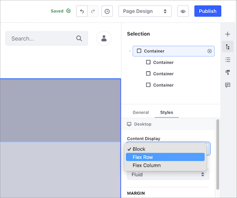

1. Set the *Align Items* and *Justify Content* settings to your preference.

    

## Additional Information

- [Content Pages Overview](./content-pages-overview.md)
- [Content Page Editor User Interface Reference](./content-page-editor-user-interface-reference.md)
- [Using Page Fragments](../../displaying-content/using-fragments/using-page-fragments.md)
