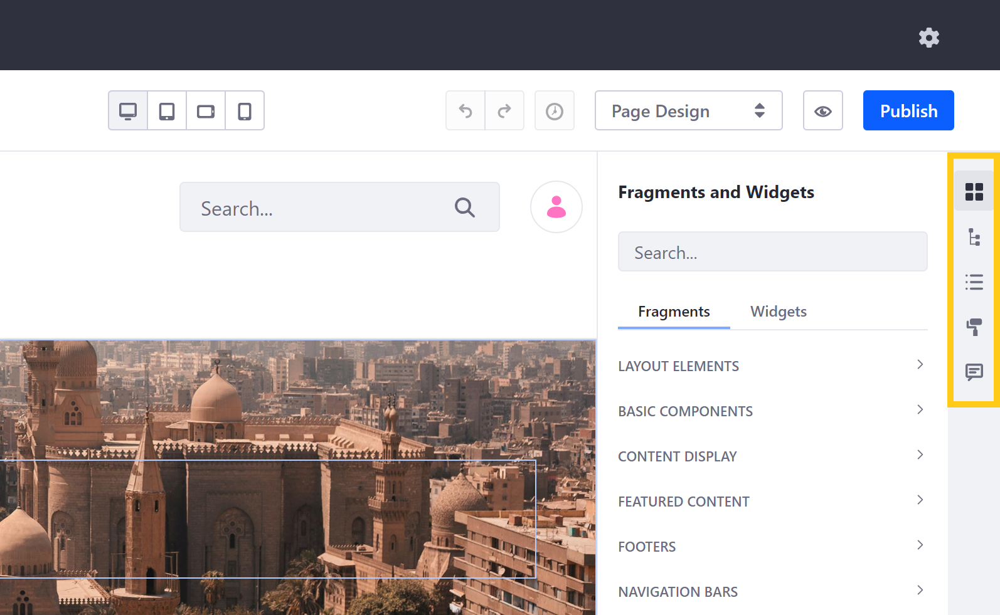
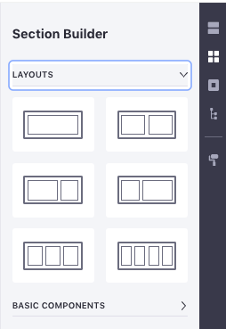

# Editing Content Pages

```note::
   Liferay DXP 7.3+. For previous Liferay DXP versions, see `Liferay DXP 7.1 and 7.2 <#liferay-dxp-7-1-and-7-2>`_.
```

Content Pages are easy to display, manage, and develop. You can access these options by clicking on the *Edit* icon () at the top right of the *Application Bar*. This reveals the editing toolbar and sidebar, which contain tools and components for building your Content Pages.

* [Editing Toolbar](#editing-toolbar)
* [Editing Sidebar](#editing-sidebar)


## Editing Toolbar

The Content Page toolbar contains tools for creating unique user experiences, setting localized translations, switching between edit modes, and more.


### Experiences

Using the *Experience* drop-down menu, you can create copies of the current page to customize for a specific audience. See [Content Page Personalization](../../personalizing-site-experience/experience-personalization/content-page-personalization.md) for more information.

### Translations

Click on the *language flag* to access the translation drop-down menu. Here, you can view the status of active languages for a Page, as well as switch between languages to view and edit translations directly. See [Configuring Site Languages](../../site-settings/site-localization.md) for more information.

### Device Display

Click on the device icons to access DXP's Responsive Layout Editor, where you can view and configure how your Content Page is displayed on desktops, tablets, and smartphones.

### Edit History

Click on the History icon () to view changes you've made to the Content Page during your current edit session. Use the undo and redo buttons to reverse or restore those changes.

### Edit Mode Selector

Click on the edit mode drop-down menu to select between *Content Editing* and *Page Design* modes. Each mode determines which panels you can access in the editing sidebar menu. When in Content Edition, you can access the [Selection](#selection) (), [Contents](#contents) (), and [Comments](#comments) () panels. While in Page Design, you can also access [Fragments and Widgets](#fragments-and-widgets) () and [Page Design Options](#page-design-options) ().

### Preview and Publish

After making your changes, click on the *Preview* icon ( to show the published view of your Page. While previewing your changes, you can select which experience, language, and device layout to view. When finished, click *Publish*. By default, publishing makes your changes live immediately. However, if you've enabled a custom [Workflow](../../../process-automation/workflow/introduction-to-workflow.md) to direct the review and publishing process, clicking Publish initiates your defined procedure.

## Editing Sidebar

Depending on your selected editing mode, you can access these options in the edit sidebar:

*  - [Fragments and Widgets](#fragments-and-widgets)
*  - [Selection](#selection)
*  - [Contents](#contents)
*  - [Page Design Options](#page-design-options)
*  - [Comments](#comments)



### Fragments and Widgets

In the Fragments and Widgets sidebar panel (  ), you can access both out-of-the-box and custom Page elements for building your Page.

* **Fragments**: Fragments are extensible, reusable, drag-and-drop elements that serve as the primary building blocks for Content Pages. Examples include layout elements, videos, and banner images with text overlay. See [Using Fragments](./using-fragments.md) to learn more about DXP's out-of-the-box fragments, or [Developing Fragments](../../developer-guide/developing-page-fragments/developing-fragments-intro.md) to learn how to create your own.

* **Widgets**: As in other DXP contexts, widgets are [applications](../../../developing_applications.html) that add dynamic functionality to a Page. Examples include blogs, message boards, and calendars. See [Using Widgets on Content Pages](./using-widgets-on-a-content-page.md) for more information.

### Selection

In the Selection sidebar panel (), you can view a hierarchical outline of all Page elements, as well as select, configure, or remove those elements. Similarly, clicking any element on the Page while in the Design mode opens the Selection panel and highlights the selected Page element in the hierarchy. When an element is selected, you can access its General, Styles, and Link options, if it has any. See [Using Fragments](./using-fragments.md) for more information.


```note::
   A Page's Header and Footer are not listed as part of its hierarchy in the Selection panel. This is because they can only be modified from its `Master Page Template <../defining-headers-and-footers/master-page-templates.md>`_.
```

### Contents

Here you can view, edit, and manage all web content on the Page. This includes content displayed in widgets and mapped to content fields. See [Managing Web Content on Content Pages](./managing-web-content-on-content-pages.md) for more information.

### Page Design Options

Click on the *Look and Feel* icon () to change the theme or manage other options for the Page. See [Page Configuration UI Reference](../page-settings/page-configuration-ui-reference.md#look-and-feel) for more information about these options.

### Comments

Use Page Fragment comments to collaborate with team members while developing your Content Page. Once made, you can view, edit, delete, or reply to open comments in the Comments panel of the Content Page sidebar (). If [mentions](../../../collaboration-and-social/notifications-and-requests/user-guide/mentioning-users.md) are enabled, you can tag Users with Page update permissions as part of your comment.

```note::
   For versions prior to 7.3+, comments are disabled by default. To enable Page comments, go to *Control Panel* → *Configuration* → *System Settings* → *Pages* → *Content Page Editor*. Then, check the *Comments Enabled* checkbox, and click on *Update*.
```

## Liferay DXP 7.1 and 7.2

Unlike Widget Pages, Content Pages can only be edited through the Site Builder and cannot be edited live on the page. Any edits that you make to a page are saved as a draft until you publish the page. Subsequent changes after the initial publication are again saved as a draft, without affecting the live page, until the page is published again. 

### Creating Content Pages

1.  Go to *Site Management* &rarr; *Site Builder* &rarr; *Pages*.

2.  Click .

3.  On the next page, select *Content Page* and provide a name for the page.

    You are then brought to the Content Page management interface.
 
    

To edit an existing Content Page,

1.  Go to *Site Administration* &rarr; *Site Builder* &rarr; *Pages*.

2.  Click *Actions* ()
    &rarr; *Edit* next to the Content Page you want to edit.

You can also get to this page by selecting the *Edit* button () from the Control Menu if you're viewing the published Content Page.

Here you can view a preview of your page, add Fragments and Widgets, and manage the configuration for the page or any Fragments and Widgets currently residing on the page.

Your tools for building the page are all found on the right side of the page. From top to bottom, the options are

* [Sections](#sections)
* [Section Builder](#section-builder)
* [Widgets](#widgets)
* [Page Structure](#page-structure)
* [Look and Feel](#look-and-feel)

### Sections

Here you see a list of Collections available. Initially, you only have the Basic Sections Collection which is included with the product. You can open the Collection and drag Sections directly onto the page.


Once a section is added to a page, you can edit its background color, background image, and spacing. Since these options are available to page editors, the options are limited, and the color palette can be set by the Fragment developer.


### Section Builder

Here you start with Layouts and Basic Components. Add Layouts to the page to provide a space where you can add Components.



### Widgets

The Widgets section functions just like the *Add* menu on a Widget Page. The full list of available widgets appears, and you can add them to the page.


The main difference is that only the main configuration options are available for widgets on Content Pages. Various other configurations like *Look and Feel* are only available for widgets on Widget Pages.

### Page Structure

Page Structure provides a high level view of every Fragment and every field within each Fragment on the page.


Choosing a field in Page Structure highlights it on the page. On large complicated page, this helps you find everything.

### Look and Feel

Click the *Page Design Options* icon () to change the theme or manage other options for the page. These options are fully documented in [Creating Pages](/dxp/latest/en/site-building/creating_pages.html). 

### Comments

You can also comment on any page fragments. This allows discussion and collaboration for teams creating content pages. 

Comments are disabled by default, but administrators can enable them from *Control Panel* &rarr; *Configuration* &rarr; *System Settings* &rarr; *Pages* &rarr; *Content Page Editor*. Select the *Comments Enabled* checkbox and click *Update*. This enables content page comments for all instances. To control this on an instance-by-instance basis, navigate to the same setting in *Instance Settings* (instead of System Settings). 


If comments are enabled, you can access them via the Comments icon (). The comments appear for the selected fragment. You can take the following actions in the comments UI for a fragment:

*   Add new comments and reply to any existing ones. 
*   Resolve comments by clicking the checkbox for each. Resolving a comment 
    hides it from view, unless *Show Resolved Comments* is selected. 
*   Edit and delete your own comments via the Actions button 
    () 
    for each. 

If you de-select a fragment or enter the comments UI without a fragment selected, a list of the fragments on the page appears with the number of comments for each. Selecting a fragment then shows its comments. 


### Title Bar

The title bar provides navigation back to the Main Menu, a link to page configuration, and the ability to search for other pages. The title bar is covered in more detail in [Creating Pages](/dxp/latest/en/site-building/creating_pages.html). 


Great! Now you know how to use the content page interface!

## Additional Information

* [Building Content Pages](./building-content-pages.md)
* [Page Fragments](../../displaying-content/using-fragments/using-page-fragments.md)
* [Using Fragment Comments](./using-fragment-comments.md)
