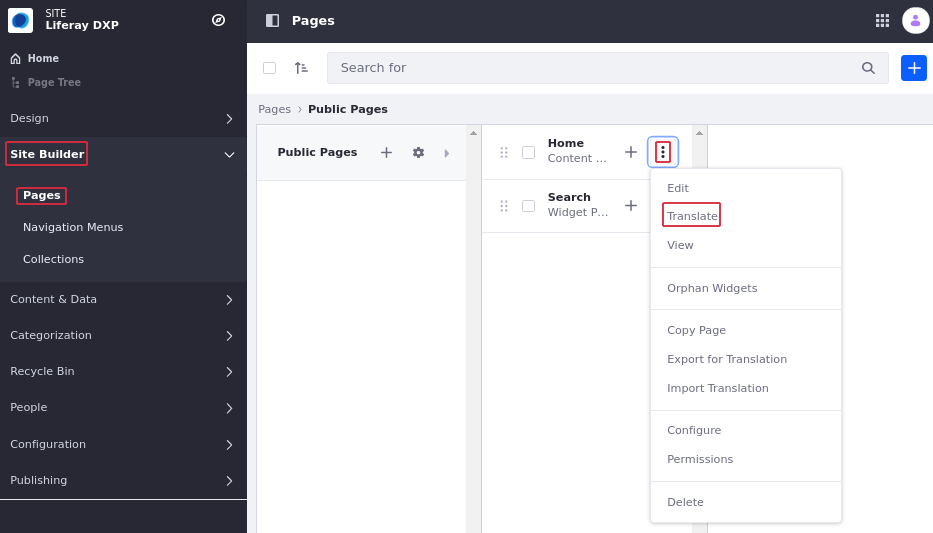
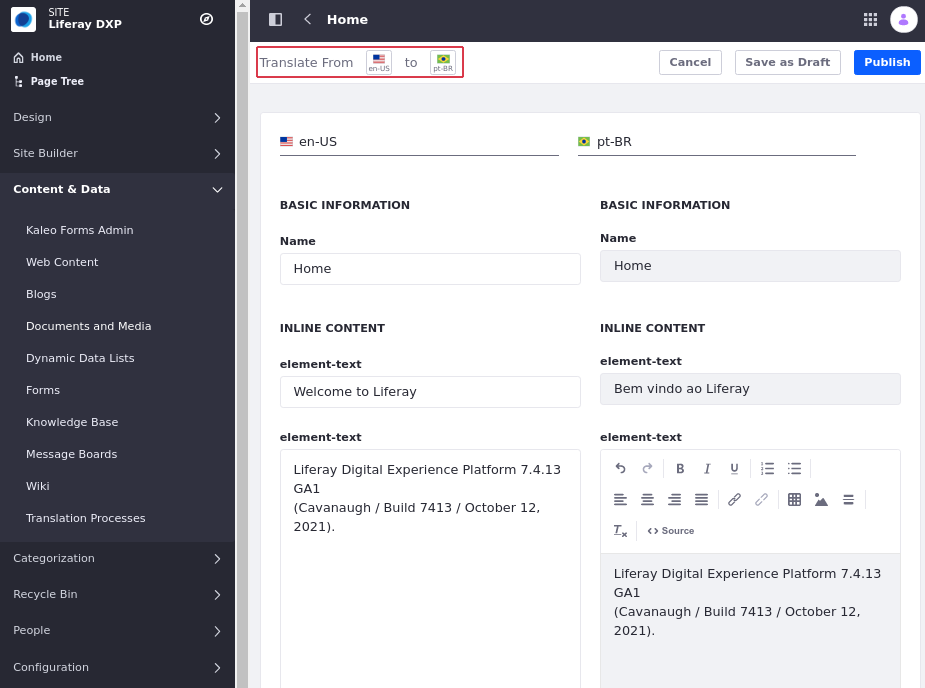

# Manually Translating Content Pages

Liferay integrates translation functionality with *Content Pages*, so you can create engaging, localized experiences for your global users. Users with the required permissions can manually translate Site content to any available language. You can also integrate the translation process with custom workflows to streamline the review and publication process for new translations.

```{important}
To translate Content Pages, users must have either Update permission for Content Pages or translations permissions for one or more languages
```

## Translating Content Pages

1. Open the *Site* menu, and go to *Site Builder* &rarr; *Pages*.

1. Click the *Actions* menu (  ) for the Content Page you want to translate and select *Translate*.

   

   This redirects you to the content translation interface, where you can view the content's original text alongside your translation. The left column displays the language you're translating from, and the right column provides editable fields you can use for your translation.

   ```{important}
   When translating a Content Page, users can only translate a Page's name and inline fragments (e.g. HTML, Header, etc.) and cannot translate Widgets or fragments containing content mappings.
   ```

1. Use the *language flags* to determine the languages you're using.

   Users with Update permissions for Content Pages can translate the original text into any language.

   Users with translate permissions can only translate the origin text into languages for which they have permission.

   

1. Enter your translation into the desired fields.

1. Click *Publish* to create a new version of the Content Pages or initiate a workflow, if it's enabled.

   Alternatively, click *Save as Draft* to save and publish your translation at a later time.

## Additional Information

- [Content Pages Overview](./content-pages-overview.md)
- [Adding Elements to Content Pages](./adding-elements-to-content-pages.md)
- [Content Page Editor User Interface Reference](./content-page-editor-user-interface-reference.md)
