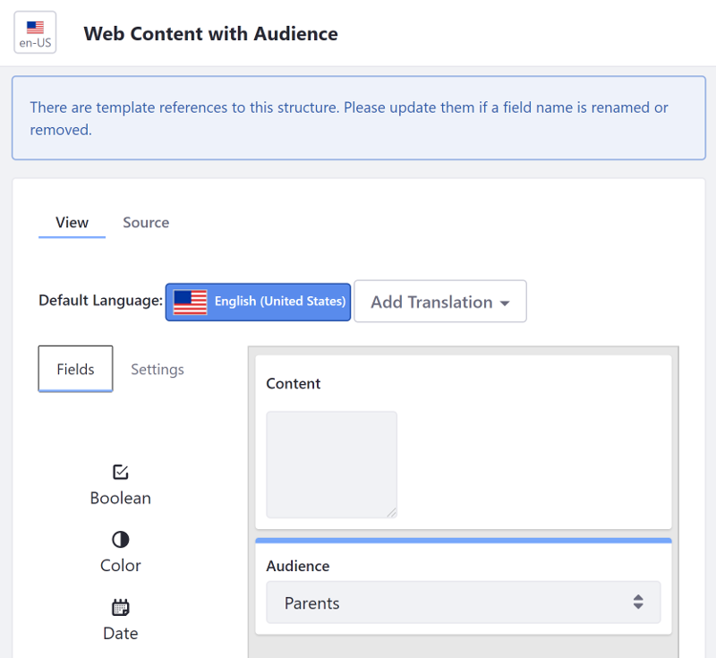
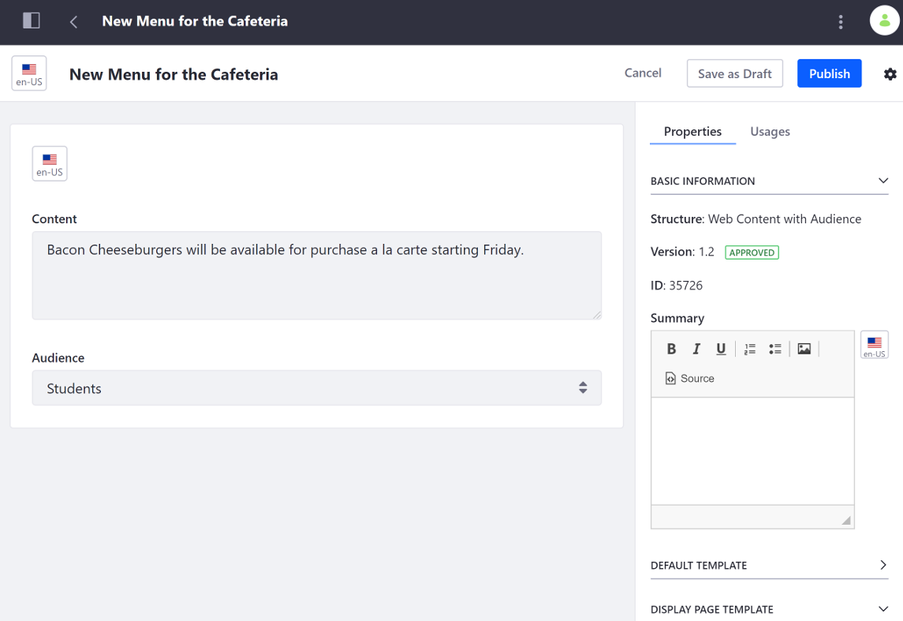

# Mapping Web Content Templates to Fragments

By default, you can map [Web Content Structure](../../../content-authoring-and-management/web-content/web-content-structures/understanding-web-content-structures.md) fields holding a single value (such as Date, Numeric, Image, Number, or Text) to Fragments. For multi-value fields (such as Select Field, Radio Button, or HTML) you must first render the field using a [Web Content Template](../../../content-authoring-and-management/web-content/web-content-templates/creating-web-content-templates.md); then you can map the Template to a Fragment.

For example the *Web Content with Audience* Structure on this image contains a Content field of *Text* type and an Audience field of *Select from List* type:



You can map the single-value Content field directly to a Fragment, but you need a Web Content Template to map the multi-value Audience field. The [Web Content Template](../../../content-authoring-and-management/web-content/web-content-templates/creating-web-content-templates.md) should use the same Structure as the Web Content Article with the field you wan to map.


```note::
  If you want to make several structure field values available (that aren't included by default) for mapping to individual Fragments, you must create a separate Web Content Template for each field that uses that Structure and renders just the one field. If you render all your fields in one Template, all their values will be mapped to the Fragment when you select the Template.
```

## Mapping a Web Content Template to a Fragment

1. [Create a Web Content Structure](/../content-authoring-and-management/web-content/web-content-structures/creating-structures.md) that contains the multi-value field you want to map.
1. [Create a Web Content Template](../../../content-authoring-and-management/web-content/web-content-templates/creating-web-content-templates.md) that uses the same Structure with the multi-value field (A).
1. In the Template, render the multi-value field from the Structure clicking its name under the *Fields* (B) heading to add the variable (C).

    

1. [Create the Web Content](../../../content-authoring-and-management/web-content/web-content-articles/adding-a-basic-web-content-article.md) based on the previous Web Content Template.

    

1. On the Fragment-supported page (Content Page, Display Page Template, etc.) [add the Fragment](./building-content-pages.md#adding-elements-to-a-content-page).
1. On the sidebar panel, click the *Selection* () button and click the element in the Fragment you want to map.
1. Under the *Mapping* section, [select and map](./building-content-pages.md#mapping-content) the Web Content Article that contains the value you want to map.
1. Once the Web Content is selected, select the Web Content Template you created as the *Field* in the *Mapping* section.

    

1. Click *Publish* to save the changes.

## Additional Information

- [Using Fragments](./using-fragments.md)
- [Understanding Web Content Structures](../../../content-authoring-and-management/web-content/web-content-structures/understanding-web-content-structures.md)
- [Creating Web Content Templates](../../../content-authoring-and-management/web-content/web-content-templates/creating-web-content-templates.md)
