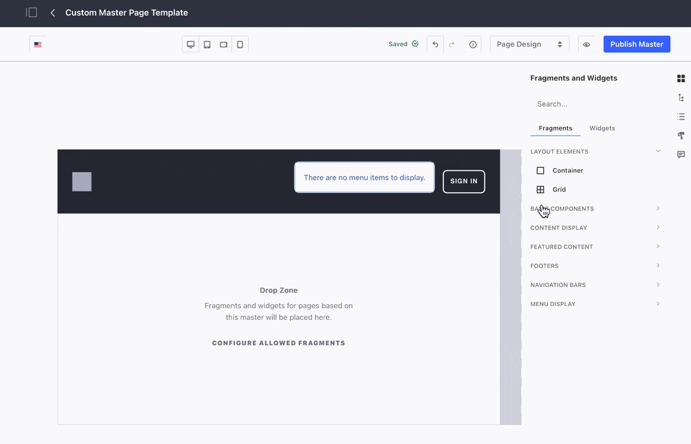
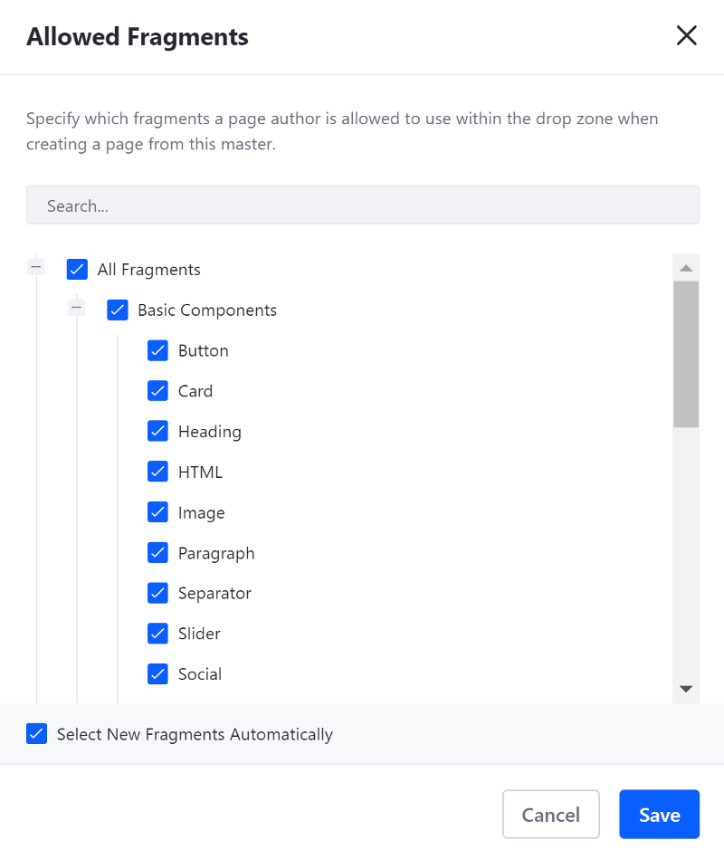

# Creating a Master Page Template

> Available: Liferay DXP 7.3+

Although Portal includes default Master Page Templates that you can use to define the look and feel of the Headers and Footers for your Site's pages, you may want a more custom solution. You can create custom Master Page Templates for this.

Follow these steps to create a Master Page Template:

1. Open Product Menu and go to Site &rarr; *Design* &rarr; *Page Templates*.
1. Under the Masters tab, click *Add* ( to create a new Master Page Template.
1. Enter the *Name* of your new Master Page Template.
1. Click *Fragments and Widgets* () on the sidebar and add Fragments for the common elements that you require.

    

1. Optionally drag and drop the Drop Zone to a new location in the layout. For example, you can add a Grid with two Modules and move the Drop Zone to one Module, so users can only add Page Fragments to that portion of the Grid.

    

1. Optionally specify which Page Fragments can be added to the Drop Zone by clicking the *Configure Allowed Fragments* button.

    - Check the Page Fragments you want to allow in this Master Page Template.
    - Check the *Select New Fragments Automatically* box to include new fragment types in the list of allowed fragments.

    

1. Click *Save* to close the *Allowed Fragments* dialog.
1. To preview your Content Page, click the *Preview* button ().
1. Click *Publish Master* to create the Master Page Template.

You can revert any action using the *Undo* () or *Redo* () buttons, or you can return to a previous version of your edits using the *History* () button.

```note::
  If a custom Master Page Template is used for a page, the Theme for the page is defined through the Master Page Template and can't be changed through the page's settings. See `Changing a Master Page Template's Theme <./managing-master-page-templates.md#changing-a-master-page-template-s-theme>`_ for more information.
```

## Additional Information

- [Managing Master Page Templates](./managing-master-page-templates.md)
- [Master Pages Templates](./master-page-templates.md)
