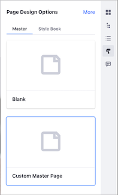
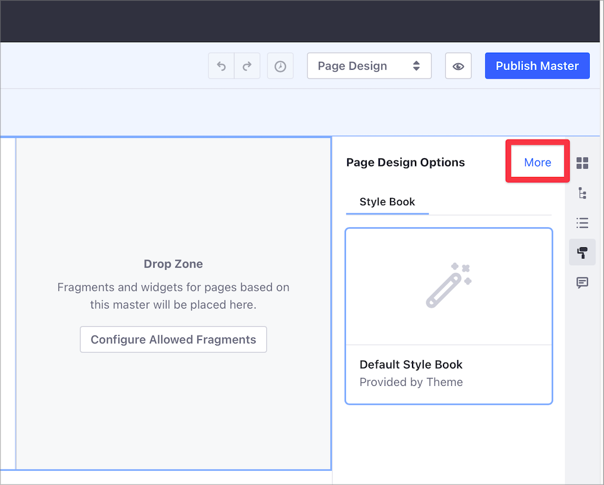
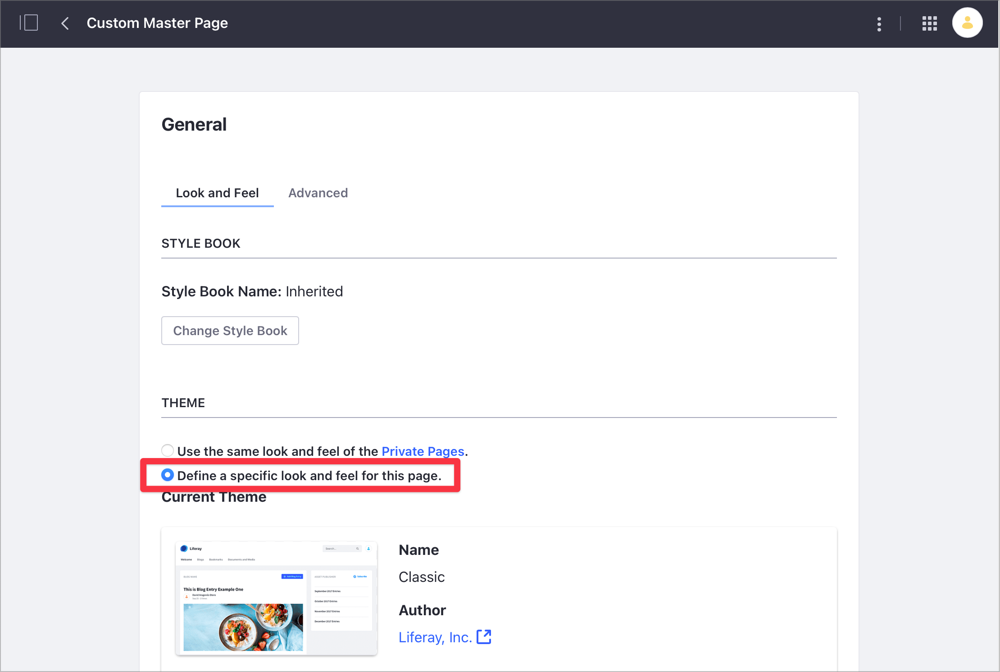

# Managing Master Page Templates

> Available: Liferay DXP 7.3+

To manage a Master Page Template, follow these steps:

1. Open the Product Menu, go to Site &rarr; *Design* &rarr; *Page Templates* and select the *Masters* tab.

    

1. Open the *Actions* () Menu for a Master Page Template and select one of the options. 

**Edit:** Configure the Master Page Template.

**Change Thumbnail:** Select a thumbnail image to display for the Master Page Template's card in the *Masters* tab.

**Rename:** Change the name of the Master Page Template.

**Make a Copy:** Duplicate the Master Page Template. The copy uses the same name with "Copy" appended to the end.

**Export:** Export and download the Master Page Template definition. This option is available when the Master Page Template is in the *Approved* status.

**Permissions:** Define permissions for the Master Page Template.

**Delete:** Remove the Master Page Template. You can also delete multiple Master Page Templates at once by checking the box for each template and clicking the `X`, or selecting the *Delete* action from the Management Toolbar.

**Discard Draft:** Discard the Master Page Draft. This option is available when the Master Page Template is in the *Draft* status.

```note::
   After changes are made and published, they are propagated to all pages that use the Master Page Template.
```

## Changing the Master Page Template of a Page

You can change the Master Page Template of a Page in the [Content Page Editor](../building-and-managing-content-pages/content-page-editor-user-interface-reference.md). Follow these steps:

1. Navigate to the Page where you want to change the Master Page Template.
1. Click the *Page Design* menu ().
1. Under the Masters section, click the *Master Page Template* you want to use.

   

## Changing a Master Page Template's Theme

When you apply a custom Master Page Template to a Page, the Theme is not defined through the Page but through the Master Page Template. Follow these steps to update the Theme for the Master Page Template:

1. Navigate to the Page where you want to change the Master Page Template.
1. Click the *Actions* () menu and select *Edit*.
1. Open the *Page Design* menu ().
1. Click *More* to access the Master Page Template General options.

   

1. In the *Look and Feel* area, under the *Theme* section, select *Define a specific look and feel for this page*.

    

1. Scroll down and click *Change Current Theme*.
1. From the list of *Available Themes*, select a new Theme and click *Save* to apply the changes.

## Additional Information

- [Master Pages Templates](./master-page-templates.md)
- [Creating a Master Page Template](./creating-a-master-page-template.md)
